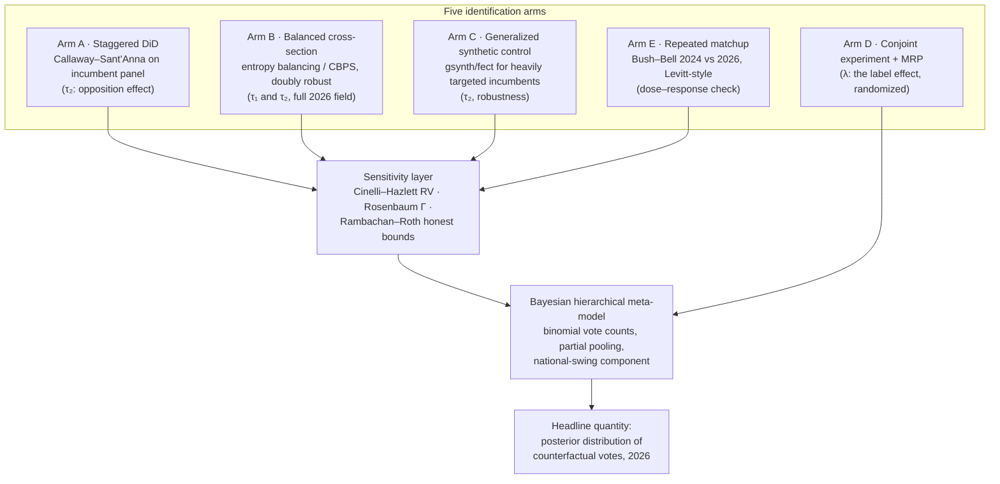

# The AIPAC Penalty

### How many more votes would 2026 primary candidates have received if they rejected AIPAC? An analysis plan and data strategy.

> **Status: analysis plan (pre-data).** Drafted August 12, 2026, mid-primary-season —
> deliberately, because Massachusetts (Sep 1), New Hampshire (Sep 8), Rhode Island, and
> Delaware have not yet voted, so the core hypotheses can be pre-registered before those
> outcomes exist. Nothing here has touched outcome data yet.

On August 4, 2026, Abdul El-Sayed won the Michigan Democratic Senate primary by about a
point — after AIPAC's super PAC spent $30.6 million against him, the largest single-race
outlay in the organization's history. One week later Peggy Flanagan, who pledged to
reject AIPAC money, won Minnesota's Senate primary by 19 points over an AIPAC-endorsed
congresswoman. The same cycle, though, Wesley Bell beat Cori Bush's comeback by 22
points behind a 27:1 outside-spending advantage, and AIPAC-linked money went roughly
3-and-4 across contested Democratic primaries. A July 2026 Data for Progress survey
experiment found Democrats described as AIPAC-funded ran 6.2 points behind Democrats who
reject PAC money. So which is it — does AIPAC association now *cost* votes in a
Democratic primary, and how many?

Nobody has answered this with a real research design. Repeated literature searches
(August 2026) find journalism, advocacy trackers, and one public conjoint — **no
peer-reviewed causal estimate of the AIPAC effect on primary vote share exists.** The
niche is open. This document is the plan for filling it.

## TL;DR

- **The question needs two estimands, not one.** "Rejecting AIPAC" is a candidate's
  strategic choice with two separable consequences: (1) *losing AIPAC's support* (the
  endorsement cue plus conduit money), and (2) *provoking AIPAC's opposition* (UDP
  independent expenditures against you). A candidate who rejects AIPAC doesn't get
  "no AIPAC" — they often get AIPAC on the other side. We estimate both effects and
  compose them into the counterfactual the question asks about.
- **Identification is the whole game.** AIPAC endorses likely winners and targets
  incumbents its private polling says are beatable — two-sided selection that a naive
  regression cannot fix. The plan triangulates five designs: staggered
  difference-in-differences (Callaway–Sant'Anna) on incumbents, entropy-balanced
  cross-sections for the 2026 field, generalized synthetic control for the heavily
  targeted few, a pre-registered conjoint experiment for the pure label effect, and the
  Bush–Bell repeated matchup as a Levitt-style natural experiment.
- **Every observational estimate ships with a sensitivity analysis** (Cinelli–Hazlett
  robustness values, Rosenbaum bounds, Rambachan–Roth honest bounds), because the
  archetypal confounder — AIPAC's private polling — is unobservable by construction.
- **Votes, not just vote share.** A Bayesian hierarchical model pools race-level effects
  and propagates uncertainty into the headline quantity — the posterior distribution of
  total counterfactual votes across 2026 primaries — with the turnout denominator
  treated as endogenous, summed within posterior draws.
- **The data are mostly free.** FEC filings give near-real-time treatment measurement
  (AIPAC PAC = C00797670, UDP = C00799031, DMFI = C00710848). The binding constraint is
  candidate-level 2026 primary returns in-season: the plan is a Ballotpedia scrape
  validated against state-certified results.
- **Pre-register before September 1.** Four states haven't voted. Timestamping the
  design on OSF before the Massachusetts and New Hampshire primaries converts part of
  this from a retrodiction into a genuine out-of-sample test.

## 1. The Problem: A Question That Sounds Simple and Isn't

"How many more votes would candidates have received if they rejected AIPAC?" hides three
distinct treatments:

1. **AIPAC endorsement + bundled money.** AIPAC PAC endorsed over a hundred Democratic
   incumbents in 2024; most of its money is earmarked individual contributions passed
   through as a conduit. This is a *label plus dollars* bundle attached mostly to safe
   incumbents.
2. **UDP spending for you.** Independent expenditures supporting the AIPAC-preferred
   candidate in a contested primary (Bell in MO-01, Boafo in MD-05, Bean in IL-08).
3. **UDP spending against you.** The Bowman/Bush/El-Sayed treatment — the mirror image,
   and in 2026 the most visible one.

The counterfactual "candidate X rejects AIPAC" is a *policy of the candidate*, not a
surgical deletion of one variable. Rejecting the endorsement forfeits treatment 1,
plausibly triggers treatment 3, and changes campaign discourse (in 2026, rejection
itself became a message — Flanagan and El-Sayed ran *on* it). Formally this is a
consistency / treatment-variation-irrelevance problem, and we handle it by defining two
estimands and composing them:

- **τ₁ (support effect):** effect of AIPAC endorsement/conduit money on the recipient's
  primary vote share, relative to the same candidate without it.
- **τ₂ (opposition effect):** effect of UDP independent expenditure against a candidate
  on that candidate's primary vote share.

The answer to the user-facing question for candidate *i* is then approximately
`−τ₁ + P(retaliation | reject) × τ₂ + λ` where λ is the *message value* of public
rejection — the component the conjoint experiment (§3, Arm D) is designed to isolate.
We will report the composition explicitly rather than pretending the question maps to a
single regression coefficient.

Two more structural facts discipline everything downstream:

- **Interference.** Vote shares are zero-sum within a race: one candidate's treatment
  *is* the opponent's exposure. The unit of analysis is the race–candidate dyad, and the
  estimand is the effect on the treated candidate's share against the same field. Across
  races, Gaza-era salience is a common shock — a cycle-level confounder, not something a
  cross-sectional design can difference away.
- **Two-sided selection.** AIPAC endorses candidates who were going to win anyway
  (biasing naive estimates of τ₁ upward) and targets candidates its private polling says
  are beatable (biasing naive estimates of τ₂ toward "the money worked"). The 2026
  scorecard — roughly 3 wins, 4 losses in contested Democratic primaries despite $100M+
  — is itself evidence that targeting is aimed at close races, exactly where the
  spending-effects literature (Erikson & Palfrey 2000) says money endogenously flows.

## 2. Design Architecture: Five Arms and a Spine

No single design is credible alone here. The plan triangulates: each arm buys
identification with a different assumption, and agreement across arms is the evidence.



### Arm A (primary design): staggered difference-in-differences on the incumbent panel

Panel of Democratic incumbents' contested primary vote shares, 2014–2026. Treatment
onset is genuinely staggered — the Bowman/Bush cohort was hit in 2024, the
Espaillat-challenge/2026 cohort later, and some threatened incumbents (Omar, Tlaib)
never received major IE against them. Two-way fixed effects would use already-treated
units as controls (the Goodman-Bacon pathology), so we estimate Callaway & Sant'Anna
(2021) group-time ATTs with never-treated progressive incumbents as controls,
conditioning parallel trends on CFscore, prior margins, and district covariates.
Event-study leads test the "already declining" story (Bowman's redistricting predates
UDP money — the leads must show it). Inference: wild-cluster bootstrap plus Fisherian
permutation, because the treated N per cohort is small. Parallel-trends sensitivity via
Rambachan & Roth (2023) honest bounds.

A known selection subtlety: primary vote share exists only when a primary is contested,
and UDP's presence *recruits* challengers. Contestation is therefore itself an outcome.
We model contest emergence as a first stage (following Hirano & Snyder) and report
bounds under extreme assumptions about the uncontested counterfactuals.

### Arm B: balanced cross-sections for the full 2026 field

The DiD panel covers incumbents only. For open seats (MD-05, NE-02, MN-Sen, MI-Sen) —
where most 2026 action happened — we estimate ATTs by entropy balancing (Hainmueller
2012) and covariate-balancing propensity scores (Imai & Ratkovic 2014) with doubly
robust estimation, on a candidate–race dataset of all 2018–2026 Democratic congressional
primaries. Covariates: incumbency/tenure, prior margins, CFscore ideology, Israel-policy
position coding (roll calls, public statements), pre-treatment fundraising (Q1, before
most IE lands), small-dollar share, Cook PVI (2026 edition — ten states redrew maps),
district demographics including Jewish, Arab-American, Black, and college-educated
population shares, opponent quality, and — critically — co-occurring crypto/AI super PAC
spending, which moved in lockstep with UDP in 2026 and would otherwise be attributed to
AIPAC.

### Arm C: generalized synthetic control for the heavily targeted

For the ~6–8 incumbents with major IE against them and adequate pre-periods, gsynth/fect
(Xu 2017) with augmented-SCM bias correction (Ben-Michael et al. 2021) constructs
counterfactual trajectories under an interactive fixed-effects model — allowing
selection on unobserved time-varying vulnerability, which DiD's parallel trends rules
out. Honest caveat: biennial elections and historically uncontested primaries make T₀
short and gappy; this is a robustness arm, not the lead. Inference by conformal/placebo
permutation.

### Arm D: conjoint experiment + MRP — the label effect, randomized

The observational arms estimate the *bundle* (label + money + ads + salience). A
pre-registered conjoint on validated Democratic primary voters (Hainmueller, Hopkins &
Yamamoto 2014) isolates the *label*: candidate profiles randomize "endorsed by AIPAC" /
"accepted AIPAC contributions" / "rejected AIPAC contributions" / no mention, against
active-control endorsers (Planned Parenthood, a nurses union, a crypto PAC), crossed
with issue positions so the design separates the AIPAC cue from the Israel-position cue
— the central confound in interpreting 2026. Report marginal means by subgroup (Leeper
et al. 2020), not just AMCEs. Then MRP (Gelman & Little 1997; Park, Gelman & Bafumi
2004) projects individual-level effects onto each district's primary electorate, scaled
by measured endorsement awareness. Benchmark: Data for Progress's July 2026 conjoint
found a 6.2-point penalty in a *general*-election frame; the Michigan primary-electorate
polling (64% "less likely" vs 10% "more likely") suggests the primary penalty is larger.
The observational-minus-experimental gap is itself an estimate of the pure-spending
channel. Fielding options: a CES 2026 team module if slots remain (~$1k/question;
verify — commitments may have closed), else Prolific/YouGov with voter-file validation.

### Arm E: the repeated matchup

Bush vs. Bell ran in 2024 (UDP ~$8.5–9M, Bell 51–46) and again in 2026 (UDP ~$2M,
27:1 total outside advantage, Bell 59.2–36.9). Same two candidates, same district, two
spending doses — the primary-election analogue of Levitt's (1994) repeat-challengers
design, which historically yields the *smallest* spending effects in the literature.
One race proves nothing, but it is the single cleanest dose–response observation in the
data and a published-in-advance test: the design predicts the 2026 margin should exceed
2024's only via the non-money channels if spending effects are small. NY-16 (if
Latimer's 2026 primary was uncontested, that is itself informative — deterrence) and any
other rematches get the same treatment.

### The spine: sensitivity, then aggregation

**Sensitivity layer (mandatory, every observational arm):** Cinelli & Hazlett (2020)
robustness values benchmarked against observed covariates ("a confounder as strong as
prior-cycle margin would need partial R² = X to nullify"), Rosenbaum Γ bounds on matched
pairs, E-values for win/lose outcomes, Rambachan–Roth for the DiD. AIPAC's private
polling is the confounder we cannot observe; the deliverable is not "no confounding" but
"here is exactly how strong confounding must be to change the answer."

**Aggregation:** a Bayesian hierarchical model (binomial vote counts with
overdispersion; Stan via `brms` or PyMC) pools race-level effects with partial pooling,
cycle and state varying intercepts, and a national-swing component that induces the
cross-race correlation a naive sum would ignore. The headline quantity — *how many more
votes* — is computed inside each posterior draw as
`Σ_races (share₁·T₁ − share₀·T₀)` with the turnout denominator T treated as
treatment-dependent (Hall & Thompson 2018 show turnout, not persuasion, often carries
these effects), then summarized as a posterior distribution. No point estimate stands
alone.

**Multiverse discipline:** the treatment definition (endorsement-only / any IE / IE >
$1M / pledge rejection), sample (incumbents / all), outcome (share / log votes / win),
and estimator all admit defensible alternatives — and a politically charged question
invites motivated choices in both directions. We enumerate the full specification grid
in advance and publish the specification curve (Simonsohn, Simmons & Nelson 2020) with
permutation-based joint inference, via `specr` or Python `specification_curve`.

**Pre-registration:** the plan, hypotheses, treatment codings, covariate sets, and
specification universe go to OSF (or EGAP, which accepts observational designs)
**before September 1, 2026** — the Massachusetts primary (Markey vs. Moulton, who made
AIPAC rejection an early pillar) and New Hampshire's Pappas–Manzur race then serve as
held-out prospective tests of the fitted model's predictions.

## 3. Data Strategy

Full source-by-source detail, with verified URLs, committee IDs, access methods, costs,
and lags, lives in [research_notes/03_data_sources.md](research_notes/03_data_sources.md).
The operational summary:

### Treatment (free, near-real-time, from FEC primary sources)

| Variable | Source | Notes |
|---|---|---|
| AIPAC endorsement (binary, dated) | AIPAC/DMFI press releases, Ballotpedia endorsement pages, Track AIPAC roster | AIPAC publishes no clean public list; reconstruct and archive (Wayback) as coded |
| AIPAC conduit dollars to candidate | FEC Schedule B, committee **C00797670** | **De-duplicate memo entries** — earmarked conduit contributions appear twice; naive sums double-count |
| UDP / DMFI IE for/against (continuous, signed, dated) | FEC Schedule E, committees **C00799031**, **C00710848**; 24/48-hr e-filings | The cleanest treatment measure; near-real-time around primaries |
| Shell-PAC IE (2026 innovation) | FEC Schedule E + monthly audit of new committees | 40%+ of 2026 UDP spending routed through pop-up PACs (Elect Chicago Women, Center for Democratic Priorities, BOLD America, …); trace transfers from C00799031 |
| Reject-AIPAC pledge (anti-treatment, dated) | rejectaipac.org rosters, IfNotNow pledge, press coverage | Distinguish formal pledge from rhetorical refusal; archive pages |
| Confounding PAC spending | FEC Schedule E for Fairshake/Protect Progress (crypto), Leading the Future (AI) | Moved in lockstep with UDP in 2026; omitting it attributes their effect to AIPAC |

### Outcome

Candidate-level 2026 primary returns have **no free canonical source in-season**. Plan:
scrape Ballotpedia's structured race pages (~470 congressional primaries; MediaWiki
tables parse cleanly) for election-night numbers, then validate every treated race
against state-certified SoS results (2–6 weeks post-election). Historical panel
2012–2024 from the FEC's biennial *Federal Elections* publications (official,
candidate-level, Excel) plus MEDSL's House-primary compilations. MEDSL's cleaned 2026
files arrive too late for in-season work but anchor the replication release.

### Covariates

Voteview DW-NOMINATE (incumbents), DIME v4.0 CFscores through 2024 (challengers with
prior runs; 2026 first-timers get CFscores re-estimated from 2025–26 itemized receipts
projected onto DIME donor scores), FEC fundraising totals, Cook PVI **2026 edition**,
Dave's Redistricting composites, Census ACS, and Brandeis AJPP Jewish population
estimates. Geography warning that touches every district covariate: **ten states redrew
maps mid-decade for 2026** (AL, CA, FL, LA, MO, NC, OH, TN, TX, UT) — all district
variables must be rebuilt on 2026 boundaries via block-level crosswalks, and AJPP's CD
file is on 116th-Congress lines (aggregate their county estimates instead).

### Supplementary

Data for Progress crosstabs (the July 2026 conjoint and April Michigan poll are
published benchmarks); prediction-market tick data (Kalshi API, Polymarket CLOB) for
event studies around large IE filings — thin liquidity limits this to the marquee races;
CES 2026 for the survey arm if module slots remain.

## 4. Priors: What Effect Size Would Be Surprising?

The literature brackets expectations from both sides. Levitt's repeat-matchup design
says ~0.3 pp per $100k of challenger spending (1990s dollars) — under which even $30M
buys single digits. Kalla & Broockman's meta-analysis says persuasion ≈ 0 in general
elections *but explicitly carves out* low-information, no-party-cue settings — which is
what a primary is; primaries are where persuasion survives. Kousser et al. find
high-single-digit to double-digit endorsement effects in low-information primaries.
Sides, Vavreck & Warshaw's ad-effects estimates imply fractions of a point per
ad-share shift, larger down-ballot. And 2026's raw pattern — $30.6M failing in Michigan
while 27:1 succeeded in Missouri — is consistent with effects that are real,
heterogeneous, and smaller than the spending totals suggest, possibly *sign-flipped* in
electorates where the AIPAC label itself became a negative cue (the DFP 64/10 Michigan
split). A posterior centered on low-to-mid single digits of vote share for the label,
with wide race-to-race heterogeneity and an opposition-spending effect that shrinks —
or reverses — in high-salience urban electorates, would surprise no one who has read
this literature. Anything larger needs the sensitivity analysis to survive scrutiny.

## 5. Execution Plan

| Phase | Work | Target |
|---|---|---|
| 0 | Pre-analysis plan → OSF; freeze treatment codings for completed races | **before Sep 1, 2026** |
| 1 | Data pipeline: FEC pulls (Schedules B/E, dedup logic), Ballotpedia scraper, historical panel assembly, boundary crosswalks | Sep 2026 |
| 2 | Treatment audit: reconcile journalistic tallies (which conflict — IL is "2–3" or "2 of 4" depending on source) against FEC filings; publish the race-level treatment table as its own artifact | Sep 2026 |
| 3 | Arms A–C, E on completed primaries; held-out predictions for MA/NH filed before those elections | Sep 2026 |
| 4 | Arm D conjoint fielding (contingent on CES slot or budget) | Oct 2026 |
| 5 | Aggregation model, specification curve, sensitivity suite, write-up | Nov–Dec 2026 |
| 6 | Replication release when MEDSL certified 2026 data lands | 2027 |

Planned repo layout, following house conventions (`uv` environment, separation of
pipeline / analysis / tests):

```
aipac_penalty_2026/
├── README.md                  # this plan
├── research_notes/            # deep-research provenance (empirics, methods, data)
├── requirements.txt           # uv-managed environment
├── data_pipeline/             # fec_pull.py, ballotpedia_scrape.py, crosswalks.py
├── treatment_coding/          # race-level treatment table + coding rules + archive links
├── analysis/                  # arm_a_did.py, arm_b_balance.py, ..., aggregate_votes.py
└── test_*.py                  # pipeline and coding-rule tests
```

## 6. Threats to Validity (the honest list)

1. **Unobserved targeting intelligence.** AIPAC's private polling drives both where it
   spends and outcomes. No covariate set fixes this; the sensitivity layer quantifies it.
2. **The label–position confound.** AIPAC-endorsed candidates differ ideologically from
   opponents, and 2026 voters may be punishing Israel positions, not AIPAC per se. The
   conjoint's position-crossed design is the only arm that separates these.
3. **Bundled treatments.** Crypto and AI super PACs spent alongside UDP; failure to
   model them inflates the AIPAC estimate mechanically.
4. **Contestation is endogenous.** UDP recruits challengers and deters others (an
   uncontested Latimer 2026 is a treatment *effect*, invisible in vote-share data).
   Deterrence effects mean vote-based estimands understate total influence.
5. **Small treated N.** A handful of mega-spend races carry τ₂. Permutation inference
   and partial pooling are mitigations, not cures; the posterior will be honest about
   width.
6. **2026 is one cycle of a moving regime.** The Mamdani-era salience shock means
   estimates are local to 2026 Democratic electorates — the plan estimates *this
   cycle's* penalty, and cross-cycle extrapolation is explicitly out of scope.
7. **Source conflicts.** Journalistic spending tallies disagree; the treatment table is
   built from FEC primary filings only, with news coverage used to find — never to
   measure — treatment.

## Research provenance

Three deep-research briefings (compiled 2026-08-12, all claims source-linked, with
uncertainty flags) underpin this plan:

- [01_empirical_landscape.md](research_notes/01_empirical_landscape.md) — AIPAC's
  2024–2026 electoral involvement, race-by-race, with the Reject-AIPAC countermovement
  and public-opinion trendlines
- [02_methods_review.md](research_notes/02_methods_review.md) — method-by-method causal
  inference review with canonical citations, assumptions, and software
- [03_data_sources.md](research_notes/03_data_sources.md) — the data-source catalog:
  URLs, committee IDs, access methods, lags, costs
