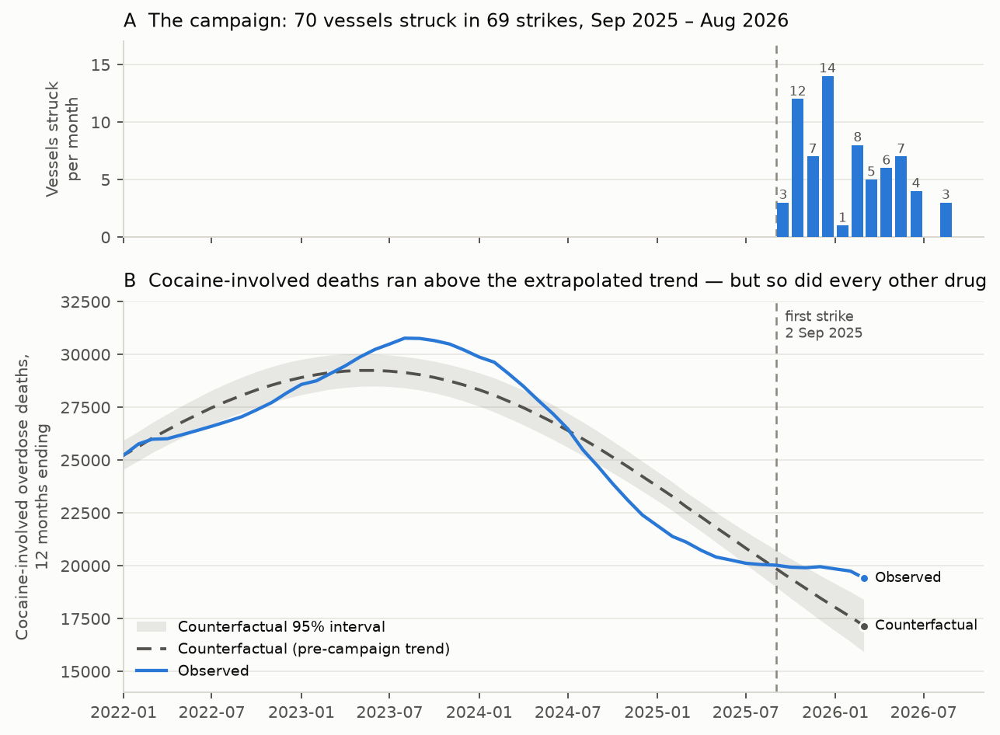
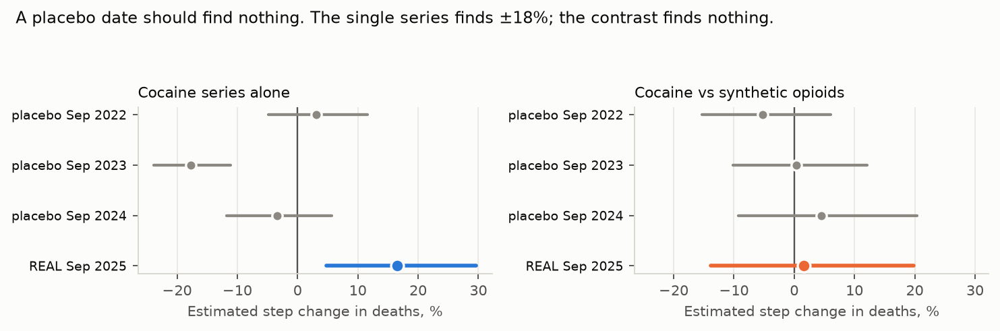
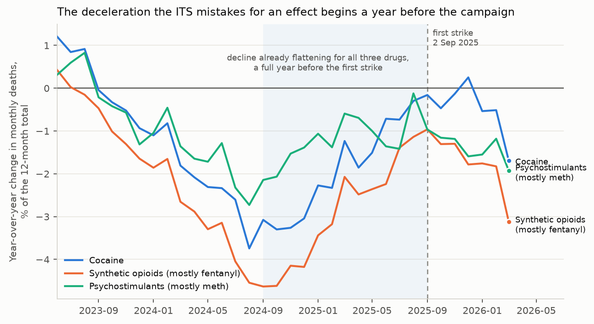
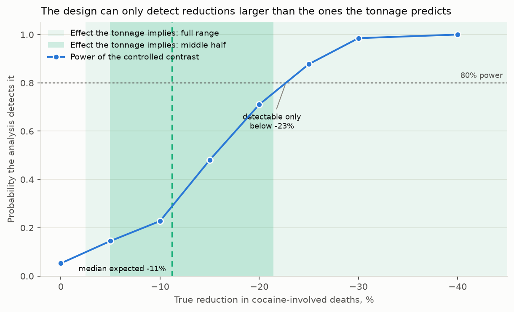

# Did the boat strikes cut America's cocaine supply?

An interrupted time series on the US military campaign against alleged drug
vessels in the Caribbean and Eastern Pacific — and on why the obvious version of
that analysis gives the wrong answer.

[](https://colab.research.google.com/github/aflaxman/ai_assisted_research/blob/claude/time-series-drug-supply-boats-0ozk3v/boat_strikes_drug_supply_its/tutorial.ipynb)



Run the obvious analysis and it looks like a finding: after the strikes began,
cocaine-involved overdose deaths ran **16.5% above** the trend projected from
before the campaign (95% CI +4.8 to +29.6). Deaths up, not down.

That number is an artifact. This post is about how to tell.

## TL;DR

- **The campaign.** 69 strikes destroyed 70 vessels between 2 September 2025 and
  28 August 2026, killing at least 213 people. Despite the framing, this is
  mostly not a Caribbean operation: **52 of the 70 vessels were struck in the
  Eastern Pacific**, 18 in the Caribbean.
- **The data problem.** CDC publishes provisional overdose deaths only as
  *12-month-ending rolling totals*, currently through March 2026. That gives
  seven windows touching the campaign, and a window ending *k* months in
  contains only *k* of 12 post-campaign months. Mean leverage: **1/3**.
- **Why the naive answer fails.** At 1/3 leverage the estimator amplifies model
  error about threefold. Run it on a placebo date — September 2023, when nothing
  happened — and it confidently reports **−17.7%**. What it actually measures is
  the deceleration of the overdose decline, which began around **August 2024, a
  year before the first strike**, and happened to fentanyl and methamphetamine
  at the same time.
- **The fix.** Compare cocaine against drugs the strikes cannot touch. Fentanyl
  and methamphetamine reach the US overland from Mexico; cocaine crosses open
  water. Shared national shocks cancel. In simulation this restores nominal
  interval coverage where the single-series estimator collapses to zero.
- **The result.** Cocaine versus synthetic opioids: **+1.6% (−13.8 to +19.9)** —
  null. Cocaine versus psychostimulants: +21.0% (+5.6 to +38.5), but it decays
  to +3.4% once you allow a four-month lag and loses significance in four of six
  alternative specifications. Comparator choice is driving it, not the campaign.
- **Was the analysis capable of finding anything?** Barely. The tonnage
  arithmetic implies an expected reduction of **−2.5% to −46% (median −11%)**.
  The design's minimum detectable effect at 80% power is **−22.7%**. At the
  median expected effect, power is about 25%.
- **The honest verdict.** No detectable effect on cocaine-involved overdose
  deaths. The interval is compatible with reductions as large as **14%**, and the
  design could not reliably have detected anything smaller than **23%**. And
  **18 more months of releases moves the detectable effect only from −22.7% to
  −20.6%** — waiting will not rescue this design.

## The problem: a question the public data is not built to answer

The policy claim is specific: strike the boats, and less cocaine reaches
American users. Both halves of that are hard to measure.

Cocaine supply itself is unobserved. There is no monthly price-and-purity
series, no wastewater panel, no flow estimate published fast enough to test a
campaign that is a year old. What does exist, updated monthly and to a
consistent definition, is **overdose deaths involving cocaine** — a downstream,
lagged, badly confounded proxy, and the only high-frequency series available.

So the design is forced: an interrupted time series on cocaine-involved deaths,
with September 2025 as the interruption. Which runs straight into the data's
shape.

CDC's provisional releases (`data.cdc.gov` resource `xkb8-kh2a`) report deaths
in the **12 months ending** each month, never the month itself. I tried hard to
get true monthly counts out of the CDC WONDER provisional API instead and did
not succeed; `8hzs-zshh`, which has drug-level and regional detail, is also
12-month-ending and stops in December 2025. So the rolling window is not a
choice to be modelled around — it is the data.

## The fix, part one: model the window instead of ignoring it

Fitting a segmented regression to a rolling total is wrong twice. Consecutive
observations share 11 of 12 months, so they are autocorrelated by construction.
And the window smears a step at month `T0` across the next 12 observations,
biasing the step toward zero.

Better to model the latent monthly count and let the rolling sum fall out of it:

```
log mu(m) = a + spline(m) + effect(m)        latent monthly mean
S(t)      = sum_{k=0..11} mu(t - k)          what CDC publishes
```

The covariance of overlapping sums has a closed form — two windows covary
through exactly the months they share:

```
Cov(S(t), S(t')) = phi * sum_{m in overlap(t, t')} mu(m)
```

which is `phi * A diag(mu) A'` for the moving-sum operator `A`: a banded matrix
of bandwidth 11. That makes the whole thing an iterated GLS problem
([`its_core.py:fit_its`](its_core.py)) with no deconvolution, no seed
estimation, and no invented monthly data. Baseline spline knots sit only in the
pre-campaign period, so the counterfactual extrapolates pre-campaign behaviour
rather than curving through the campaign.

It works. Simulate latent months with a known step, publish only the rolling
sums, and the estimator recovers the step with a bias under 0.03 in log terms
across 25 replicates ([`test_its_core.py`](test_its_core.py)). The naive
regression on the same data attenuates the step by more than half.

## The fix, part two: the reason the naive answer is still wrong

Recovering the step correctly *when the model is right* is not the same as being
trustworthy. Here is the number that governs everything:

| Window ending | 2025-09 | 2025-10 | 2025-11 | 2025-12 | 2026-01 | 2026-02 | 2026-03 |
|---|---|---|---|---|---|---|---|
| Fraction post-campaign | 0.08 | 0.17 | 0.25 | 0.33 | 0.42 | 0.50 | 0.58 |

A window responds to a step with weight equal to its post-campaign fraction, so
the step is identified with **mean leverage 1/3** — and any systematic error in
the latent model is amplified by roughly the inverse.

That amplification is not hypothetical. Overdose deaths are seasonal.
Count-scale periodic seasonality is annihilated exactly by a 12-month window,
but realistic *multiplicative* seasonality on a trending baseline is not: in
simulation it moves the rolling totals by under 3% — and displaces the estimated
step by up to 30 percentage points. Ninety-five percent interval coverage for a
single series falls from nominal to **zero out of 30 replicates**.

The real data agree. Run the estimator against placebo interruption dates when
nothing happened:



The cocaine series alone "detects" −17.7% in September 2023 and +3.1% in
September 2022. The estimator is not measuring interventions. It is measuring
curvature — and Figure 2 shows what curvature:



The year-over-year decline in monthly deaths was steepest in **August–September
2024** and flattened steadily from then on, for cocaine, fentanyl and
methamphetamine alike. By the time of the first strike the decline had nearly
stopped for all three. A counterfactual fitted before September 2025 projects
the old steep decline forward, the flattening arrives on schedule, and the model
scores the difference as an effect. The +16.5% is that mistake.

## The controlled design

If shared national dynamics are the problem, difference them out. Cocaine
reaching the US crosses open water from South America. Fentanyl and
methamphetamine are made in Mexico and moved overland. All three series share
American demand, naloxone access, reporting practice, and the seasonality that
wrecks the single-series fit. Only cocaine is exposed to the strikes.

So the estimator is the **contrast**: the cocaine step minus the comparator
step. In the same simulations that drove single-series coverage to zero, the
contrast keeps nominal coverage and bias under 0.04 in log terms.

Two caveats to state plainly. Because cocaine-involved and opioid-involved
deaths overlap heavily, adding their variances makes the interval
**conservative**. And that same overlap — CDC calls illicitly manufactured
fentanyl the main driver of cocaine-involved overdose deaths, and a death
involving both is counted in both series — means the two series share far more
than seasonality, which biases the contrast *toward zero*. This is the
analysis's central weakness, not a footnote.

### Results

| Estimator | Lag | Estimate | 95% CI |
|---|---|---|---|
| Cocaine alone | 0 | +16.5% | +4.8 to +29.6 |
| Synthetic opioids alone | 0 | +14.7% | +1.1 to +30.1 |
| Psychostimulants alone | 0 | −3.7% | −11.4 to +4.8 |
| **Cocaine vs synthetic opioids** | 0 | **+1.6%** | **−13.8 to +19.9** |
| Cocaine vs synthetic opioids | 2 | −0.4% | −15.8 to +17.7 |
| Cocaine vs synthetic opioids | 4 | −5.5% | −21.7 to +14.0 |
| Cocaine vs psychostimulants | 0 | +21.0% | +5.6 to +38.5 |
| Cocaine vs psychostimulants | 2 | +12.8% | −1.6 to +29.3 |
| Cocaine vs psychostimulants | 4 | +3.4% | −11.2 to +20.4 |

The fentanyl-comparator contrast is a clean null and stays null across lags.
The methamphetamine contrast is nominally positive at zero lag and decays to
nothing by four months — the pattern you expect from differing trend curvature,
not from a supply shock, which should if anything *strengthen* with lag. Across
six alternative specifications (reported instead of pending-adjusted counts,
step-plus-ramp, dose-response in cumulative vessels struck, stiffer and
wigglier baselines) the fentanyl contrast ranges −3.5% to +9.8% and the
methamphetamine contrast +10.1% to +21.0%. **No specification produces a
significant reduction.** Full tables in [`outputs/`](outputs/).

Note the sign throughout. Nothing here points to fewer cocaine deaths.

## How large an effect should we have expected?

A null means nothing until you know what you were looking for. Working forward
from tonnage ([`supply_arithmetic.py`](supply_arithmetic.py)):

- 70 vessels destroyed, at 1.0–2.5 t of cocaine each → **70–175 t**.
- The Coast Guard also had a record year: ~510,000 lb (231 t) seized in FY2025
  against a long-run average near 167,000 lb (76 t), a surge of **+156 t**.
- Total removed from a US-bound flow of 500–900 t/yr: **25–66%** of it.
- Scenarios leaving less cocaine to arrive than Americans demonstrably consume
  (~145 t/yr, RAND/ONDCP) are discarded as internally inconsistent.
- Times an elasticity of deaths to supply of 0.1–0.7 → an expected change of
  **−2.5% to −46%, median −11%**.

The elasticity is the weak link and is deliberately swept wide. Values near 1
are implausible: inventories buffer, demand is inelastic, and most
cocaine-involved deaths are driven by the fentanyl in the mix.

Two sub-cases matter for interpretation. **Strikes alone**, excluding the
interdiction surge, imply −0.8% to −41%. **Caribbean strikes alone** — the 18
vessels actually struck where the headlines say — imply −0.2% to −10.5%.

## Was the study capable of detecting that?



Simulating from the fitted models, with the real trajectory, the real estimated
dispersion, and the real seven post-campaign windows:

| True reduction | 0% | −5% | −10% | −15% | −20% | −25% | −30% |
|---|---|---|---|---|---|---|---|
| Power | 0.05 | 0.15 | 0.23 | 0.48 | 0.71 | 0.88 | 0.99 |

The false positive rate is 0.052 — the estimator is calibrated. The **minimum
detectable effect at 80% power is −22.7%**, which sits outside the middle half
of the range the tonnage implies. At the median expected effect the study has
about a one-in-four chance of noticing.

And more data barely helps. Extending the series by 6, 12 and 18 months moves
the detectable effect only to −22.7%, −21.1%, −20.6%. Precision here is limited
by dispersion and by the rolling window, not by follow-up length.

## What I actually conclude

1. **There is no evidence the campaign reduced cocaine-involved overdose
   deaths.** The best-controlled estimate is +1.6% (−13.8 to +19.9).
2. **That is not evidence the campaign had no effect on supply.** The interval
   still admits a 14% reduction, the design cannot reliably see reductions
   smaller than 23%, and most of the plausible range sits below that. Absence of
   evidence, in the strict sense.
3. **The 16.5% "increase" is an artifact** of extrapolating a decelerating
   trend, and the placebo test proves it rather than merely suggesting it.
4. **Anyone reporting a single-series ITS on this data is reporting noise**, in
   whichever direction their specification happens to point.
5. **Overdose deaths are the wrong outcome for this question.** Deaths counted
   as cocaine-involved are largely driven by the fentanyl they are mixed with,
   so the series tracks the fentanyl market at least as much as the cocaine
   market. There is a published argument that falling fentanyl *potency* drove
   the 2024 overdose decline — which would explain the shared deceleration in
   Figure 2 without any reference to boats.

## What would actually answer the question

- **Price and purity at the retail and wholesale level, monthly.** A supply
  shock shows up in price and purity long before it shows up in deaths. DEA
  collects the inputs; they are not published at usable frequency.
- **True monthly provisional death counts**, rather than 12-month-ending totals.
  This would raise leverage from 1/3 to 1 and is purely a publication choice.
- **Deaths involving cocaine *without* opioids**, which would separate the
  cocaine market from the fentanyl market.
- **Wastewater cocaine metabolite panels** for US cities, as Europe has run for
  years.
- **Departure-flow estimates** rather than seizure counts, so removals can be
  expressed as a fraction of something measured.
- **Pre-registration.** The specification space here is large enough that a
  motivated analyst can produce +21% or −5% from the same data. Fixing the
  comparator, lag and baseline in advance is the only defence.

## Reproducing this

```bash
cd boat_strikes_drug_supply_its
uv venv --python 3.11 .venv
uv pip install -r requirements.txt

# scripts import each other, so keep the project directory on the path
PYTHONPATH=. .venv/bin/python -P fetch_strikes.py      # --offline to use the snapshot
PYTHONPATH=. .venv/bin/python -P fetch_overdose.py
PYTHONPATH=. .venv/bin/python -P run_analysis.py
PYTHONPATH=. .venv/bin/python -P supply_arithmetic.py
PYTHONPATH=. .venv/bin/python -P power_analysis.py --reps 400
PYTHONPATH=. .venv/bin/python -P make_figures.py
.venv/bin/python -P -m pytest test_its_core.py -q
```

| File | What it does |
|---|---|
| [`fetch_strikes.py`](fetch_strikes.py) | Parses the sourced strike-by-strike table into `data/strikes.csv` |
| [`fetch_overdose.py`](fetch_overdose.py) | Pulls CDC VSRR 12-month-ending counts by drug |
| [`its_core.py`](its_core.py) | The rolling-window ITS estimator, leverage diagnostic, contrast |
| [`run_analysis.py`](run_analysis.py) | Primary, placebo and sensitivity tables |
| [`supply_arithmetic.py`](supply_arithmetic.py) | Tonnage → expected effect, with a consistency filter |
| [`power_analysis.py`](power_analysis.py) | Power curve and minimum detectable effect |
| [`test_its_core.py`](test_its_core.py) | 23 tests, including step recovery and the coverage collapse |

Data provenance: strike events from the Wikipedia table compiled from the New
York Times and ABC News trackers (snapshot committed in
`data/wikitext_snapshot.txt`); deaths from CDC VSRR provisional counts; tonnage
figures from USCG press releases, UNODC's World Drug Report and RAND/ONDCP
consumption estimates, all listed in `supply_arithmetic.SOURCES`.

## Challenges

1. **Break the contrast.** Find a comparator choice that produces a significant
   *reduction*. How hard is it? What does that tell you about the +21%?
2. **Regional exposure.** `8hzs-zshh` has HHS-region detail. Caribbean cocaine
   lands on the East Coast; Eastern Pacific cocaine arrives overland through the
   Southwest. Does a region-by-route interaction show anything the national
   series cannot?
3. **Recover the monthly series.** Given 12-month-ending totals and one seed of
   12 monthly values, monthly counts are exactly determined by
   `y(t) = S(t) − S(t−1) + y(t−12)`. Estimate the seed by smoothness
   regularisation and check how fast seed error propagates. Why did I not build
   the analysis on this?
4. **Fit the dose properly.** The campaign paused for 66 days in mid-2026. A
   real supply effect should relax during a pause. Build a distributed-lag dose
   model and see whether the pause is informative.
5. **Pre-register the 2027 analysis.** Write the specification now, in a file,
   before the data exist.

## Further reading

- Bernal, Cummins & Gasparrini, [Interrupted time series regression for the
  evaluation of public health interventions](https://doi.org/10.1093/ije/dyw098),
  *IJE* 2017 — the standard reference, including why controls matter.
- Degli Esposti et al., [Can synthetic controls improve causal inference in
  interrupted time series evaluations?](https://doi.org/10.1093/ije/dyaa152),
  *IJE* 2020.
- UNODC, [World Drug Report 2025](https://www.unodc.org/unodc/en/data-and-analysis/world-drug-report-2025.html)
  — cocaine manufacture at a record ~4,100 t.
- [Decreased fentanyl potency as the primary driver of the 2024 decline in U.S.
  overdose deaths](https://www.medrxiv.org/content/10.64898/2025.12.04.25341579.full.pdf)
  — the leading competing explanation for the trend this analysis has to
  extrapolate through.
- CDC, [VSRR Provisional Drug Overdose Death Counts](https://data.cdc.gov/NCHS/VSRR-Provisional-Drug-Overdose-Death-Counts/xkb8-kh2a)
  and the [technical notes](https://www.cdc.gov/nchs/nvss/vsrr/drug-overdose-data.htm)
  on pending-investigation adjustment.
- InsightCrime, [Timeline of US strikes against alleged drug
  boats](https://insightcrime.org/news/timeline-us-strikes-against-alleged-drug-boats/)
  and [A reduction in supply? Analyzing recent cocaine price
  trends](https://insightcrime.org/news/analysis/a-reduction-in-supply-analyzing-recent-cocaine-price-trends/).
- Wikipedia, [United States strikes on alleged drug traffickers during Operation
  Southern Spear](https://en.wikipedia.org/wiki/United_States_strikes_on_alleged_drug_traffickers_during_Operation_Southern_Spear).
