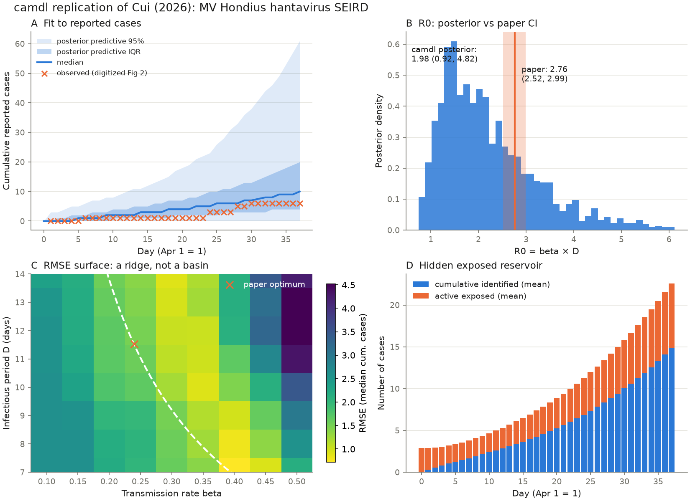
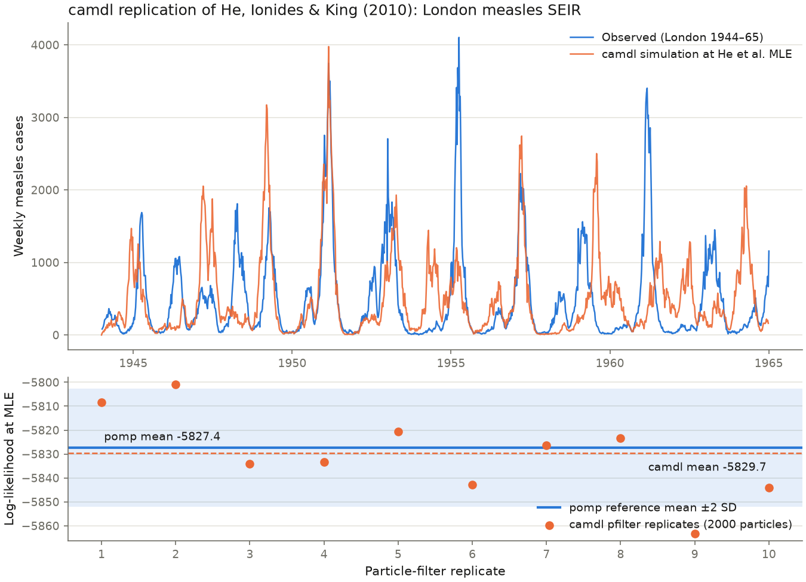

# Replicating epidemic-model papers with camdl

Two replications using [camdl](https://github.com/vsbuffalo/camdl)
([intro blog post](https://vincebuffalo.com/blog/introducing-camdl/)), a DSL +
compiler + inference stack for stochastic compartmental models:

1. **Cui (2026)** — the MV Hondius hantavirus cruise-ship outbreak SEIRD
   (the target paper; see below)
2. **He, Ionides & King (2010)** — London measles, camdl's external-validation
   benchmark (run first to prove the toolchain end-to-end)

---

# 1. Cui (2026): MV Hondius hantavirus SEIRD

Replicates: Jiaming Cui, *Modeling the Impact of Exposed Cases in a
Hantavirus Outbreak on a Cruise Ship*, medRxiv
[2026.05.08.26352718](https://doi.org/10.64898/2026.05.08.26352718)
(also on OpenReview as `78vM3b8mpk`). The paper fits a discrete-time
stochastic SEIRD with daily Poisson transitions to cumulative reported
cases from the April–May 2026 Andes-virus outbreak aboard the MV Hondius
(Apr 1 – May 7: 6 reported cases in the paper's Figure 2), using an
Ensemble Adjustment Kalman Filter (300 members, 10 iterations).



## What replicates and what doesn't

**Point estimates replicate.** PGAS posterior means from camdl land close
to the paper's Table 1 (fit: IF2 scout, 8 chains × 2000 particles, then
PGAS, 4 chains × 3000 sweeps, R̂ ≤ 1.005):

| parameter | camdl posterior mean (95% CrI) | paper (95% CI) |
|---|---|---|
| β (transmission rate) | 0.22 (0.11, 0.44) | 0.23 (0.22, 0.25) |
| Z (latency, days) | 9.4 (6.3, 11.9) | 9.12 (8.76, 9.48) |
| D (infectious period, days) | 10.3 (7.1, 13.8) | 11.52 (11.06, 11.97) |
| δ (case fatality) | 0.41 (0.31, 0.50) | 0.36 (0.35, 0.38) |
| R0 = β·D | 2.2 (0.9, 4.8) | 2.76 (2.52, 2.99) |

**The uncertainty quantification does not.** With uniform priors on the
paper's own Table 1 ranges, the posteriors for Z, D, and δ are nearly
indistinguishable from those priors — six reported cases carry almost no
information about them — and the paper's CIs are 5–20× narrower than the
posterior CrIs. Panel B makes the contrast explicit for R0: the paper's
(2.52, 2.99) sits inside a camdl posterior spanning (0.9, 4.8) that
includes R0 = 1. EAKF ensemble spread after 10 assimilation iterations is
known to under-state posterior uncertainty (filter variance collapses on
repeated passes over the same data); these results are consistent with
that failure mode.

**The claimed identifiability is a ridge.** Replicating the paper's
Figure 3C RMSE grid (panel C) shows the low-RMSE region is a valley along
the constant-product curve β·D ≈ 2.76, not a basin around the paper's
optimum — my grid minimum (β = 0.40, D = 7) has the *same R0* as the
paper's (β = 0.24, D = 11.52). camdl's LHS survey agrees: among the top
40 of 400 landscape points the log-likelihood varies by 0.3 nats while β
ranges 0.13–0.33 and D ranges 7–14 (β–D correlation −0.67). Only the
product β·D is identified by these data.

**The qualitative headline replicates.** The fitted model does imply a
hidden exposed reservoir comparable to the identified cases throughout
April (panel D mirrors the paper's Figure 4), and the fit envelope covers
the observed series (panel A vs the paper's Figure 2).

## Reproducibility notes

- **Data are not published with the paper.** The observed series was
  digitized from Figure 2's red crosses (37 daily values; jumps of
  +1/+2/+2/+1 on Apr 6 / 24 / 28 / 30). The Apr 6 first case matches
  WHO's reported first onset date.
- **N is never stated.** I used 181 (87 passengers + 60 crew aboard at
  the May 2 WHO notification, plus 34 who disembarked earlier, per WHO
  DON601/604). Early-phase dynamics are insensitive to N.
- **Initial conditions are never stated.** E(0) is estimated here as an
  initial-value parameter (posterior mean ≈ 2.9).
- **Inference differs by design:** the paper uses EAKF; camdl provides
  IF2 + PGAS. Matching point estimates across different inference
  machinery strengthens the point-estimate replication; the CI
  discrepancy is the substantive finding.
- WHO's later DON (May 27) estimated a **22-day mean incubation** for
  this outbreak — outside the paper's [6, 12]-day prior range for Z
  entirely, which would push R0 and the hidden-reservoir estimates
  further still.

## Files

- `hondius_seird.camdl` — the SEIRD model (paper's Poisson daily-update
  process as chain-binomial at dt = 1; R0 declared as a `quantities {}`
  derived output)
- `fit_hondius.toml` — IF2 scout + PGAS posterior configuration
- `data/hondius_cases.tsv`, `data/hondius_cumulative.tsv` — digitized series
- `results/hondius_posterior_draws.tsv` — 1600 PGAS posterior draws
- `results/rmse_grid.tsv` — the Figure 3C replication grid
- `plot_hondius.py` — the four-panel figure

## Quickstart

```bash
camdl check hondius_seird.camdl
camdl fit run fit_hondius.toml --label hondius --seed 3
camdl fit summary @hondius
camdl simulate hondius_seird.camdl --draws posterior \
    --fit results/fits/fit_hondius-*/ -n 400 --seed 21 \
    --obs-only results/hondius_postpred_obs.tsv
uv run python plot_hondius.py
```

---

# 2. He, Ionides & King (2010) with camdl

Notes from a first end-to-end run of [camdl](https://github.com/vsbuffalo/camdl)
([intro blog post](https://vincebuffalo.com/blog/introducing-camdl/)), a DSL +
compiler + inference stack for stochastic compartmental models, developed at
the Institute for Disease Modeling.



## What this replicates

He, Ionides & King (2010), *Plug-and-play inference for disease dynamics:
measles in large and small populations as a case study*, J. R. Soc. Interface
7:271–283 ([doi:10.1098/rsif.2009.0151](https://doi.org/10.1098/rsif.2009.0151)).
The London weekly measles notification series (1944–1965), fit with a
stochastic SEIR model featuring school-term forcing, a cohort school-entry
pulse, inhomogeneous mixing, and extra-demographic transmission noise.

This directory exercises camdl's workflow at the paper's published London MLE
(R0 = 56.8, amplitude = 0.554, rho = 0.488, ...):

1. `camdl check` — compile-time validation (units, dimensions)
2. `camdl simulate` — forward simulation at the MLE vs the observed series
3. `camdl pfilter` — particle-filter log-likelihood at the MLE, compared
   against the reference implementation (R's `pomp`, the package from the
   original authors)
4. `camdl fit run` — a small IF2 "scout" fit re-estimating three headline
   parameters from the data

## Files

- `he2010_london.camdl` — the model (from camdl's external-validation suite,
  Apache-2.0; annotated line-by-line correspondence with the paper)
- `params/he2010_london_mle.toml` — published MLE values
- `data/he2010_london_cases.tsv` — London weekly notifications, 1096 weeks
- `data/he2010_london_covariates.tsv` — spline-smoothed population and
  (4-year-lagged) birthrate covariates
- `fit_he2010.toml` — IF2 scout-fit configuration
- `plot_replication.py` — figure: observed vs simulated series + pfilter
  log-likelihoods vs the pomp reference

## Results

All runs on a fresh Linux container, camdl 0.1.0+578d682, published London
MLE parameters throughout.

**Particle-filter log-likelihood at the MLE** (2000 particles × 10
replicates, 1096 weekly observations):

| implementation | mean loglik | sd | n |
|---|---|---|---|
| camdl `pfilter` | **−5829.7** | 18.1 | 10 |
| pomp `pfilter()` (reference) | −5827.4 | 12.3 | 20 |

The 2.3-nat gap is inside Monte Carlo error (combined SE ≈ 6.5 nats) and
inside the ~10-nat systematic offset expected from camdl's continuous vs
pomp's discretized Normal observation density. One 2000-particle filter
pass over 21 years of data takes about 6 seconds.

**Forward-simulation ensemble at the MLE** (`results/forward_ensemble_summary.tsv`):

| stat | camdl (20 seeds) | pomp (200 sims) |
|---|---|---|
| total cases, 21 years | 538,063 ± 8,696 | 538,602 ± 7,274 |
| final-year cases | 25,787 ± 14,047 | 27,638 ± 11,497 |
| persistence rate | 20/20 | 200/200 |

The simulation reproduces London's biennial measles cycle (top panel of
the figure) — peaks land in the right years with the right amplitude,
which is the regime signature He et al.'s noise and forcing structure
exists to capture.

**IF2 scout fit** re-estimating R0, amplitude, and rho from the data
(4 chains × 2000 particles × 25 iterations, ~30 min wall). A first
attempt at 500 particles was killed by camdl's particle-filter degeneracy
watchdog on all 4 chains (sustained ESS collapse) — the error message
named the fix: more particles or tighter bounds. The rerun:

| parameter | scout estimate | He et al. published MLE |
|---|---|---|
| R0 | 53.6 | 56.8 |
| amplitude | 0.477 | 0.554 |
| rho | 0.545 | 0.488 |

A deliberately small scout, and camdl says so: the compound convergence
gate **fails** the run (max  = 1.074 > 1.01 threshold; best chain
loglik −6119 vs −5827 at the published MLE), the dt-Richardson check
flags discretization dependence at dt = 1, and per-chain diagnostics
recommend more particles. The estimates move from arbitrary starts
toward the published values, but the tooling — correctly — refuses to
certify a 4-chain × 25-iteration run as converged. He et al.'s actual
analysis used orders of magnitude more search effort; camdl's docs
suggest 36 chains × 200 iterations for a real scout stage.

## Impressions of camdl

- The compiler earns its keep: `camdl check` dimension-checks every rate
  expression, and the model file documents each place it must deviate
  from clean dimensional analysis (e.g. He et al.'s phenomenological
  `(I + iota)^alpha` mixing term requires an explicit
  `unchecked_dim(..., reason = ...)` escape hatch).
- Every run is content-addressed and cached (`results/sims/...`,
  `camdl cat <hash>`), so reruns are free and provenance is automatic.
- Failure modes are diagnosed, not silent: the ESS-collapse watchdog
  killed an under-resourced fit with a specific, actionable error rather
  than returning garbage estimates, and the scout-convergence gate
  (Â threshold + decibans), dt-Richardson check, and near-bound warnings
  all fired on the small demo fit rather than letting it pass as "done."
- Speed: a 21-year chain-binomial simulation runs in ~50 ms; a
  2000-particle filter pass in ~6 s of CPU.

## Quickstart

```bash
./install.sh   # in a camdl clone — installs OCaml + Rust toolchains and camdl
camdl check he2010_london.camdl
camdl simulate he2010_london.camdl --params params/he2010_london_mle.toml \
    --backend chain_binomial --dt 1.0 --seed 42 --obs-only results/sim_obs.tsv
camdl pfilter he2010_london.camdl --params params/he2010_london_mle.toml \
    --data data/he2010_london_cases.tsv --particles 2000 --replicates 10 \
    --seed 42 --output results/pfilter_logliks.tsv
uv run python plot_replication.py
```
