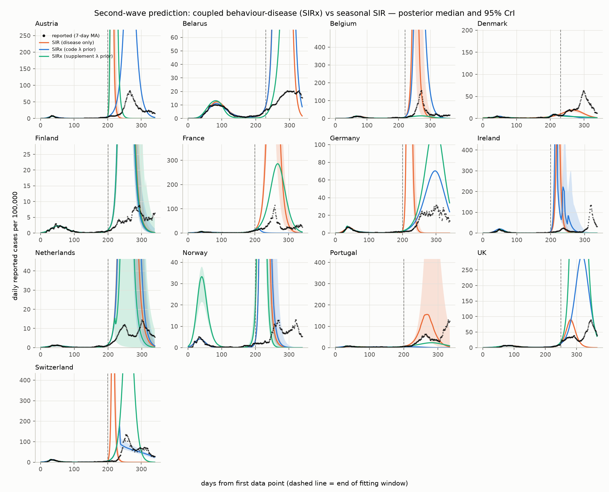
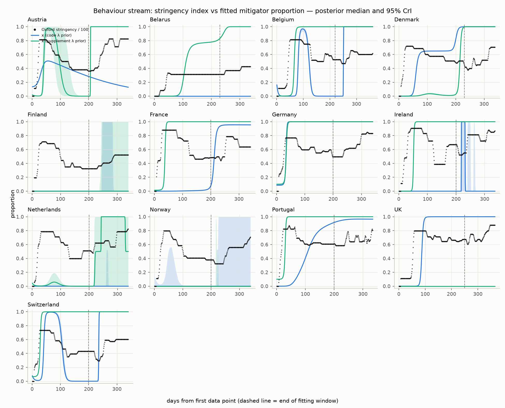
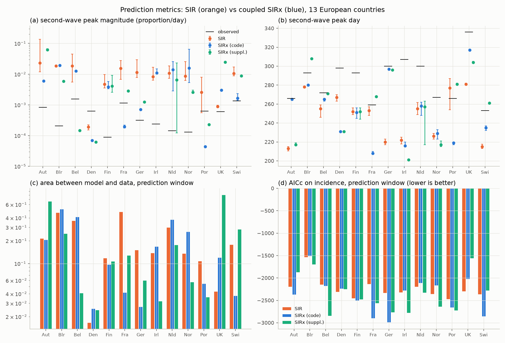

# Frimpong & Bauch (2026) with camdl: pandemic waves from coupled behaviour-disease dynamics

Replicates: Sefah Frimpong & Chris T. Bauch, *Pandemic waves as the
outcome of coupled behaviour and disease dynamics: a mathematical
modelling study*, J. Theor. Biol. 2026
([ScienceDirect](https://www.sciencedirect.com/science/article/pii/S0022519326001955);
medRxiv [2026.02.05.26345658](https://doi.org/10.64898/2026.02.05.26345658);
[authors' code + data](https://github.com/SefahF/Pandemic-waves-as-the-outcome-of-coupled-social-and-disease-dynamics)).

The paper fits two deterministic ODE models to the Spring-2020
SARS-CoV-2 wave in 13 European countries and tests how well each
retrodicts the Fall-2020 second wave:

- **SIR** ("disease model"): seasonal-transmission SIR fitted to daily
  reported case incidence only.
- **SIRx** ("coupled model"): the same SIR plus an imitation-dynamics
  behaviour state x (the proportion supporting NPIs) that suppresses
  transmission by (1 − εx) and grows or decays with the payoff
  difference between mitigating (cost c) and not (perceived reported
  prevalence, decaying as e^(−λt)); fitted jointly to case incidence
  and the Oxford stringency index (OSI/100).

Its headline: the SIR model fits the first wave slightly better, but
badly overshoots the second wave; the coupled model predicts the second
wave's magnitude far better and is preferred by AICc in every country.



## What replicates and what doesn't

**The paper's headline numbers reproduce exactly from its published
particles.** Before any refitting, `validate_metrics.py` pushes the
authors' own posterior particles (their repository's `Paper Particles/`,
100 lowest-error per country — the paper's stated procedure) through
this replication's independent model implementation and metric code.
Every abstract-level number comes back:

| metric (mean ± SD over 13 countries) | paper | reimplementation on the paper's particles |
|---|---|---|
| SIR AICc, prediction window | −2295 ± 212 | −2295 ± 154 |
| SIRx AICc, prediction window | −2638 ± 345 | −2687 ± 357 |
| SIR area between curves | 0.16 ± 0.11 | 0.166 ± 0.103 |
| SIRx area between curves | 0.072 ± 0.071 | 0.065 ± 0.073 |
| SIR predicted second-peak magnitude | 0.0083 ± 0.0090 | 0.0081 ± 0.0074 |
| SIRx predicted second-peak magnitude | 0.0015 ± 0.0014 | 0.0014 ± 0.0014 |
| observed second-peak magnitude | 0.0006 ± 0.0005 | 0.0006 ± 0.0005 |
| SIR predicted second-peak day | 253 ± 31 | 249 ± 25 |
| SIRx predicted second-peak day | 283 ± 19 | 284 ± 20 |

Table S3's SIRx R0 and Reff reproduce to two decimals for all 13
countries (median relative error 1%) — once its statistic is
reverse-engineered from the authors' notebook: it is the **maximum over
the training window of the across-particle mean R0(t) curve**, not a
median "for the prediction period – after 200 days" as the caption
says. The paper's SIR R0 for its four high-seasonality countries
(Austria, Belgium, Norway, Switzerland) is not reproducible from its
published particles under the notebook's own formula; the other nine
match.

**Independent camdl refits replicate the SIR results and the
qualitative SIRx claims, but not the SIRx margins.** Refitting from
scratch (camdl ODE backend, Sbplx scout + adaptive MH, uniform priors):

| metric (mean ± SD) | paper | camdl SIR | camdl SIRx (code λ prior) | camdl SIRx (suppl. λ prior) |
|---|---|---|---|---|
| AICc, prediction window | SIR −2295 / SIRx −2638 | −2242 ± 237 | −2368 ± 411 | −2368 ± 426 |
| area between curves | SIR 0.16 / SIRx 0.072 | 0.209 ± 0.151 | 0.182 ± 0.167 | 0.205 ± 0.251 |
| second-peak magnitude | SIR 0.0083 / SIRx 0.0015 | 0.0102 ± 0.0071 | 0.0068 ± 0.0068 | 0.0092 ± 0.0173 |
| second-peak day (data: 285 ± 24) | SIR 253 / SIRx 283 | 247 ± 25 | 252 ± 33 | 259 ± 34 |

The SIR column lands on the paper's SIR numbers. The refitted SIRx
beats SIR on AICc in 7/13 countries (code prior) or 9/13 (supplement
prior) — the paper reports 13/13 — and its average overshoot sits
between the paper's SIRx and SIR. The paper's Belarus/Finland failure
(coupled model degenerates to behaviour-off) reproduces: Belarus under
the code prior and Finland under both land in x ≈ 0 modes.





**The λ prior is load-bearing, and the paper's two sources disagree
about it.** The supplement's Table S2 gives the risk-memory decay
λ ∈ [0, 0.03]; the released code declares (0, 0.2). Under the code's
range, maximum likelihood finds a *better-fitting* first-wave mode
(λ ≈ 0.065 for Austria, +65 nats) in which e^(−λt) has fully decayed by
autumn — perceived risk is dead, NPI support cannot rebound, and the
model's headline mechanism for capping the second wave disappears.
Constrained to the supplement's range, the Austria fit lands almost
exactly on the paper's published estimates (β 0.285 vs 0.30, γ 0.21 vs
0.23, ε 0.352 vs 0.348, λ 0.011, i0 1.2e-4 vs 1.4e-4). The paper's own
particles concentrate at λ ≈ 0.01 even though its code allowed 0.2 —
the second wave's predictability hinges on a prior the data actively
disfavour within the training window.

**ABC-SMC's "posterior" width is set by its tolerance, not the data.**
The deterministic-ODE likelihood posterior is essentially a point: 20,000
MH draws span ~0.02 log-likelihood units, and each parameter's 95% CrI
has near-zero width. The paper's wide violin plots and credible
intervals are level-sets of parameters fitting within the ABC tolerance
— a different statistical object, with width chosen by the tolerance
schedule. (Neither is honest uncertainty for a deterministic model with
autocorrelated errors; a stochastic process model — camdl's
chain-binomial backend with PGAS — would be the principled route, at
substantially higher compute.) Because point-mass posteriors inherit
whatever local optimum the scout finds, per-country SIRx refits are
bimodal-lottery-like — visible as the heterogeneity in the figures —
whereas ABC-SMC's tolerance cloud averages over that basin structure.

**The behaviour stream needs an outside weight.** With a free
observation sd on the stringency stream, maximum likelihood inflates it
to ~0.5 and washes the stream out entirely, for every country — the
generalisation of the paper's Belarus/Finland failure mode. The ABC
design's *separate behaviour tolerance* is what keeps behaviour in the
model at all; the likelihood analogue used here fixes σ_x = 300‰, the
RMS the paper's own accepted particles achieve (0.29–0.50).

## Model translation notes (paper → camdl)

- **Code beats supplement where they disagree.** The supplement writes
  the seasonal forcing as `cos(t − φ)` (period 2π days) and gives
  φ ∈ [−90°, 90°], λ ∈ [0, 0.03], c ∈ [0, 0.1], κ ≤ 10,000/day. The
  authors' scripts use `cos(2π(t − φ)/365)` with φ ∈ [−135, −45] days,
  λ ∈ [0, 0.2], c ∈ [0, 0.01], κ ∈ [100, 5000] — and the behaviour
  payoff uses **reported** prevalence I/η₀, not I. This replication
  follows the code.
- **The SIR variant carries a hidden 0.8.** The paper's SIR script fixes
  ε = 1, x = 0.2, multiplying transmission by a constant (1 − 0.2) = 0.8
  — a pure rescale of β, reproduced literally so fitted β is comparable.
  The paper's R0 = β/γ convention omits it.
- **Counts, not proportions.** camdl compartments are populations, so
  S, I, R are counts with N = pop and the data TSVs are the paper's
  proportion series × pop. x becomes a real-valued compartment
  X = pop·x with an `ode {}` law; identical dynamics up to scale.
  (The paper's script assigns the Netherlands Germany's population — a
  bug kept for fidelity; it only rescales the count units.)
- **camdl's `normal` likelihood is a discretized-count density**, so the
  OSI stream is fitted on a permille (0–1000) scale where rounding costs
  <0.1%.
- **Likelihood replaces ABC tolerances.** The paper runs ABC-SMC with
  separate acceptance tolerances for the incidence and behaviour
  streams; here each stream gets a normal likelihood, whose sd is the
  tolerance's analogue. The case-stream sd σ_i is estimated; the
  behaviour-stream sd is **fixed** at 300‰ — the paper's own accepted
  particles have behaviour RMS 0.29–0.50, and with a *free* scale the
  ML solution inflates it to wash the OSI stream out entirely (the
  paper's Belarus/Finland failure mode, for every country).
- **Ii0 (initial reported incidence) is dropped**: it affects only the
  day-1 observation, which is ≈0 everywhere. Parameter-count parity
  with the paper holds anyway (SIR 7, SIRx 12 fitted parameters).
- **Fitting**: camdl's ODE backend, NLopt-Sbplx multi-start scout
  (LHS starts) then 4-chain adaptive Metropolis-Hastings, 80k
  iterations, uniform priors on the paper's ranges. The training window
  is each country's Table-S1 cutoff (200–250 days); the rest is
  out-of-sample. (camdl parses `[data].holdout_after` but does not yet
  apply it — the split is materialised in `*_train.tsv` files.)

## Files

- `sir_covid.camdl`, `sirx_covid.camdl` — the two models
- `prep_data.py` — builds `data/*.tsv` from the authors' repository
- `gen_fits.py` — writes the 26 per-country fit configs into `fits/`
- `run_fits.sh` — runs all fits (~2.5 h on 4 cores)
- `analyze.py` — posterior trajectories + the paper's metrics
  (peaks, area, AICc, Table S3) via a scipy re-integration validated
  against camdl's ODE backend to <0.2%
- `validate_metrics.py` — the same metric code run on the authors'
  published particles (the implementation-validation layer)
- `plot_waves.py` — the three figures
- `results/summary_stats.tsv`, `results/table_s3_comparison.tsv`,
  `results/paper_particle_metrics.tsv`

## Quickstart

```bash
python3 prep_data.py /path/to/authors-repo-clone
python3 gen_fits.py
./run_fits.sh                                  # ~4 h on 4 cores, 39 fits
uv run python pandemic_waves/validate_metrics.py /path/to/authors-repo-clone
uv run python pandemic_waves/analyze.py        # both from camdl_replication/
uv run python pandemic_waves/plot_waves.py
```
