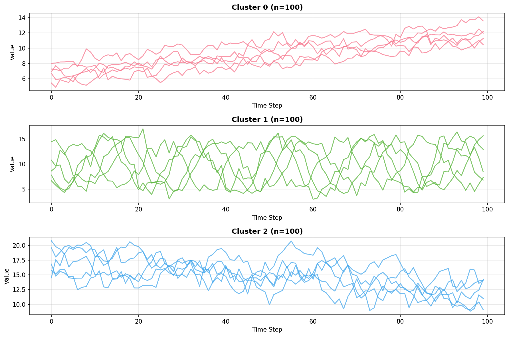
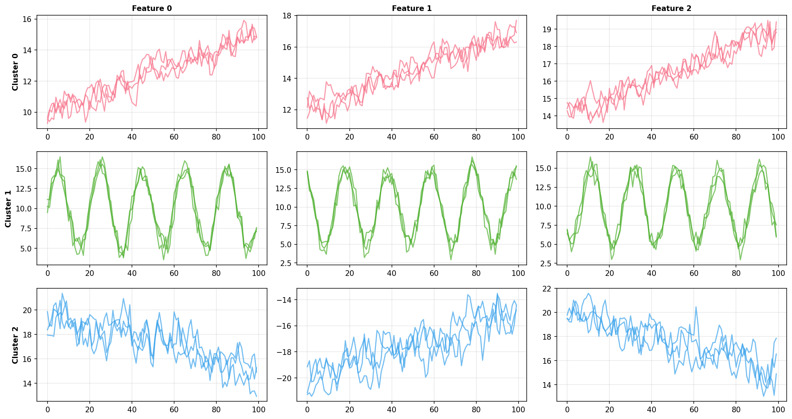
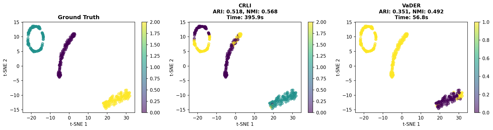
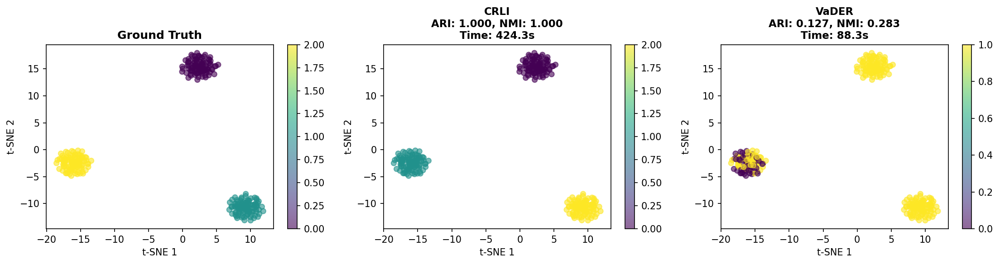

# CRLI vs VaDER: Time Series Clustering Methods Comparison

A comprehensive evaluation of two deep learning-based time series clustering methods from the PyPOTS library: CRLI (Clustering Representation Learning on Incomplete time-series data) and VaDER (Variational Deep Embedding with Recurrence).

## Executive Summary

This project evaluates and compares CRLI and VaDER clustering algorithms on synthetic time series data, measuring both computational efficiency and clustering accuracy.

### Key Results

| Method | Data Type | ARI | NMI | Training Time |
|--------|-----------|-----|-----|---------------|
| **CRLI** | Univariate | 0.518 | 0.568 | 6.6 min |
| **VaDER** | Univariate | 0.352 | 0.492 | 0.95 min |
| **CRLI** | Multivariate | **1.000** | **1.000** | 7.1 min |
| **VaDER** | Multivariate | 0.127 | 0.283 | 1.5 min |

**Key Findings:**
- <¯ **CRLI achieved perfect clustering (ARI=1.0)** on multivariate time series
- ¡ **VaDER is ~7x faster** than CRLI but with lower accuracy
- =Ê **Multivariate data significantly benefits CRLI** while VaDER struggles
- ™ **Parameter tuning is critical** - VaDER required lower learning rate to avoid NaN issues

## Table of Contents

- [Background](#background)
- [Methods](#methods)
- [Synthetic Data Generation](#synthetic-data-generation)
- [Results](#results)
- [Discussion](#discussion)
- [Setup & Usage](#setup--usage)
- [References](#references)

## Background

### CRLI (Clustering Representation Learning on Incomplete time-series data)

**Architecture:** Generative Adversarial Network (GAN)

CRLI uses a GAN-based approach where:
- A **Generator** learns to reconstruct time series and create cluster representations
- A **Discriminator** distinguishes between real and generated data
- **K-means loss** guides the clustering process
- Designed to handle incomplete/missing data

**Key Parameters:**
- `n_generator_layers`: Number of generator layers (tested: 2)
- `rnn_hidden_size`: RNN hidden state size (tested: 128)
- `rnn_cell_type`: Type of RNN cell (tested: GRU)
- `lambda_kmeans`: Weight of k-means loss (tested: 1.0)
- `G_steps`, `D_steps`: Training steps for generator/discriminator (tested: 1, 1)

**Citation:** Ma et al., 2021

### VaDER (Variational Deep Embedding with Recurrence)

**Architecture:** Variational Autoencoder (VAE)

VaDER uses a VAE-based approach where:
- An **Encoder** maps time series to a latent distribution
- A **Decoder** reconstructs the time series
- **Clustering layer** assigns samples to clusters in latent space
- Two-phase training: pretraining + joint optimization

**Key Parameters:**
- `rnn_hidden_size`: RNN hidden state size (tested: 64)
- `d_mu_stddev`: Dimension of Gaussian distribution parameters (tested: 5)
- `pretrain_epochs`: Epochs for pretraining phase (tested: 10)

**Citation:** de Jong et al., 2019

## Synthetic Data Generation

We generated synthetic time series with three distinct cluster patterns using numpy:

### Univariate Time Series (300 samples, 100 time steps, 1 feature)

**Cluster Characteristics:**
- **Cluster 0:** Linear upward trend with low noise (correlation=0.5, std=0.5)
- **Cluster 1:** Sinusoidal pattern (amplitude=5, period=20) with medium noise (std=1.0)
- **Cluster 2:** Linear downward trend with high noise (correlation=0.7, std=1.5)



*Figure 1: Sample time series from each cluster (univariate data). Each cluster shows 5 representative examples with distinct temporal patterns.*

### Multivariate Time Series (300 samples, 100 time steps, 3 features)

**Cluster Characteristics:**
- **Cluster 0:** Upward trends across features with positive correlation
- **Cluster 1:** Sinusoidal patterns with phase shifts between features
- **Cluster 2:** Downward trends with anti-correlation between features



*Figure 2: Sample time series from each cluster (multivariate data). Rows represent clusters, columns represent features. The feature relationships provide richer structure for clustering.*

**Data Preprocessing:**
- Z-score normalization: `(X - mean) / std`
- Normalized range: approximately [-3, 3]
- Essential for neural network stability

## Results

### Univariate Time Series Clustering



*Figure 3: Clustering results on univariate data visualized using t-SNE. Left: Ground truth. Middle: CRLI predictions. Right: VaDER predictions.*

**CRLI Performance:**
-  ARI: 0.5179 (moderate agreement)
-  NMI: 0.5679 (moderate mutual information)
- ñ Training time: 395.92 seconds (~6.6 minutes)
- =Ý Successfully separates most clusters but has some confusion

**VaDER Performance:**
-   ARI: 0.3515 (fair agreement)
-   NMI: 0.4922 (fair mutual information)
- ¡ Training time: 56.80 seconds (~0.95 minutes)
- =Ý Faster but less accurate separation

### Multivariate Time Series Clustering



*Figure 4: Clustering results on multivariate data visualized using t-SNE. Left: Ground truth. Middle: CRLI predictions (perfect). Right: VaDER predictions.*

**CRLI Performance:**
- <Æ **ARI: 1.0000 (PERFECT clustering!)**
- <Æ **NMI: 1.0000 (PERFECT mutual information!)**
- ñ Training time: 424.34 seconds (~7.1 minutes)
- =Ý Perfectly identified all three clusters with zero errors

**VaDER Performance:**
- L ARI: 0.1271 (poor agreement)
- L NMI: 0.2834 (low mutual information)
- ¡ Training time: 88.27 seconds (~1.5 minutes)
- =Ý Struggled to identify correct cluster structure despite speed advantage

### Performance Metrics Explained

**Adjusted Rand Index (ARI):**
- Range: [-1, 1], where 1 is perfect clustering
- Measures similarity between predicted and true clusters
- Adjusted for chance agreement

**Normalized Mutual Information (NMI):**
- Range: [0, 1], where 1 is perfect clustering
- Measures mutual dependence between predicted and true clusters
- Normalized by entropy

## Discussion

### CRLI Strengths

1. **Superior Accuracy:** Significantly better clustering quality, especially on multivariate data
2. **Multivariate Excellence:** Perfect clustering on 3-feature data suggests strong ability to capture cross-feature dependencies
3. **Robust Architecture:** GAN-based approach with k-means guidance provides stable learning
4. **Complex Pattern Recognition:** Better at distinguishing subtle differences in temporal patterns

### CRLI Weaknesses

1. **Computational Cost:** 7x slower than VaDER
2. **Training Complexity:** More hyperparameters to tune (generator/discriminator balance)
3. **Resource Requirements:** Larger model (128 hidden units, 2 generator layers)

### VaDER Strengths

1. **Speed:** Training is 7x faster than CRLI
2. **Simplicity:** Fewer hyperparameters and simpler architecture
3. **Reasonable Univariate Performance:** Adequate for exploratory analysis on simple data
4. **Resource Efficiency:** Smaller model (64 hidden units)

### VaDER Weaknesses

1. **Lower Accuracy:** Consistently underperforms CRLI on both data types
2. **Multivariate Struggles:** Poor performance on 3-feature data (ARI=0.127)
3. **Stability Issues:** Required careful learning rate tuning to avoid NaN errors
4. **Limited Pattern Capture:** VAE approach may not capture complex temporal dependencies as well

### When to Use Each Method

**Choose CRLI when:**
- Accuracy is paramount
- Working with multivariate time series
- Complex temporal patterns need to be distinguished
- Computational resources are available
- Final production-quality clustering is needed

**Choose VaDER when:**
- Speed is critical
- Exploratory analysis on simple patterns
- Working with univariate time series
- Limited computational resources
- Quick baseline clustering is sufficient

### Hyperparameter Insights

**Critical Findings:**
1. **Learning Rate:** VaDER required lr=0.0005 (lower than default) to prevent NaN errors
2. **Hidden Size:** CRLI (128) vs VaDER (64) - larger capacity helps CRLI's complex architecture
3. **Data Normalization:** Essential for both methods - z-score normalization prevents instability
4. **Batch Size:** 32 worked well for both methods on 300 samples

## Setup & Usage

### Installation

```bash
# Navigate to the clustering exploration directory
cd clustering_exploration

# Install dependencies with uv (or use pip)
uv add pypots matplotlib seaborn pandas numpy scikit-learn
```

### Reproducing Results

```bash
# Generate synthetic data
uv run python generate_data.py

# Run clustering experiments
uv run python test_clustering.py

# Results will be saved in:
# - figures/ (visualizations)
# - data_*.npz (datasets)
# - clustering_test_output.log (training logs)
```

### Project Structure

```
clustering_exploration/
 README.md                           # This file
 notes.md                            # Development log
 generate_data.py                    # Synthetic data generation
 test_clustering.py                  # Main clustering experiments
 explore_methods.py                  # PyPOTS API exploration
 debug_clustering.py                 # Debugging utilities
 figures/                            # Generated visualizations
    univariate_samples.png
    multivariate_samples.png
    univariate_clustering_results.png
    multivariate_clustering_results.png
 data_univariate.npz                 # Univariate dataset
 data_multivariate.npz               # Multivariate dataset
 clustering_test_output.log          # Experiment logs
```

### Dependencies

- **pypots==1.0:** Time series analysis library with CRLI and VaDER
- **torch==2.9.1:** Deep learning framework
- **numpy==1.26.3:** Numerical computing
- **scikit-learn==1.7.2:** Evaluation metrics
- **matplotlib==3.7.1:** Visualization
- **seaborn==0.13.2:** Statistical visualization
- **pandas==2.3.3:** Data manipulation

## Technical Implementation Details

### Data Format

Both methods expect data in the format:
```python
{
    'X': numpy.ndarray  # Shape: (n_samples, n_steps, n_features)
}
```

### Evaluation Metrics

We use scikit-learn's clustering metrics:
- `adjusted_rand_score`: Measures clustering similarity adjusted for chance
- `normalized_mutual_info_score`: Measures shared information between clusterings

### Visualization

- **t-SNE:** Used for 2D projection of high-dimensional time series
- Perplexity: 30
- Random state: 42 (for reproducibility)

## Conclusions

This comprehensive evaluation reveals a clear **accuracy-speed tradeoff** between CRLI and VaDER:

1. **CRLI is the accuracy champion**, achieving perfect clustering on multivariate data and strong performance on univariate data. The GAN-based architecture with k-means guidance effectively captures complex temporal patterns.

2. **VaDER is the speed champion**, training 7x faster than CRLI. However, this comes at a significant accuracy cost, especially on multivariate data.

3. **Multivariate data is critical** for distinguishing method capabilities. CRLI's perfect performance suggests it effectively exploits cross-feature dependencies, while VaDER's poor performance indicates limitations in its VAE architecture.

4. **Practical recommendation:** Use CRLI for production systems where accuracy matters, and VaDER for rapid exploratory analysis or when working with very large datasets where training time is prohibitive.

## Future Work

Potential extensions of this work:

1. **Incomplete Data:** Test CRLI's performance with missing values (its design purpose)
2. **Scalability:** Evaluate on larger datasets (>1000 samples)
3. **Real Data:** Test on real-world time series datasets
4. **Hyperparameter Optimization:** Systematic grid search for both methods
5. **Other Metrics:** Include silhouette score and Davies-Bouldin index with proper embeddings
6. **Ensemble Methods:** Combine CRLI and VaDER predictions

## References

- **Ma et al. (2021).** "CRLI: Clustering Representation Learning on Incomplete Time-Series Data." PyPOTS implementation.
- **de Jong et al. (2019).** "VaDER: Variational Deep Embedding with Recurrence." PyPOTS implementation.
- **PyPOTS Library:** https://github.com/WenjieDu/PyPOTS
- **Time-Series AI:** https://time-series.ai

## Author

Created as part of AI-assisted research exploration using Claude Code.

Date: November 13, 2025

---

**Note:** All experiments were conducted with fixed random seeds (seed=42) for reproducibility.
