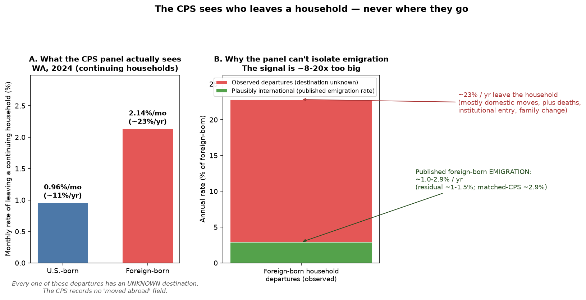
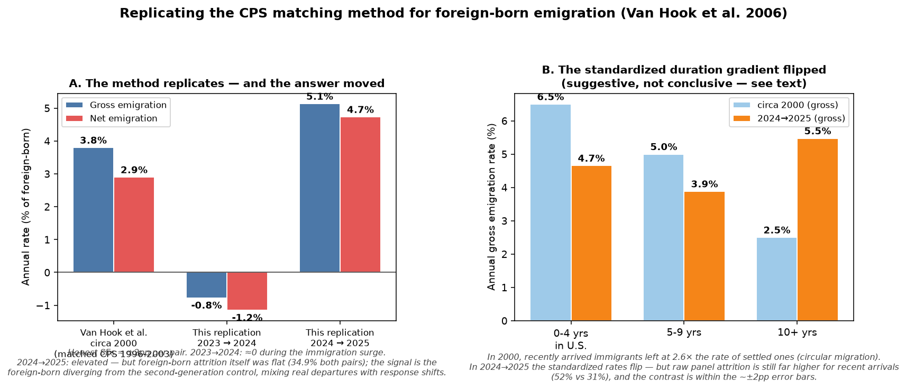
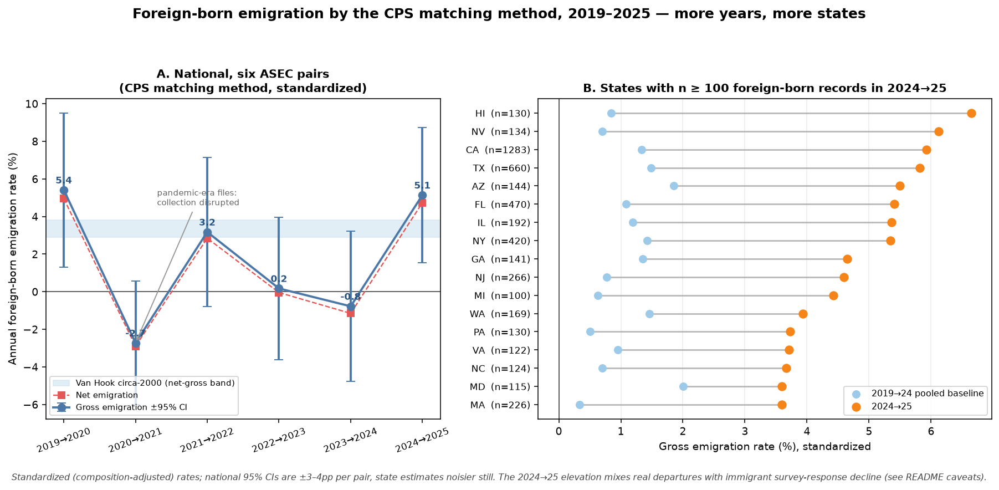
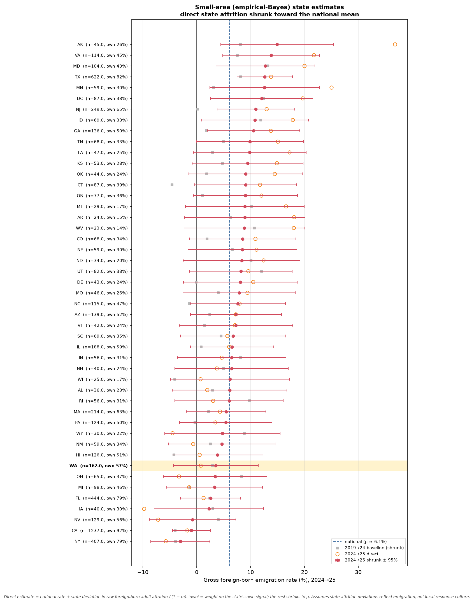
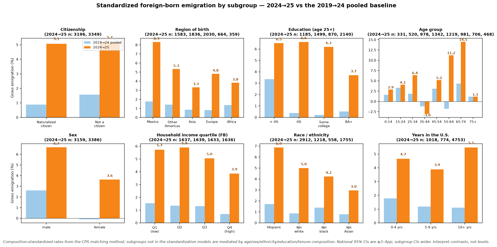
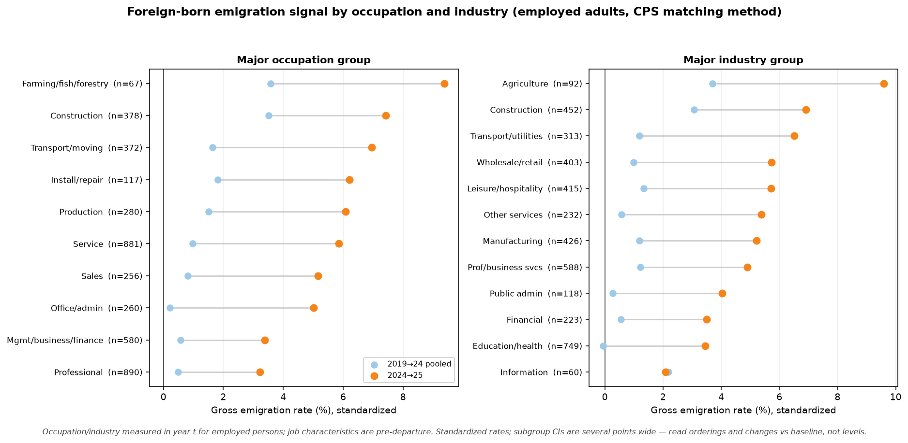

# Can the Current Population Survey measure who *leaves* the country?

> **The short answer:** The CPS sees who leaves a household. It never sees where
> they go. That one gap is the whole story.

The Current Population Survey (CPS) re-interviews the same addresses month after
month, so it is tempting to think you could spot international out-migration
directly: here is a person in the household in January, gone in February —
surely some of them moved abroad. I chased that idea, read what others have
done, and then computed the numbers for Washington State from public data.



## TL;DR

- **Yes, the CPS has a longitudinal design** you can exploit: addresses stay in
  sample for 4 months, rest 8, return for 4 more. Consecutive months link by
  household ID + person line number.
- **No, you cannot read international out-migration off the monthly panel
  directly.** The CPS follows *addresses*, not *people*. When someone leaves, the
  survey simply stops seeing them — the basic monthly file and the recurring
  March supplement have **no destination field, no "moved abroad" code.** For a
  departure, a move to the next neighborhood and a move to Mumbai look identical.
  (The Census Bureau *has* asked directly, in one-off **emigration supplements**
  — 1987–1989 and August 2008 — but none became an ongoing series, and all share
  a fatal blind spot, below.)
- **Researchers have used the CPS for emigration anyway — indirectly.** The
  landmark method (Van Hook, Zhang, Bean & Passel, *Demography* 2006) links
  March CPS files a year apart and *statistically decomposes* the people who
  vanish into deaths, internal movers, and emigrants. It estimates a proportion;
  it never points at an individual and says "emigrant."
- **I computed it for Washington (2024).** Linking all 11 consecutive
  month-pairs of the 2024 basic monthly CPS, **1.14% of people in a continuing
  WA household leave it each month** (~13%/year). Foreign-born residents leave at
  **2.1%/month (~23%/year)** — but published foreign-born *emigration* is only
  ~1–3%/year (residual methods ~1–1.5%; the matched-CPS method ~2.9%).
  **The observed signal is roughly an order of magnitude (~8–20×) too large to be
  emigration.** It is dominated by ordinary domestic moves, deaths, and household
  change, and none of it carries a destination.
- **The honest method for a state-level emigration number is the residual /
  matched-CPS approach, not direct panel observation.**
- **Update: I replicated Van Hook et al.'s method on ASEC 2023→24 and
  2024→25.** The machinery works on modern public files (after dodging a
  genuine, apparently undocumented Census data bug — the 2024 ASEC's
  month-in-sample field is reverse-coded). Results, with honest error bars of
  ±2 points per pair: **2023→24 ≈ 0; 2024→25 gross 5.1% / net 4.7%,
  elevated** — but driven by the foreign-born *diverging from the control
  group* (their own attrition was flat), so the estimate bundles real
  departures with 2025's immigrant survey-response shifts. For Washington:
  point estimate **~43,000 net foreign-born emigrants/yr in the 2024→25
  window (plausibly 0–90k), vs ≈0 the year before.**

## The problem: emigration is the hardest number in demography

A country's population changes through four channels: births, deaths,
immigration, and emigration. Three of them are well measured. The fourth is
not. As Van Hook and colleagues put it, "of the four components, emigration,
especially of the foreign-born, has proved the most difficult to gauge."

The reason is structural. People who immigrate arrive and can be counted.
People who emigrate *leave* — they are no longer here to fill out a survey. The
United States has no exit register and asks no one to check out. The Census
Bureau has said for decades that it lacks "a believable estimate of that elusive
process: emigration."

So when I noticed the CPS panel structure, I wondered: does the rotating design
quietly record emigration as attrition? Could a state like Washington be
estimated from the public files?

## How the CPS panel actually works

The CPS uses a **4-8-4 rotation**. A sampled address is interviewed for 4
consecutive months (month-in-sample, MIS, 1–4), left alone for 8 months, then
interviewed for 4 more (MIS 5–8). Consecutive monthly files therefore share most
of their addresses, and you can link a person from month *t* to month *t+1*.

The standard linkage keys (the same ones IPUMS uses to build `CPSIDP`):

| Level | Key | Validation |
|---|---|---|
| Household | `HRHHID` + `HRHHID2` | re-interview status `HRINTSTA` |
| Person | line number `PULINENO` within household | sex `PESEX`, race `PTDTRACE`, age `PRTAGE` (±) |

I verified this works: **98.6% of eligible Washington households reappear in the
next month's file**, and household + line keys are unique within a month. If the
keys were unstable, that match rate would be near zero.

The catch is what the file *does not* contain. I searched the full 2024 basic
monthly record layout. There is a country-of-**birth** field (`PENATVTY`), a
citizenship field (`PRCITSHP`), and an immigrant **year-of-entry** field
(`PRINUYER`) — all about where people *came from*. There is **nothing about
where a departing person goes.** When a household stops responding, the file
records a "Type A noninterview" (`HRINTSTA = 2`) — a bucket that lumps refusals,
no-one-home, and temporary absence together with families that actually moved.
A household that emigrated and a household that slammed the door are the same
code.

One precision worth making: the CPS *does* tell domestic from international moves
— but only for arrivals. The March (ASEC) migration battery asks current
residents where they lived a year ago, and "abroad" is one of the answers. That
is an *in*-migration flag; there is no symmetric *out*-migration flag, because
the person who would tick it has already left the sampling frame. The asymmetry
is the whole problem: you can survey the arrived, never the departed.

Even the one field that tracks roster changes, `PUCHINHH` ("change in household
composition"), does not help. It flags people *added* (codes 1–3) and
demographic edits (code 9), but in the public file a departing person gets no
record at all: across the entire nation in February 2024 it carried just **5**
"deleted" codes and **zero** "died" codes. A person who leaves is simply
**gone** — no reason, no destination, not even a death flag. The disappearance
*is* the only signal.

## What the panel shows for Washington

I linked all 11 consecutive month-pairs of the 2024 basic monthly CPS (Jan→Feb
… Nov→Dec), filtered to Washington (state FIPS 53), and classified every person
in a *continuing, re-interviewed* household as a **stayer** or a **leaver**.
Everything is weighted by the final person weight `PWSSWGT`. (Whole-household
departures are analyzed separately, because when a household stops responding we
cannot tell a move from a refusal.)

**Washington, 2024 (pooled over 11 month-pairs, 14,337 person-pairs):**

| Group | Monthly departure rate | Annualized | Leavers / person-pairs |
|---|---|---|---|
| All persons | **1.14%/mo** (weighted) | ~12.9%/yr | 155 / 14,337 |
| U.S.-born | 0.96%/mo | ~10.9%/yr | 110 / 12,162 |
| Foreign-born | **2.14%/mo** | ~22.8%/yr | 45 / 2,175 |

Washington tracks the nation almost exactly (US: 1.17%/mo overall, foreign-born
1.75%/mo), which is reassuring for such a small state sample.

At the household level, **7.9% of Washington households scheduled to return were
not cleanly re-interviewed** the next month (Type A noninterviews dominate, plus
a few vacancies and disappearances). Whole-household moves abroad live inside
that 7.9% — indistinguishable from the refusals that make up most of it.

### Why this cannot be emigration

The foreign-born leave their household at ~2.1%/month, more than twice the
U.S.-born rate. The tempting story writes itself: the extra departures are
people going home. The data refuse that story.

- **Magnitude.** A 2.1%/month household-departure rate annualizes to ~23%/year.
  The published foreign-born *emigration* rate is ~1–3%/year — residual methods
  put it near 0.9–1.5% (e.g., Mulder 2003 ≈ 0.9%), the matched-CPS method higher
  at ~2.9% on average and up to ~3.8% for the most recent arrivals (Van Hook et
  al.). Even taking the high end, emigration could account for only **about a
  tenth** of the foreign-born departures the panel sees; on the residual figure,
  a twentieth.
- **Confounding.** The foreign-born are younger, more likely to rent, and more
  residentially mobile *within* the U.S. — exactly the people who change address
  often, domestically. The CPS cannot separate that from an international move.
- **It is happening right now, with the same caveat.** In August 2025 Pew
  Research used CPS monthly tabulations to report the U.S. foreign-born
  population fell by ~1.4 million in the first half of 2025 — and warned the drop
  "may in part be due to technical reasons such as declining CPS survey
  participation among immigrants." That is the Type A noninterview problem,
  live, in the most-watched migration number of the year.

So the panel gives you a real, weightable, state-level number — the rate at
which people leave their households — and that number is *gross residential
churn*, not emigration. International out-migration is in there. You just cannot
get it out.

## They tried asking directly — and gave up

Before turning to indirect methods, it is worth knowing that the Census Bureau
*did* try the direct route. The CPS has carried **emigration supplements** — in
July 1987, June 1988, and November 1989 (analyzed with a "multiplicity" design),
and again in the **August 2008 Immigration/Emigration Supplement**. The 2008
supplement asked surviving households to name members and prior co-residents now
*living outside the United States*, including the **destination country** and the
emigrant's demographics. Census documentation called it the only nationally
representative source on emigration from the U.S.

So why isn't it the answer? Because of one structural flaw, the same one that
sinks the monthly panel: it is a **"left-behind reporter"** design. It can only
find an emigrant who left behind a household with someone still here to report
them. A household that emigrated *in full* leaves no one to answer the door —
exactly the case most central to measuring out-migration. Add that it was
one-off (no continuing series) and too small for a state like Washington, and
the direct approach collapses back into estimation.

## How the pros do it: indirect estimation

If you cannot observe emigrants leaving, you infer them from who is *missing*.

- **Residual method (Census Bureau).** Take the foreign-born population counted
  at two points in time. Add known new arrivals, subtract deaths. Whatever stock
  is *missing* relative to that bookkeeping is attributed to emigration. The
  Bureau's modern population estimates build net international migration this way
  from the American Community Survey, with the CPS monthly files as a more-timely
  benchmark and administrative data (e.g., DHS) as adjustments.
- **Matched-CPS decomposition (Van Hook, Zhang, Bean & Passel, *Demography*
  2006, 43(2):361–382).** This is the closest anyone has come to the idea that
  started this post — and it is essentially my Washington exercise done right.
  They link the March CPS to the next year's March CPS and treat everyone present
  in the first but absent in the second as a *mixture* of deaths, internal
  movers, and emigrants. The attrition rate `a` decomposes as
  `a = m + d + e + r` (internal migration + death + emigration + other
  nonresponse), so emigration is the residual `e = a − m − d − r`: internal
  migration `m` comes from the "lived elsewhere a year ago" question, mortality
  `d` from NHIS-linked death models, and `r` from a same-rate assumption against
  the U.S.-born second generation. It matches residual methods for long-term
  residents and runs *higher* for recent arrivals — where the authors argue it
  is more accurate. Applied to 1995–2009 data it puts foreign-born emigration at
  about **2.9%/year on average** (≈3.8%/year in the first five years after
  arrival, falling toward ~0.8% later). Crucially, it works at the **annual**
  link and never identifies an individual emigrant; it estimates a proportion.

Both methods share a feature my month-to-month exercise lacks: they do not
pretend the survey saw the emigration. They model it — and they get the monthly
churn out of the way first, exactly because, as Panel B shows, that churn would
otherwise swamp the signal.

## Replicating the matched-CPS method on 2023–2025 data

Reading Van Hook et al. closely, their optimism is earned — so I replicated
their method end-to-end on the two most recent ASEC pairs (March 2023→2024 and
2024→2025), from public files, no API key. The pipeline
([`asec_matching_method.py`](asec_matching_method.py),
[`run_replication.py`](run_replication.py)) follows the paper: match March year
*t* (month-in-sample 1–4) to March *t+1* (5–8) by household ID + line number,
validated on sex and age; measure non-follow-up `u` for foreign-born vs
**second-generation** adults; internal migration `m` from the "lived here a
year ago" question; mortality `d` from a life table; composition-adjust with
weighted logits; apply their Eq. 9; subtract a return-immigration ratio.



### A data bug worth knowing about

The replication initially produced **zero** cross-year matches. The cause is a
genuine bug in a published Census file: **in the 2024 ASEC public-use file,
`H_MIS` (month-in-sample) is reverse-coded — households labeled 1–4 are
actually 5–8 and vice versa** — while the 2023 and 2025 files are correct. I
verified this by cross-tabbing ASEC `H_MIS` against the authoritative `HRMIS`
in the March basic monthly file (perfect swap for 2024 — every one of ~95,000
matched records lands exactly 4 off, zero on the diagonal — and perfect
diagonals for 2023/2025).

It turns out this is a *recurring* Census processing error: IPUMS documents
the identical 1–4↔5–8 swap in the **2016, 2018, 2020, and 2022** ASEC files
(every even year), and corrects it in their releases. As far as an independent
check could find, **the 2024 instance is not yet publicly documented
anywhere** — no Census erratum, no IPUMS revision note. Van Hook et al.'s own
footnote 7 fought the same species of error two decades ago. Anyone linking
the raw 2024 ASEC by its own `H_MIS` gets zero (or garbage) links; the fix is
either `H_MIS_corrected = ((H_MIS + 3) % 8) + 1` for March-basic records or —
what this project does — take the true MIS from the March basic monthly file
by household ID.

### Results

| Quantity | Van Hook circa 2000 | 2023→2024 | 2024→2025 |
|---|---|---|---|
| Non-follow-up, foreign-born `u_f` | (era benchmark: 29%) | 34.9% | 34.9% |
| Non-follow-up, second-gen `u_s` | — | 35.2% | 33.7% |
| Internal migration `m_f` / `m_s` | ~16% (era) | 10.8% / 9.0% | 9.6% / 11.1% |
| Gross emigration, raw components | — | −2.4% | +3.0% |
| **Gross emigration, standardized** | **3.8%** | **−0.8%** | **5.1%** |
| Honest SE (full component bootstrap) | (0.06% reported) | ±2.1pp | ±1.9pp |
| Return immigration | 0.9% | 0.4% | 0.4% |
| **Net emigration** | **2.9%** | **−1.2%** | **4.7%** |

The components land where they should: non-follow-up near 35% (response rates
have slipped since the 1990s' 29%), internal migration near 10% (U.S.
residential mobility has famously halved since the 1990s). Both headline
gross figures were independently re-derived by an adversarial code audit
(no blocker or major defects). The machinery works. Interpreting the output
takes more care:

- **Honest error bars are ±2 points, not the paper-style ±0.1.** A
  fixed-coefficient bootstrap like the paper's (which we also report, for
  comparability) resamples only the foreign-born side and returns ±0.13–0.16pp
  — self-refutingly tight, since it would make the *negative* 2023→24 estimate
  "significantly negative emigration." Resampling all four component samples
  (foreign-born and second-generation, follow-up and migration) gives ±2.1pp (2023→24) and ±1.9pp (2024→25).
  One year-pair simply cannot pin the level the way seven pooled pairs could.
- **2023→2024: −0.8% ± 2.1 — consistent with zero *and* with the historical
  2–3%.** The negative point estimate says foreign-born attrition ran no
  higher than the control's; negative point estimates are a familiar feature
  of residual-style methods when the true rate is small (Mulder's 1990s
  residuals went negative for Mexico).
- **2024→2025: 5.1% ± 1.9 standardized (3.0% raw) — elevated, but look at
  what moved.** Foreign-born non-follow-up itself was *flat* across the two
  pairs (34.87% → 34.91%). The 5.9-point swing decomposes into: the
  second-generation control *improving* (−1.45pp), the internal-migration
  terms flipping (m_f fell, m_s rose), and the logit standardization
  amplifying the raw gap. If ~2.4M people/year had truly vanished from the
  frame, the direct signal — u_f rising — should be visible; it is not. So
  read 2024→25 as: *the foreign-born stopped looking like the control group*,
  a real and unusual signal whose split between actual departures and
  survey-response shifts this method cannot determine. The implied count
  (4.7% × 51.3M ≈ 2.4M/yr) also inherits the Census Vintage-2024 upward
  revision of the population controls, and DHS removals run an order of
  magnitude smaller — treat the count as a loose upper bound, not an
  estimate. (Pew's CPS-based 2025 decline is the same instrument, so it
  corroborates nothing independently.)
- **The "inverted duration gradient" is a standardized-composition pattern,
  not raw evidence.** In the raw data, recently arrived immigrants still
  disappear from the panel at far higher rates than settled ones (u_f ≈ 52%
  for 0–4 years vs 31% for 10+ — in *both* pairs). Duration is not a model
  covariate (matching the paper), so the standardized subgroup rates reflect
  how the foreign-born-vs-control gap distributes over age/tenure/education
  profiles. The 10+ vs 0–4 contrast (5.5% vs 4.7%) is inside the error bars.
  It is *suggestive* of the departure signal concentrating among settled
  immigrants in 2025 — but no more than suggestive.

So the paper's optimism replicates with an asterisk: the CPS panel plus the
decomposition *can* measure emigration — turning my earlier "you cannot get
it out" into "you can get it out, with a model, honest error bars of about
±2 points, and assumptions that must hold." The method's load-bearing
assumption — equal residual nonresponse for foreign-born and
second-generation adults — is precisely what the 2025 immigration climate
stresses, and when it bends, the method reads survey avoidance as emigration.

### More years: six pairs, 2019→2025

Running the same pipeline over every ASEC pair back to the first CSV-format
year (data-quality note: the `H_MIS` reverse-coding bug turns out to afflict
**every even-year ASEC we checked — 2020, 2022, and 2024** — matching IPUMS's
report for 2016–2022; the true-MIS fix neutralizes all of them):



| Pair | Gross (standardized) | Raw | Net | Context |
|---|---|---|---|---|
| 2019→20 | **5.4% ± 2.1** | 4.3% | 5.0% | COVID collapsed March-2020 field collection |
| 2020→21 | −2.7% ± 1.7 | −2.4% | −2.9% | pandemic-distorted base year |
| 2021→22 | 3.2% ± 2.0 | 1.7% | 2.8% | recovery |
| 2022→23 | 0.2% ± 1.9 | 0.0% | −0.1% | immigration surge |
| 2023→24 | −0.8% ± 2.0 | −2.4% | −1.2% | immigration surge |
| 2024→25 | **5.1% ± 1.8** | 3.0% | 4.7% | enforcement era, falling immigrant response |

Two lessons. First, the six-pair average is ~1.7%/year — landing between the
residual-method range (~1–1.5%) and Van Hook's matched-CPS estimates (2.9–3.8%),
which is reassuring for the machinery. Second, and more sobering: **the two
big spikes coincide exactly with the two survey-disruption events** (COVID's
field-collection collapse in the March 2020 file; the 2025 enforcement
climate). The method reads any shock to *who answers the survey* as
migration. A single year-pair is a noisy, regime-sensitive instrument; the
multi-year view is what makes the 2024→25 reading interpretable — elevated,
yes, but by an amount that history says can be produced by response
disruption alone.

### More states

Person-level emigration probabilities average cleanly over any geography.
For the 17 states with ≥100 eligible foreign-born records in 2024→25
(standardized gross rates; pooled 2019→24 baseline in parentheses):

CA 5.9% (1.3) · TX 5.8% (1.5) · FL 5.4% (1.1) · NY 5.3% (1.4) · NJ 4.6%
(0.8) · IL 5.4% (1.2) · **WA 3.9% (1.5)** · MA 3.6% (0.3) · GA 4.6% (1.4) ·
AZ 5.5% (1.9) · VA 3.7% (1.0) · MD 3.6% (2.0) · NC 3.7% (0.7) · PA 3.7%
(0.5) · MI 4.4% (0.6) · NV 6.1% (0.7) · HI 6.6% (0.8)

Every large immigrant state sits 2–6 points above its own 2019→24 baseline
in 2024→25 — the elevation is national and uniform in direction, which fits
both candidate explanations (departures and response decline are both
nationwide phenomena). State cells are small (CA n≈1,300 down to n≈100), so
treat cross-state differences as noise; the state-vs-own-baseline contrast is
the meaningful read. Washington is middle-of-the-pack, not exceptional.

**Important caveat on these state numbers:** they average nationally-fit
predictions over each state's records, so they capture state differences in
*composition* (age, tenure, origin mix), not state-specific departure
behavior. The small-area model next fixes that.

### All fifty states: a small-area model

A state's *own* departure signal lives in its raw panel attrition — but with
20–1,300 records per state, direct estimates are hopelessly noisy for most.
The standard answer is small-area estimation: anchor each state's direct
estimate to its own raw foreign-born attrition (national rate + the state's
attrition deviation, passed through the migration denominator), then shrink
toward the national mean with an empirical-Bayes random-effects model
(Fay–Herriot form; DerSimonian–Laird between-state variance). Small states
keep 15–30% of their own signal; California keeps 92%.



Highlights for 2024→25 (shrunk estimate ± posterior SD): the top of the
ranking is TX +12.6 ± 2.6, VA +13.8 ± 4.6, MD +12.7 ± 4.7, NJ +11.0 ± 3.7;
the bottom is NY **−3.0 ± 2.8**, CA **−1.0 ± 1.8**, NV −0.8 ± 4.1;
**WA +3.6 ± 4.0** (vs +3.0 ± 2.6 in its 2019→24 baseline — Washington's own
attrition barely moved). The between-state spread (τ ≈ 6pp) is genuinely
large — and the reordering relative to the composition indices (CA falls
from +5.9 to −1.0; TX rises) shows the two estimators measure different
things.

Read with care: the model must *assume* that a state's excess attrition over
the national level reflects emigration rather than local survey-response
culture or field operations — at the state level there is no second-
generation control to net that out (state second-generation cells are far
too small). The CA/NY negatives and the TX/VA/MD highs are consistent with
either differential enforcement exposure *or* differential response shifts
by state. These are the best state numbers this method can produce, and
their honest reading is "state departure-plus-response signal."

### More strata: what the ASEC supports

Because every year-*t* characteristic rides along with the match, the method
stratifies by anything the ASEC measures — the paper itself did age, sex,
origin, and duration; the same person-level probabilities average over any
subgroup. Standardized gross rates for 2024→25:



- **Sex**: male 6.7% vs female 3.6% — the same ~2:1 male excess the paper
  found circa 2000. The most robust subgroup pattern in both eras.
- **Region of birth**: Mexico 8.3% (baseline 1.8%) leads, then other
  Americas 5.3%, Europe 4.8%, Africa 3.8%, Asia 3.3% — the same ordering Van
  Hook et al. found circa 2000 (Mexico highest at 5.5%), now amplified.
- **Education (25+)**: <HS 6.5%, HS 6.6%, some college 6.2%, **BA+ 3.7%** —
  the departure signal concentrates in less-educated groups.
- **Household income**: monotone gradient, Q1 5.7% → Q4 3.9%.
- **Race/ethnicity**: Hispanic 6.9% highest; non-Hispanic Asian 3.0% lowest.
- **Citizenship**: naturalized 5.1% vs noncitizen 5.2% — essentially equal
  *after* standardization (raw attrition is much higher for noncitizens, 40%
  vs 31%, but so is their baseline mobility). A surprise worth flagging: the
  2025 signal is *not* confined to noncitizens.
- **Age and duration**: in the baseline models these are composition-mediated
  (see the audit caveat). The duration-aware variant below resolves this
  properly.
- **Occupation and industry** (employed adults; job measured in year *t*,
  i.e., pre-departure): the 2024→25 signal concentrates in the classic
  enforcement-exposed immigrant-labor sectors — **agriculture 9.6%
  (industry) / farming occupations 9.4%, construction ~7%, transportation
  ~7%** — versus 3.2–3.5% for professional, management, financial, and
  education/health workers, and 2.1% for information. The ordering tracks
  the unauthorized share by industry, and the raw attrition agrees (52% for
  farm occupations, 45% construction vs ~30% professional). Caveats: cells
  are 60–900 records; job loss between waves can masquerade as subgroup
  differences; the unemployed and out-of-labor-force are excluded.



### Making duration real: PEINUSYR in the models

The baseline models (like the paper's) exclude time-in-U.S., so duration
"estimates" only echo covariate composition. Adding PEINUSYR entry-cohort
bands to the **foreign-born** non-follow-up and migration models (the
second-generation control has no entry year — it nets out nonresponse at the
covariates both groups share) lets the estimates vary directly with duration.
The national gross barely moves (5.1% → 5.3% in 2024→25, as expected), but
the duration story transforms:

| 2024→25 gross | Composition-based | **Duration-aware** |
|---|---|---|
| 0–4 years in U.S. | 4.7% | **14.8%** |
| 5–9 years | 3.9% | 0.4% |
| 10+ years | 5.5% | 3.9% |

The apparent "inversion" un-inverts: with the models allowed to see duration,
the 2024→25 departure signal **concentrates overwhelmingly in the 2020–2024
arrival cohorts** — the immigration-surge population, many with parole or
pending-asylum status revoked or under threat in 2025 — at roughly 15%/year,
versus ~4% for settled immigrants. The same cohort showed ≈0 (−2.4%) in
2023→24. This matches the raw attrition gradient (52% vs 31%) and restores
the *qualitative* shape Van Hook found circa 2000 (recent arrivals leave
most), at a far higher level. Caveat: duration-specific *nonresponse* has no
control-side counterpart, so cohort-specific survey withdrawal loads into
these numbers with even less protection than the national estimate has.

Caveats scale with ambition: subgroup rates inherit the national ±2pp
uncertainty *plus* subgroup sampling noise, and stratifiers outside the
standardization models (income, race, region) are partly composition
artifacts. Read contrasts and consistent patterns, not levels.

### Washington, by the honest method

Averaging the person-level emigration probabilities over Washington's
foreign-born records (composition-standardized, n≈170, national return ratio
applied — state-level CIs span several points):

| Window | WA gross rate | WA net rate | Net emigrants (on ~1.2M FB stock) |
|---|---|---|---|
| 2023→2024 | −1.3% (≈0) | ≈0 | ≈0 |
| 2024→2025 | 3.9% | 3.5% | **~43,000/yr point estimate; plausibly 0–90k** |

The 2024→25 point estimate sits above the pre-2025 literature-anchored
13k–37k range, with all the national-level caveats plus state sampling noise.

### An order-of-magnitude figure for Washington (pre-2025 baseline)

Putting the honest method to work at the back of an envelope: Washington's
foreign-born population is roughly **1.25–1.3 million** (~16% of the state,
weighted from the same CPS files; the monthly estimate bounces between ~14% and
~18% on sampling noise). Applying the published foreign-born emigration rate —
~1–1.5%/year (residual) up to ~2.9%/year (matched-CPS) — gives a rough
**13,000–37,000 foreign-born emigrants per year from Washington**, plus a much
smaller, lower-rate flow of U.S.-born emigrants. That is a *literature-anchored
estimate*, not something the CPS panel measured. And even its high end is
dwarfed by the ~290,000 foreign-born WA residents (~23% of ~1.27M) the panel
sees leave their households each year for reasons it cannot label.

## Reproduce it

No API key needed; the public-use files are open.

```bash
# 1. set up an isolated environment (uv)
uv venv .venv && uv pip install -r requirements.txt

# 2. download the 2024 basic monthly files (~120 MB total, ZIP-wrapped .dat)
.venv/bin/python download_data.py --year 2024 --out cps_data

# 3. run the full Washington + national analysis
.venv/bin/python analyze_wa.py cps_data

# 4. (re)build the figure, run the tests
.venv/bin/python make_figure.py
.venv/bin/python test_link_months.py

# 5. Van Hook replication: download ASEC 2023-2025 (~150 MB each zip) +
#    March basic files, then run (also needs statsmodels/scipy)
#    curl the asecpubYYcsv.zip files from census.gov into cps_data/asecYY/
.venv/bin/python run_replication.py cps_data
.venv/bin/python make_replication_figure.py

# 6. multi-year extension (ASEC 2019-2025, states, strata)
.venv/bin/python run_multiyear.py cps_data
.venv/bin/python make_multiyear_figure.py
.venv/bin/python make_strata_figure.py

# 7. small-area state estimates (all states, empirical-Bayes)
.venv/bin/python small_area_states.py
.venv/bin/python make_smallarea_figure.py
.venv/bin/python make_occind_figure.py
```

Outputs land in `outputs/`: per-pair and pooled summaries, and the figures above.

| File | What it does |
|---|---|
| [`cps_parse.py`](cps_parse.py) | Read a monthly fixed-width file into the columns needed |
| [`link_months.py`](link_months.py) | Link month *t* → *t+1*; classify stayers/leavers/households |
| [`analyze_wa.py`](analyze_wa.py) | Pool all 2024 month-pairs; weighted rates by nativity |
| [`make_figure.py`](make_figure.py) | The two-panel monthly-churn figure |
| [`test_link_months.py`](test_link_months.py) | Synthetic-fixture tests of the linkage logic |
| [`asec_matching_method.py`](asec_matching_method.py) | Van Hook et al. (2006) CPS matching method on modern ASEC pairs |
| [`run_replication.py`](run_replication.py) | Driver: 2023→24 and 2024→25 replication vs the paper's Table 2 |
| [`make_replication_figure.py`](make_replication_figure.py) | The replication figure |
| [`run_multiyear.py`](run_multiyear.py) | Six pairs 2019→2025 + state and stratified tables (incl. duration-aware models) |
| [`make_multiyear_figure.py`](make_multiyear_figure.py) | Time-series + state dumbbell figure |
| [`make_strata_figure.py`](make_strata_figure.py) | Eight-panel subgroup figure |
| [`small_area_states.py`](small_area_states.py) | Empirical-Bayes (Fay–Herriot) state estimates, all states |
| [`make_smallarea_figure.py`](make_smallarea_figure.py) | The 48-state shrinkage figure |
| [`make_occind_figure.py`](make_occind_figure.py) | Occupation and industry dumbbell figure |

## What a critic would say

A fair skeptic could attack these estimates on several fronts. The strongest
objections, in rough order of severity:

1. **The identifying assumption is least credible exactly when the estimate
   is most interesting.** Everything rests on foreign-born and
   second-generation adults having equal *residual* nonresponse. The method
   attributes any excess foreign-born disappearance to emigration — it has no
   internal way to distinguish "left the country" from "stopped answering the
   door." 2025 is precisely when immigrant survey avoidance plausibly
   diverged. A critic can describe the 2024→25 estimate as a measurement of
   *fear*, not departure, and nothing in the data refutes them.
2. **The direct evidence of mass departure is missing.** Foreign-born
   attrition itself was flat across pairs (34.87% → 34.91%); the swing came
   from the control group improving and the mover terms flipping, amplified
   ~2× by standardization (raw 3.0% → adjusted 5.1%). If ~2.4M people/year
   had left, u_f should visibly rise. It did not.
3. **The instrument spikes whenever fieldwork breaks.** Across six pairs, the
   two elevated readings (2019→20, 2024→25) coincide with the two
   survey-disruption events, and the series swings ±3–5pp year to year —
   including *impossible* negative values — while true emigration cannot
   plausibly move that fast. The honest ±2pp SEs still understate total
   error, since they capture sampling noise but not regime shifts.
4. **Standardization is out-of-support extrapolation.** Second-generation
   coefficients are evaluated at foreign-born covariate profiles (far more
   Mexican-origin, renter, less-educated) — a model-dependent counterfactual
   that nearly doubles the raw gap in 2024→25.
5. **The counts inherit extra artifacts.** The ~2.4M/yr figure multiplies an
   upper-bound rate by a stock that the Vintage-2024 weighting revision
   itself revised upward; and corroborating it with Pew's CPS-based decline
   is circular (same instrument, same artifact). External anchors point much
   lower: DHS removals run in the hundreds of thousands.
6. **Subnational and subgroup layers stack assumptions.** State estimates
   have no state-level control group, so state attrition deviations mix
   emigration with local response culture and field operations (the CA/NY
   negatives are as consistent with outreach effects as with staying). The
   duration-aware 14.8% for 2020–24 arrivals has no cohort-specific
   nonresponse control at all — and the surge population most likely to
   leave was also least likely to be in the sampling frame to begin with.
   Occupation and industry are measured at year *t* for the employed only,
   so job loss between waves masquerades as subgroup differences.
7. **There is no ground truth.** Replicating a published method validates
   the machinery, not the estimand. The genuine external check — mirror
   statistics from receiving countries (Mexican census/ENOE return-migrant
   counts, other national registers) — has not been done here.
8. **The implications cut both ways politically.** These numbers could be
   read as "self-deportation policy is working" (overstating confidence in
   an upper bound) or dismissed as "just survey artifacts" (ignoring that
   removals, visa revocations, and voluntary departures are real and
   rising). Both readings outrun the evidence. The defensible claim is
   narrow: *the foreign-born stopped behaving like their control group in
   2024→25, by an amount unprecedented in the six-pair record outside the
   COVID disruption, concentrated among recent arrivals and
   Spanish-speaking-origin populations — some unknown mix of leaving the
   country and leaving the survey.*

Mitigations already built in: raw components reported alongside standardized
estimates, full-uncertainty SEs, the six-pair context, upper-bound language,
and adversarial audits of code, fidelity, and interpretation. The
un-mitigated residual is items 1 and 7 — they require data this method does
not have.

## Caveats (read these)

- **No destination field — the whole point.** Every "leaver" here has an unknown
  destination. This is a measure of *gross household departure*, not emigration.
- **No design-based standard errors.** The public basic monthly file omits the
  design variables (`SDMVSTRA`/`SDMVPSU`); proper variance needs replicate
  weights or a generalized variance function. The unweighted counts are shown so
  small cells are visible; treat the foreign-born WA rate as indicative.
- **Pooled month-pairs are not independent.** The rotation design means the same
  household appears in several consecutive pairs, so the pooled rate is a
  descriptive average, not 11 independent samples.
- **Annualizing is illustrative.** `1-(1-m)^12` assumes a constant monthly hazard
  and is for intuition only.
- **Temporary absence ≈ departure here.** A usual resident away for one month can
  look like a leaver, inflating the rate — another reason it overstates true
  out-mobility, let alone emigration.
- **Replication-specific caveats.** One year-pair per estimate (the paper pooled
  seven); mortality from a 2022 life table applied identically to both
  generations instead of NHIS-linked models; one pooled logit per generation
  (sex and Mexican origin as covariates) instead of eight stratified models;
  children inherit their household's mean adult emigration probability rather
  than a specific parent's; the return-immigrant "entered >2 years ago" cutoff
  is approximated with 2-year entry cohorts. The method's core assumptions —
  second-generation emigration ≈ 0 and equal *residual* nonresponse for
  foreign-born and second-generation adults — are load-bearing, and the second
  one is exactly what 2025's immigration climate stresses.

## Further reading

- Van Hook, J., Zhang, W., Bean, F. D., & Passel, J. S. (2006). *Foreign-born
  emigration: A new approach and estimates based on matched CPS files.*
  **Demography**, 43(2), 361–382. doi:10.1353/dem.2006.0013 — replicated above
  on ASEC 2023→24 and 2024→25.
- U.S. Census Bureau population estimates methodology for **net international
  migration** (ACS-based residual approach; CPS as benchmark).
- Fernandez, E. W. (1995). *Estimation of the annual emigration of U.S.-born
  persons.* Census Bureau Population Division Working Paper POP-twps0010.
- U.S. Census Bureau (2008). **August 2008 CPS Immigration/Emigration
  Supplement** — the one-off direct emigration instrument (microdata, technical
  documentation `cpsaug08`, and debriefing report POP-twps0099). Earlier
  emigration supplements: July 1987, June 1988, November 1989 (multiplicity
  method; cf. Woodrow-Lapham).
- Pew Research Center (Aug 2025), CPS-based estimates of the 2025 immigrant
  population decline (with nonresponse caveats).
- IPUMS-CPS documentation on linking the CPS over time (`CPSIDP`); Drew, Flood &
  Warren (2014) on the CPS longitudinal design.

---

*Built with public Census Bureau microdata and `uv`. Data files are not checked
in; `download_data.py` fetches them.*
