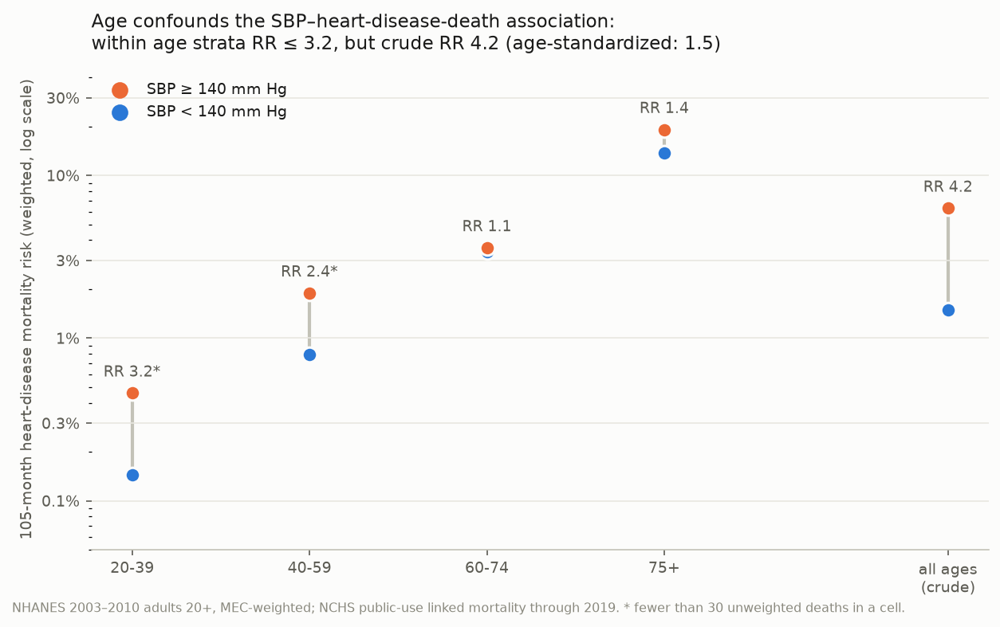

# Putting a number on "but what about confounding?": E-value computation in Python

[](https://colab.research.google.com/github/aflaxman/ai_assisted_research/blob/main/evalue_examples/tutorial.ipynb)

> ✍️ **Skeleton for drafting.** Headings, numbers, code, tables, and the
> figure are ready; the `✍️` blocks mark where prose goes, with notes on
> what each section should do. Delete the blocks as you write.

## Hook

```python
>>> def evalue(rr):
...     return rr + (rr * (rr - 1)) ** 0.5
>>> evalue(1.05)  # acetaminophen in pregnancy -> autism, adjusted HR
1.2791...
```

> ✍️ *One or two sentences: this number answers the question every
> observational finding gets — "couldn't this just be confounding?" —
> with a threshold instead of a shrug. Personal angle: you've been
> interested in e-values lately, and a tutorial by Chittaranjan Andrade
> taught you a lot, with examples from psychiatry.*

## TL;DR

- The E-value is the minimum strength of association, on the risk-ratio
  scale, that an unmeasured confounder would need with *both* exposure and
  outcome to fully explain away an observed association:
  E = RR + √(RR(RR−1)).
- Acetaminophen in pregnancy and autism (from Andrade's tutorial): HR 1.05,
  E-value 1.28 — and the source study's sibling-control analysis shows a
  confounder of roughly that modest strength really existed.
- SBP and heart-disease mortality in NHANES: crude RR 4.2, but here the
  "unmeasured" confounder (age) is measured, so we can watch the bound get
  cashed in — age shrinks the RR to 1.5, and a real effect survives.
- ~20 lines of stdlib Python, tests pinned to published values, and a
  self-contained Colab notebook that pulls everything from public CDC data.

## The Problem: an objection you can't adjust away

> ✍️ *2–3 sentences. Every observational association meets "couldn't an
> unmeasured confounder explain this?" Both sides usually argue by
> hand-waving — "we adjusted for a lot" vs. "you can never adjust for
> everything." The right question is quantitative: HOW STRONG would the
> leftover confounding have to be? Some associations are fragile, some
> are not, and it's knowable which.*

## An Answer: the E-value

> ✍️ *Introduce the method and your sources: VanderWeele & Ding (2017)
> invented it; Andrade (2026) is the tutorial that made it click for you.*

Facts to work in:

- For an observed risk ratio RR > 1:

  ```
  E = RR + sqrt(RR × (RR − 1))
  ```

- Interpretation: an unmeasured confounder must be associated with both
  exposure and outcome by at least E (risk-ratio scale) to push the
  estimate to the null; anything weaker cannot, no matter how you slice it.
- Report two: the E-value of the point estimate and of the CI bound closer
  to the null (the latter answers "how much confounding to make this
  nonsignificant?").
- Hazard ratios pass as RRs when the outcome is uncommon (<15%); ORs
  likewise; protective estimates get inverted first (E-value of OR 0.50 =
  E-value of 2.00 = 3.41).
- No-code path: <https://www.evalue-calculator.com/>.

Implementation ([`evalue.py`](evalue.py)):

```python
def evalue(rr):
    if rr < 1:
        rr = 1 / rr
    return rr + math.sqrt(rr * (rr - 1))
```

## Story 1: Tylenol in pregnancy and autism — a small E-value, cashed in

> ✍️ *Tell the story: Ahlqvist et al. (JAMA 2024, open access) followed
> 2.48 million Swedish children; 7.5% had gestational acetaminophen
> exposure. Andrade's tutorial computes the E-values. Note the neat
> methodological point: E-values need only the published estimates — the
> register data never leaves Sweden, but the calculation is fully
> reproducible from the paper.*

| Analysis | Estimate (95% CI) | E-value (point) | E-value (CI) |
|---|---|---|---|
| Full cohort, adjusted | HR 1.05 (1.02–1.08) | **1.28** | **1.16** |
| Crude (10-yr cum. incidence 1.53% vs 1.33%) | RR 1.15 | 1.57 | — |
| Sibling control | HR 0.98 (0.93–1.04) | 1.16 | 1.00 |

> ✍️ *The part the tutorial doesn't tell you (your discovery): the same
> paper ran a sibling-control analysis — comparing exposed and unexposed
> children of the SAME mother — and the association vanished (HR 0.98).
> Sibling comparison absorbs shared familial confounding: genetics,
> maternal health-care-seeking, home environment. That is an "unmeasured
> confounder" of exactly the modest strength the E-value flagged as
> sufficient. The E-value said "easy to explain away"; the sibling design
> then explained it away. The two tools agree, and neither needed the
> other to be run.*

Replication: [`replicate_acetaminophen_asd.py`](replicate_acetaminophen_asd.py);
summary data with row-level citations in [`data/`](data/).

## Story 2: SBP and heart disease — watching the E-value logic work

> ✍️ *Your motivation, first person: to further your understanding you
> wanted an example with real confounding AND (you think) a real effect —
> systolic blood pressure and ischemic heart disease, confounded by age.
> Age raises SBP and, separately, raises IHD risk more than almost
> anything else does. And here, unlike Sweden, the individual-level data
> is genuinely open: NHANES plus the NCHS public-use linked mortality
> files.*

Setup facts:

- NHANES 2003–2010 adults 20+ with measured SBP (n = 20,109), linked to
  mortality through Dec 2019; MEC survey weights on every estimate.
- Exposure: mean measured SBP ≥ 140 mm Hg. Outcome: death from diseases of
  heart (UCOD_LEADING = 1 — the closest public proxy for IHD incidence)
  within 105 months, a window fully observed for every cycle.
- The game: **pretend age is unmeasured.**

The numbers, in the order the game plays out:

1. Crude RR = **4.20** (105-month heart-death risk 6.28% vs 1.49%).
   E-value = **7.88**.
2. Age's actual strength: RR_EU = **3.14** (age 60+ is 56% prevalent among
   exposed vs 18% among unexposed); RR_UD = **13.59** (heart-death risk,
   60+ vs younger). Strong — but both are far short of 7.88, so age
   *cannot* fully explain the association away.
3. The bounding factor (algebra below): B = **2.72**, so age could shrink
   the crude RR to at most 4.20 / 2.72 ≈ **1.55**.
4. Actually standardizing by age gives RR = **1.51** (E-value 2.38).



> ✍️ *Walk the figure: within every age stratum the two dots sit close
> (RR 1.1–1.4 where deaths are plentiful); the crude all-ages pair on the
> right splays wide. Marginally, high-SBP adults are just much older.*

> ✍️ *Then the contrast that makes the two stories one lesson: E-value
> 1.28 fell to a modest familial confounder; explaining away RR 4.2 would
> take a confounder far stronger than age — and age is about the
> strongest confounder epidemiology has. Confounded ≠ explained away:
> the adjusted estimate (1.51) stays well above the null, consistent with
> SBP truly causing heart disease.*

### The algebra: from bounding factor to E-value

Ding & VanderWeele (2016) proved a bound with no assumptions about the
confounder's form. If an unmeasured confounder U is associated with the
exposure by RR_EU (how much more prevalent U is among the exposed) and
with the outcome by RR_UD, then confounding by U can inflate an observed
risk ratio by at most

```
B = (RR_EU × RR_UD) / (RR_EU + RR_UD − 1)
```

so the true causal effect satisfies RR_true ≥ RR_obs / B. To explain an
association away entirely (RR_true = 1), the confounder needs B ≥ RR_obs.

The E-value asks: what if the confounder is equally strong on both sides,
RR_EU = RR_UD = E? Set B = RR_obs and solve:

```
E² / (2E − 1) = RR_obs
E² − 2·RR_obs·E + RR_obs = 0
E = RR_obs + sqrt(RR_obs² − RR_obs)        [positive root of the quadratic]
  = RR_obs + sqrt(RR_obs × (RR_obs − 1))
```

That is the whole formula: the E-value is the equal-strength solution of
the bounding factor. In code, `bias_factor(E, E)` recovers `RR_obs`
exactly — one of the pinned tests in [`test_evalue.py`](test_evalue.py).

Plugging in the SBP numbers: B = (3.14 × 13.59) / (3.14 + 13.59 − 1) =
2.72, predicting the crude RR of 4.20 can fall to 1.55 at most. Direct
age-standardization gives 1.51.

> ✍️ *Optional nuance worth a sentence: the standardized 1.51 dips
> slightly below the "floor" of 1.55 because the bound used age
> dichotomized at 60, which understates age's full strength; the
> four-stratum standardization uses more of it. The bound is a bound on
> what THAT dichotomy could do.*

## The code

> ✍️ *Brief. One habit worth naming: every formula is pinned by tests to
> values published in the tutorial and in VanderWeele & Ding — if the
> implementation can't reproduce the literature, the tests fail.*

- [`evalue.py`](evalue.py) — E-value, CI E-value, bounding factor; stdlib only.
- [`test_evalue.py`](test_evalue.py) — 10 tests against published values.
- [`sbp_heart_death_age_confounding.py`](sbp_heart_death_age_confounding.py)
  — the NHANES pipeline (survey-weighted; fully-observed follow-up window).
- [`tutorial.ipynb`](tutorial.ipynb) — self-contained notebook; downloads
  everything from CDC (~25 MB). Runs on Colab via the badge above.

```bash
cd evalue_examples
uv venv && uv pip install -r requirements.txt
uv run pytest                                      # tests vs published values
uv run python replicate_acetaminophen_asd.py       # story 1
uv run python sbp_heart_death_age_confounding.py   # story 2
```

## How to use this in your work

> ✍️ *Your recommendations. Candidate bullets:*

- Report E-values for headline observational estimates — point and CI.
- Read them against *named* candidate confounders with plausible
  strengths, the way Story 2 names age. An E-value alone is neither alarm
  nor alibi.
- Cautions: addresses unmeasured confounding only (not selection bias or
  measurement error); E-values near the null are always small; the HR≈RR
  shortcut needs an uncommon outcome.

## Challenges

1. Compute E-values for the last observational paper you refereed.
2. Rerun the NHANES example with smoking or BMI as the pretend-unmeasured
   confounder. How close does the bound come to the adjusted estimate then?
3. Verify algebraically that E solves bias_factor(E, E) = RR — then check
   it numerically against `test_evalue.py`.
4. Find another exposure with both a full-cohort and a sibling-control
   estimate. Does the E-value predict which associations survive?

## Further reading

- Andrade C. The E-value in regressions. J Clin Psychiatry.
  2026;87(1):26f16324.
  ([link](https://www.psychiatrist.com/jcp/e-value-regression-useful-easily-understood-easily-applied-statistic/))
- VanderWeele TJ, Ding P. Sensitivity analysis in observational research:
  introducing the E-value. Ann Intern Med. 2017;167(4):268–274.
- Ding P, VanderWeele TJ. Sensitivity analysis without assumptions.
  Epidemiology. 2016;27(3):368–377.
- Ahlqvist VH, et al. Acetaminophen use during pregnancy and children's
  risk of autism, ADHD, and intellectual disability. JAMA.
  2024;331(14):1205–1214.
  ([open access](https://pmc.ncbi.nlm.nih.gov/articles/PMC11004836/))
- E-value calculator: <https://www.evalue-calculator.com/>
- NHANES: <https://wwwn.cdc.gov/nchs/nhanes/> · Linked mortality:
  <https://www.cdc.gov/nchs/data-linkage/mortality-public.htm>

> ✍️ *At prose stage: add one critique/caution citation for balance
> (candidates to verify: Poole's Epidemiology commentary; VanderWeele's
> replies to critics).*
