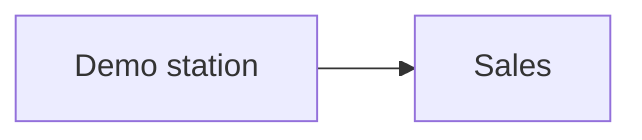
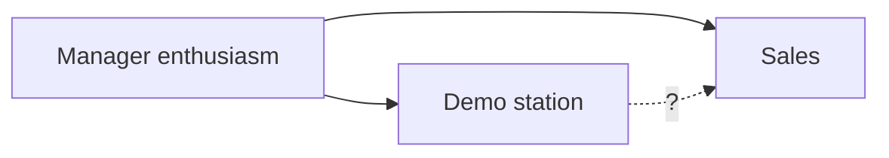
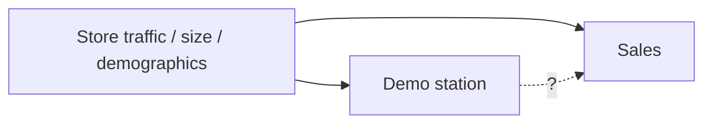
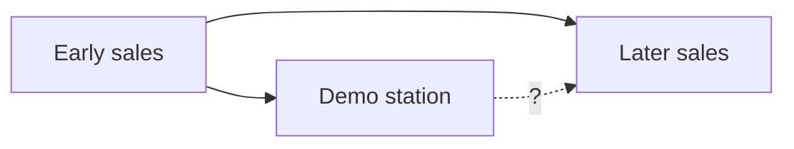
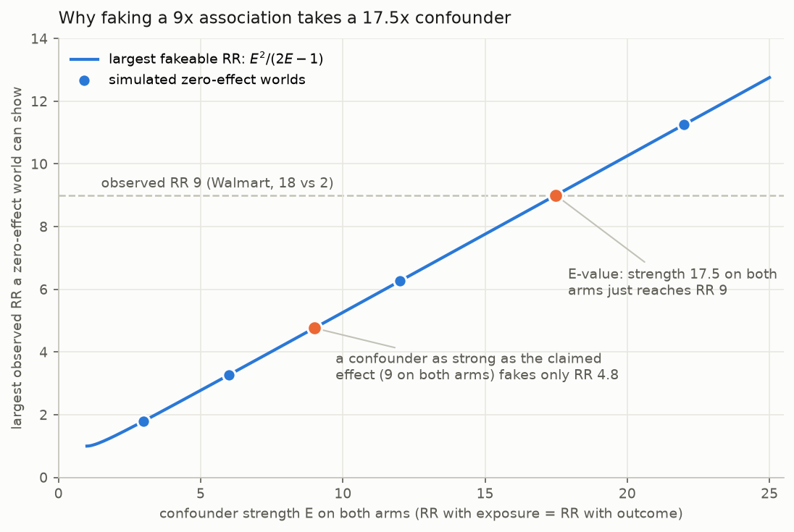
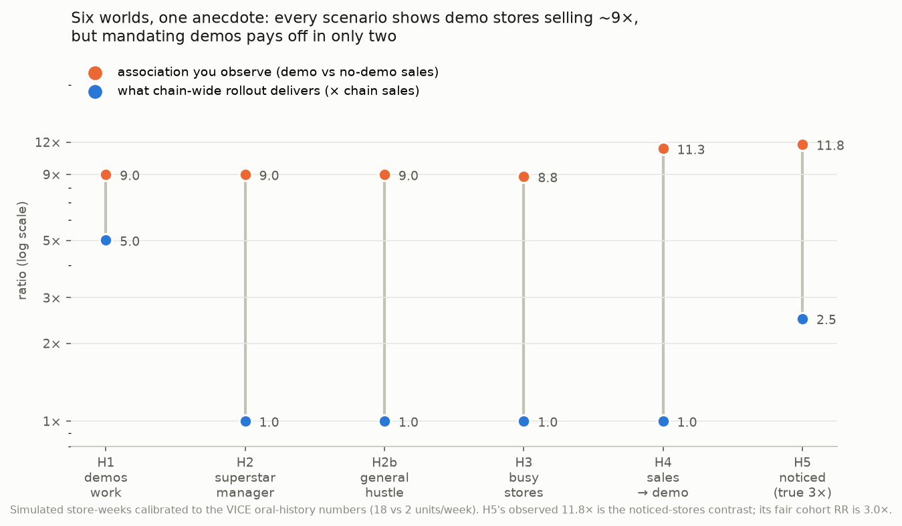

# The stores that sold 18: Guitar Hero, demo stations, and competing DAGs

> ✍️ **Skeleton for drafting** (same convention as the E-value post:
> facts, quotes, numbers, and diagrams are in place; `✍️` blocks mark
> where your prose goes).
>
> Title candidates:
> 1. The stores that sold 18: Guitar Hero, demo stations, and competing DAGs
> 2. Nine times the sales: competing DAGs for the Guitar Hero demo story
> 3. What Walmart noticed: drawing DAGs for competing hypotheses

## Hook

> **Charles Huang (co-founder, RedOctane):** Walmart were really the first
> to give us actual data. In their software data for stores, they started
> noticing, like, "Hey, there are some stores selling 18 units a week and
> everybody else is selling two. What's going on there?" They went and
> looked, and they said, "Oh, the ones that are selling 18, the store
> manager had set up a demo."

— from Blake Hester's [oral history of Guitar Hero](https://www.vice.com/en/article/the-oral-history-of-guitar-hero/) (VICE, 2021).

> ✍️ *One or two sentences: a nine-fold sales difference, an eyeball
> investigation, a chain-wide rollout. Was Walmart right? This is a
> perfect toy problem for directed acyclic graphs — small enough to hold
> in your head, real enough that a billion-dollar franchise rode on it.*

## TL;DR

- In 2005, Walmart's scanner data showed some stores selling Guitar Hero
  at 18 units/week vs 2 everywhere else; the difference was manager-installed
  demo stations. GameStop saw the same pattern (10 vs 2 pre-orders) after
  RedOctane mailed demo kits straight to store managers.
- At least four causal structures generate this exact observation: demos
  work; enthusiastic managers do both; busy stores get both; early sales
  attract demos. One DAG per hypothesis, and what each implies.
- The observed ratios are huge (RR 9 → E-value 17.5), but E-values guard
  against confounding in a fair contrast — not against self-selected
  exposure and outcome-driven discovery of the comparison itself.
- What would distinguish the DAGs: within-store timing, other games as
  negative-control outcomes, the chain-wide rollout, and the accidental
  encouragement design RedOctane ran at GameStop.

## The story, as three study designs

> ✍️ *Retell the anecdote briefly (full verbatim quotes in
> [`data/vice_oral_history_quotes.md`](data/vice_oral_history_quotes.md)).
> The fun framing: three retailers accidentally ran three different study
> designs.*

- **Best Buy — case reports.** Store managers dragged the game to the TV
  aisle and "did really well with that." No comparison group, just vivid
  anecdote.
- **Walmart — retrospective cohort.** Corporate noticed 18-vs-2 in scanner
  data, investigated the exposed group after seeing the outcome, and found
  the demos.
- **GameStop — encouragement design.** The buyer said no; RedOctane mailed
  demo discs and controllers to managers whose names they captured at a
  trade show; three weeks later, 10-vs-2 in pre-orders, and the buyer
  reversed himself.

The observed data, in both cases:

| Retailer | With demo | Without demo | Ratio |
|---|---|---|---|
| Walmart | 18 units/wk | 2 units/wk | **9.0** |
| GameStop | 10 pre-orders/wk | 2 pre-orders/wk | **5.0** |

## The competing hypotheses, as DAGs

> ✍️ *Set up: the same table is consistent with all four graphs below.
> Drawing them forces you to name the alternative stories precisely —
> that's the point of DAGs, not the arrows themselves.*

### H1: Demos sell games



> ✍️ *What Walmart concluded and acted on. If true, installing demos
> everywhere raises sales everywhere.*

### H2: Enthusiastic managers do both



> ✍️ *The quote says it plainly: "the store manager had set up a demo."
> Exposure was chosen by exactly the kind of manager who also hand-sells,
> keeps shelves stocked, and hustles. If M drives both, mandated demos in
> unenthusiastic stores do little. Note this is the retail version of
> confounding by indication.*

### H3: Busy stores get both



> ✍️ *A big suburban store with young customers has the space, staffing,
> and clientele for a demo — and would have sold more Guitar Hero anyway.*

### H4: Early sales attract demos (reverse causation)



> ✍️ *A manager who sees the weird guitar game flying off the shelf gives
> it a demo station. The demo is a consequence of hot sales, then gets
> credit for them.*

### And one non-DAG problem: how the contrast was found

> ✍️ *This deserves care, because it is easy to conflate with reverse
> causation (H4) and it is not the same thing. H4 is a claim about the
> world: the arrow really runs sales → demo, and even a perfect census of
> all stores would show the association. The noticing problem is a claim
> about how the data reached you: Walmart scanned the outcome column,
> grabbed the right tail ("who's selling 18?"), and only then looked up
> the exposure. Two distinct distortions follow:*

- **Winner's curse / regression to the mean.** "18 units/week" is the
  observed value of stores selected *for* being extreme in a noisy
  measure. Their underlying rate is lower than 18; next week they
  disappoint. In the simulation (H5), demos truly work (3×), yet the
  noticed-stores contrast reports **11.8×** — and the noticed stores drop
  by 1.5 units/week the following week with no change in anything real.
- **Exposure ascertained conditional on the outcome.** Corporate checked
  for demos only in the stores that stood out. Low-selling stores that
  also had demos were never inspected and sit silently in the "2
  units/week, no demo" pile. This is the retail cousin of recall bias in
  case-control studies: the exposure measurement itself depends on the
  outcome. The fix is boring and structural — ascertain demo status in
  *all* stores (or a random sample) *before* looking at sales.

> ✍️ *Key sentence to land: the fair cohort contrast in the same
> simulated world is 3×. The anecdote's arithmetic — quote the noticed
> stores' sales against everyone else's — turns a true 3× into a
> reported 12×, without any confounding at all. And note these pitfalls
> stack: H4 and the noticing problem can operate simultaneously, and
> neither is visible in a DAG of the world alone; selection lives in a
> DAG of the* measurement process.

## Would an E-value help?

```python
>>> evalue(18 / 2)
17.49
>>> evalue(10 / 2)
9.47
```



> ✍️ *Unpack how RR 9 becomes E-value 17.5, using the bounding factor
> B = RR_EU·RR_UD/(RR_EU+RR_UD−1) from the companion post. Three facts,
> all visible in the figure and verified by simulation:*

1. **B is always smaller than both of its inputs.** Algebraically,
   B < min(RR_EU, RR_UD) whenever both exceed 1. So to fake an observed
   RR of 9, a confounder needs a strength *greater than 9 on each arm
   separately* — no amount of strength on one arm compensates for
   weakness on the other. (In the H2 simulation: RR with sales 9.8, RR
   with demo adoption ~170.)
2. **Equal strength is the worst case the E-value prices.** Setting
   RR_EU = RR_UD = E, the largest fakeable RR is E²/(2E−1). A confounder
   as strong as the claimed effect itself (9 on both arms) can fake only
   RR 4.8; reaching 9 takes E = 17.49 — the E-value.
3. **The bound is sharp but extreme.** The zero-effect world that
   attains it needs the confounder present in essentially *every* demo
   store and in exactly 1/E of the others (`sim_equal_strength_boundary`
   reproduces this). Real confounding usually sits inside the curve.

> ✍️ *Then the caveat that makes this section worth writing: the E-value
> prices exactly one threat — an unmeasured common cause in a fair,
> correctly-oriented contrast. It assumes the arrow points from exposure
> to outcome and that the groups were assembled without looking at the
> outcome. Under H4 the arrow is backwards: there is no causal effect of
> demo on sales to defend, so "how strong must a confounder be to explain
> it away" is an answer to the wrong question. Under the noticing problem
> (H5) the contrast itself is manufactured — 11.8 observed where the fair
> cohort RR is 3 — and its E-value of 23 is sensitivity analysis
> performed on an artifact. A huge E-value narrows the confounding escape
> route and says nothing about the other exits.*

## What evidence would tell the DAGs apart

> ✍️ *The heart of the post. For each, say which hypotheses it
> discriminates:*

1. **Within-store timing** (interrupted time series): did sales jump in
   the week the demo appeared? Separates H1 from H2/H3 (whose store
   differences predate the demo), but not from H4.
2. **Negative-control outcomes**: did demo stores also over-sell Madden?
   With only (demo, GH sales) measured, H2 and H3 are the *same DAG* —
   X → demo, X → sales — differing only in the story attached to X. A
   second outcome breaks the tie exactly when the two candidate X's
   differ in whether they touch it: store traffic moves all games,
   Guitar-Hero-specific enthusiasm moves only one. Simulated Madden RRs:
   H3 busy stores **8.8**, H2b general hustle **2.4**, H2 GH-specific
   **1.0**. Two honest limits: (a) a clean Madden (RR ≈ 1) rules out
   traffic but *cannot* separate H1 from H2 — a real demo effect and a
   GH-specific confounder both leave Madden alone; (b) the test's power
   comes from the substantive assumption about which arrows X has, not
   from the data (Lipsitch et al. 2010).
3. **The GameStop mailing as an encouragement design**: kit receipt
   depended on which managers RedOctane captured at a trade show — closer
   to random than manager self-selection. Compare stores by *assignment*
   (kit mailed or not), not by uptake.
4. **The chain-wide rollout as a natural experiment**: Walmart mandated
   demos everywhere. If H1 is right, the 2-unit stores should have risen
   toward 18. (Confounded by time — word-of-mouth was exploding — so
   compare against a contemporaneous control like non-demo retailers.)
5. **The marketer's RCT**: randomize demo installation across stores.
   Nobody did this, and nobody needed to —

> ✍️ *— which sets up the epilogue's decision-theory point.*

## The simulation: six worlds, one anecdote

[`simulate_dags.py`](simulate_dags.py) builds each DAG as a population of
store-weeks, calibrated so every world reproduces the observed contrast,
then applies the tools that distinguish them
([`test_simulate_dags.py`](test_simulate_dags.py) pins the behavior):

| Scenario | True causal RR | Observed RR | Madden RR | Chain-wide rollout delivers |
|---|---|---|---|---|
| H1 demos work (9×) | 9.0 | 9.0 | 1.0 | **5.0×** |
| H2 superstar manager | 1.0 | 9.0 | 1.0 | 1.0× |
| H2b general hustle | 1.0 | 9.0 | 2.4 | 1.0× |
| H3 busy stores | 1.0 | 8.8 | 8.8 | 1.0× |
| H4 sales → demo | 1.0 | 11.3 | 1.0 | 1.0× |
| H5 noticed (true 3×) | 3.0 | 11.8 | 1.0 | 2.5× |



> ✍️ *Walk the table: the observed column is the anecdote, nearly
> constant across worlds. Each other column is a different interrogation.
> Madden flags H3 (and half-flags H2b). Within-store timing catches H4:
> demo stores' sales* fall *by 1.6 units/week after installation, because
> the demo arrived at a lucky peak. And the rollout column is the answer
> Walmart actually cared about: 5×, nothing, nothing, nothing, nothing,
> 2.5×. Note H1's rollout is 5× not 9× — the chain average already
> included the demo stores — and H5's is 2.5×: demos work there, just at
> a third of what the noticed contrast promised.*

```bash
cd guitar_hero_dags
uv venv && uv pip install -r requirements.txt
uv run python simulate_dags.py
uv run pytest
```

## Epilogue: they were probably right anyway

> ✍️ *What actually happened: Walmart rolled demos to every store, demos
> became (per Huang) "probably the biggest marketing tool for Guitar
> Hero," and the franchise passed $2 billion. Two closing thoughts:*
> *(1) Walmart's decision didn't need causal certainty — a cheap
> intervention with bounded downside and a plausibly huge effect clears
> any reasonable decision threshold even if the true effect is a fraction
> of 9x. (2) The DAG exercise still matters for the counterfactual
> question the anecdote gets used for today — "demos made Guitar Hero" —
> which requires H1, not just a good bet.*

## Challenges

1. Draw the DAG for the Lennon Lange story (an associate producer
   secretly demoing the game around the Bay Area) — what does it do to
   the "without demo" comparison group?
2. Extend [`simulate_dags.py`](simulate_dags.py): make H2's manager
   enthusiasm continuous instead of binary, or add measurement noise to
   demo ascertainment. How far inside the E-value curve do realistic
   parameterizations sit?
3. The GameStop buyer reversed himself on n = 2 stores. What's the
   probability of a 10-vs-2 split under no effect, for plausible weekly
   pre-order counts?
4. Find the modern equivalent in your own work: a dashboard comparison
   someone noticed, investigated after the fact, and acted on.

## Sources

- Hester B. The Oral History of 'Guitar Hero'. VICE, January 27, 2021.
  <https://www.vice.com/en/article/the-oral-history-of-guitar-hero/>
  (verbatim excerpts in [`data/vice_oral_history_quotes.md`](data/vice_oral_history_quotes.md))
- Pearl J, Mackenzie D. *The Book of Why* — for DAG background.
- Hernán MA, Robins JM. *Causal Inference: What If* — confounding,
  selection, and negative controls, free online.
- Lipsitch M, Tchetgen Tchetgen E, Cohen T. Negative controls: a tool for
  detecting confounding and bias in observational studies. *Epidemiology*.
  2010;21(3):383–388.
- Smith LH, VanderWeele TJ. Bounding bias due to selection. *Epidemiology*.
  2019;30(4):509–516 — the selection-bias analog of the E-value.
- Companion post: the E-value writeup in
  [`../evalue_examples/`](../evalue_examples/).

> ✍️ *At prose stage: verify the $2B / 25M units franchise figures against
> a citable source (the VICE piece states them), and decide whether the
> mermaid DAGs become rendered images for WordPress.*
