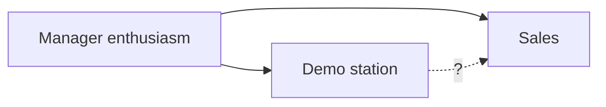
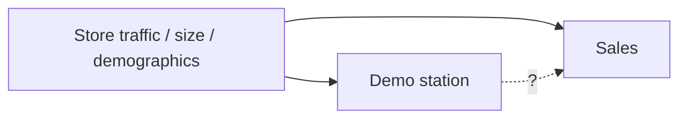
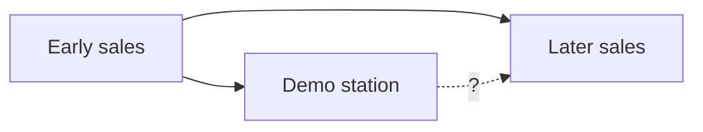

# The stores that sold 18: Guitar Hero, demo stations, and competing DAGs

> ✍️ **Skeleton for drafting** (same convention as the E-value post:
> facts, quotes, numbers, and diagrams are in place; `✍️` blocks mark
> where your prose goes).
>
> Title candidates:
> 1. The stores that sold 18: Guitar Hero, demo stations, and competing DAGs
> 2. Nine times the sales: competing DAGs for the Guitar Hero demo story
> 3. What Walmart noticed: drawing DAGs for competing hypotheses

## Hook

> **Charles Huang (co-founder, RedOctane):** Walmart were really the first
> to give us actual data. In their software data for stores, they started
> noticing, like, "Hey, there are some stores selling 18 units a week and
> everybody else is selling two. What's going on there?" They went and
> looked, and they said, "Oh, the ones that are selling 18, the store
> manager had set up a demo."

— from Blake Hester's [oral history of Guitar Hero](https://www.vice.com/en/article/the-oral-history-of-guitar-hero/) (VICE, 2021).

> ✍️ *One or two sentences: a nine-fold sales difference, an eyeball
> investigation, a chain-wide rollout. Was Walmart right? This is a
> perfect toy problem for directed acyclic graphs — small enough to hold
> in your head, real enough that a billion-dollar franchise rode on it.*

## TL;DR

- In 2005, Walmart's scanner data showed some stores selling Guitar Hero
  at 18 units/week vs 2 everywhere else; the difference was manager-installed
  demo stations. GameStop saw the same pattern (10 vs 2 pre-orders) after
  RedOctane mailed demo kits straight to store managers.
- At least four causal structures generate this exact observation: demos
  work; enthusiastic managers do both; busy stores get both; early sales
  attract demos. One DAG per hypothesis, and what each implies.
- The observed ratios are huge (RR 9 → E-value 17.5), but E-values guard
  against confounding in a fair contrast — not against self-selected
  exposure and outcome-driven discovery of the comparison itself.
- What would distinguish the DAGs: within-store timing, other games as
  negative-control outcomes, the chain-wide rollout, and the accidental
  encouragement design RedOctane ran at GameStop.

## The story, as three study designs

> ✍️ *Retell the anecdote briefly (full verbatim quotes in
> [`data/vice_oral_history_quotes.md`](data/vice_oral_history_quotes.md)).
> The fun framing: three retailers accidentally ran three different study
> designs.*

- **Best Buy — case reports.** Store managers dragged the game to the TV
  aisle and "did really well with that." No comparison group, just vivid
  anecdote.
- **Walmart — retrospective cohort.** Corporate noticed 18-vs-2 in scanner
  data, investigated the exposed group after seeing the outcome, and found
  the demos.
- **GameStop — encouragement design.** The buyer said no; RedOctane mailed
  demo discs and controllers to managers whose names they captured at a
  trade show; three weeks later, 10-vs-2 in pre-orders, and the buyer
  reversed himself.

The observed data, in both cases:

| Retailer | With demo | Without demo | Ratio |
|---|---|---|---|
| Walmart | 18 units/wk | 2 units/wk | **9.0** |
| GameStop | 10 pre-orders/wk | 2 pre-orders/wk | **5.0** |

## The competing hypotheses, as DAGs

> ✍️ *Set up: the same table is consistent with all four graphs below.
> Drawing them forces you to name the alternative stories precisely —
> that's the point of DAGs, not the arrows themselves.*

### H1: Demos sell games


> ✍️ *What Walmart concluded and acted on. If true, installing demos
> everywhere raises sales everywhere.*

### H2: Enthusiastic managers do both



> ✍️ *The quote says it plainly: "the store manager had set up a demo."
> Exposure was chosen by exactly the kind of manager who also hand-sells,
> keeps shelves stocked, and hustles. If M drives both, mandated demos in
> unenthusiastic stores do little. Note this is the retail version of
> confounding by indication.*

### H3: Busy stores get both



> ✍️ *A big suburban store with young customers has the space, staffing,
> and clientele for a demo — and would have sold more Guitar Hero anyway.*

### H4: Early sales attract demos (reverse causation)



> ✍️ *A manager who sees the weird guitar game flying off the shelf gives
> it a demo station. The demo is a consequence of hot sales, then gets
> credit for them.*

### And one non-DAG problem: how the contrast was found

> ✍️ *Walmart didn't sample stores; it noticed the extremes and asked what
> was different about them. Comparing the noticed-best (18) to everyone
> else (2) exaggerates any of the mechanisms above — regression to the
> mean guarantees the next week's 18s look less special. Worth a short
> paragraph: selection on the outcome is a defect no arrow diagram of the
> world fixes, because it lives in how the data reached you.*

## Would an E-value help?

> ✍️ *Bridge to the E-value post. RR 9 gives E-value 17.5 — on its face,
> only an absurdly strong confounder could explain it away. But the
> E-value's premise is a fair cohort contrast with confounding as the only
> threat. Here the exposure is self-selected (H2), possibly caused by the
> outcome (H4), and the comparison groups were assembled by looking at the
> outcome first. Big E-values don't rescue a broken design — a compact
> lesson on what sensitivity analysis does and doesn't buy you.*

```python
>>> evalue(18 / 2)
17.49
>>> evalue(10 / 2)
9.47
```

## What evidence would tell the DAGs apart

> ✍️ *The heart of the post. For each, say which hypotheses it
> discriminates:*

1. **Within-store timing** (interrupted time series): did sales jump in
   the week the demo appeared? Separates H1 from H2/H3 (whose store
   differences predate the demo), but not from H4.
2. **Negative-control outcomes**: did demo stores also over-sell Madden?
   If yes, that's T or M at work, not the demo.
3. **The GameStop mailing as an encouragement design**: kit receipt
   depended on which managers RedOctane captured at a trade show — closer
   to random than manager self-selection. Compare stores by *assignment*
   (kit mailed or not), not by uptake.
4. **The chain-wide rollout as a natural experiment**: Walmart mandated
   demos everywhere. If H1 is right, the 2-unit stores should have risen
   toward 18. (Confounded by time — word-of-mouth was exploding — so
   compare against a contemporaneous control like non-demo retailers.)
5. **The marketer's RCT**: randomize demo installation across stores.
   Nobody did this, and nobody needed to —

> ✍️ *— which sets up the epilogue's decision-theory point.*

## Epilogue: they were probably right anyway

> ✍️ *What actually happened: Walmart rolled demos to every store, demos
> became (per Huang) "probably the biggest marketing tool for Guitar
> Hero," and the franchise passed $2 billion. Two closing thoughts:*
> *(1) Walmart's decision didn't need causal certainty — a cheap
> intervention with bounded downside and a plausibly huge effect clears
> any reasonable decision threshold even if the true effect is a fraction
> of 9x. (2) The DAG exercise still matters for the counterfactual
> question the anecdote gets used for today — "demos made Guitar Hero" —
> which requires H1, not just a good bet.*

## Challenges

1. Draw the DAG for the Lennon Lange story (an associate producer
   secretly demoing the game around the Bay Area) — what does it do to
   the "without demo" comparison group?
2. Simulate all four DAGs so each produces the observed 18-vs-2 table,
   then simulate the chain-wide rollout under each. How different are the
   outcomes?
3. The GameStop buyer reversed himself on n = 2 stores. What's the
   probability of a 10-vs-2 split under no effect, for plausible weekly
   pre-order counts?
4. Find the modern equivalent in your own work: a dashboard comparison
   someone noticed, investigated after the fact, and acted on.

## Sources

- Hester B. The Oral History of 'Guitar Hero'. VICE, January 27, 2021.
  <https://www.vice.com/en/article/the-oral-history-of-guitar-hero/>
  (verbatim excerpts in [`data/vice_oral_history_quotes.md`](data/vice_oral_history_quotes.md))
- Pearl J, Mackenzie D. *The Book of Why* — for DAG background.
- Hernán MA, Robins JM. *Causal Inference: What If* — confounding,
  selection, and negative controls, free online.
- Companion post: the E-value writeup in
  [`../evalue_examples/`](../evalue_examples/).

> ✍️ *At prose stage: verify the $2B / 25M units franchise figures against
> a citable source (the VICE piece states them), and decide whether the
> mermaid DAGs become rendered images for WordPress.*
