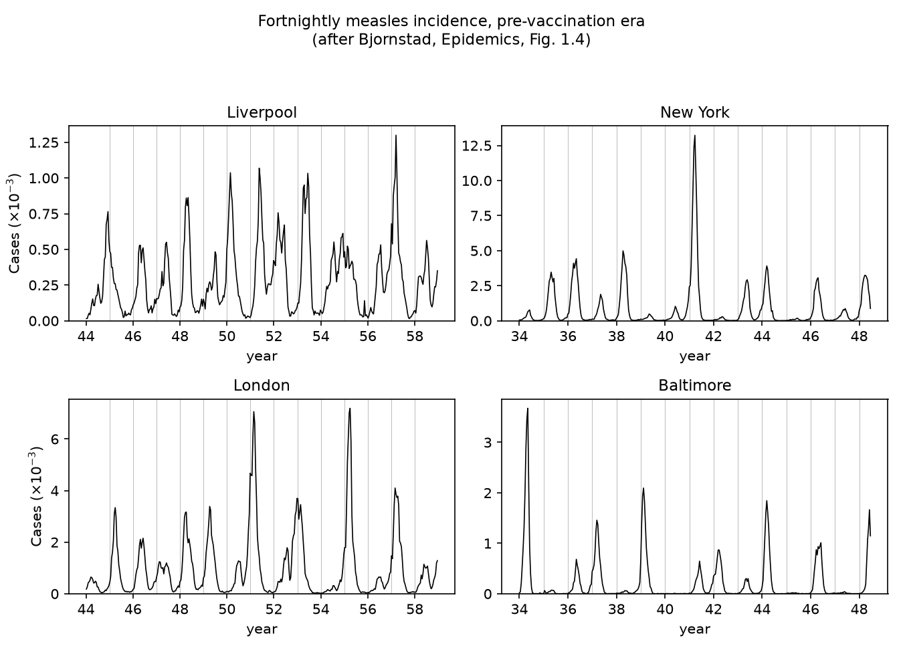

# Measles incidence in four cities, after Bjornstad's *Epidemics* Fig. 1.4 — with camdl

Bjornstad's *Epidemics: Models and Data using R* opens with a figure
(Fig. 1.4) that every infectious-disease modeler should stare at for a
while: fortnightly measles incidence in Liverpool, New York, London, and
Baltimore during the pre-vaccination era. Four large cities, one virus,
and four different rhythms — annual epidemics, biennial cycles, and
irregular outbreaks. This project replicates that figure from the primary
data sources and then goes one step beyond the book's descriptive opening:
it fits a seasonally forced stochastic SEIR to each city with
[camdl](https://github.com/vsbuffalo/camdl) and asks whether one
mechanistic model, refit per city, reproduces each city's rhythm.



## Data

Fig. 1.4's caption: "Incidence of measles in various US and UK cities
during the pre-vaccination era. The data represent fortnightly incidence
(roughly corresponding to the virus' serial interval)."

| city | source | cadence | window used here |
|---|---|---|---|
| London, Liverpool | He, Ionides & King (2010) UK registry data (`twentycities.rda`, weekly notifications + annual births/population) | weekly, shown fortnightly | 1944–1958 |
| New York, Baltimore | Dalziel et al. (2016) US city data (`dalziel` dataset in Bjornstad's `epimdr2` package: biweekly cases + population + susceptible recruits) | biweekly | 1934–1948 |

The book plots 1944–1958 for all four cities; the Dalziel US series ends
mid-1948, so the US panels here take the last 14.5 pre-vaccination years
instead (the underlying US source is presumably the same city reporting
system). Both `.rda` files are committed under `sources/` and
`fetch_sources.sh` documents where they came from.

A consistency check on the raw series: dividing mean annual reported cases
by the birth stream (in a pre-vaccination endemic setting essentially
everyone gets measles, so true incidence ≈ births) gives implied reporting
rates of 0.49 (London), 0.47 (Liverpool), 0.44 (Baltimore), and 0.23
(New York). He et al.'s published London MLE for the reporting probability
is 0.488 — the data hang together.

## The camdl analysis

The model is the He, Ionides & King (2010) seasonally forced stochastic
SEIR already validated against `pomp` in
[`../camdl_replication/`](../camdl_replication/): term-time transmission
forcing, a cohort pulse of susceptibles at school entry, `(I + iota)^alpha`
inhomogeneous mixing, Gamma extra-demographic noise on the force of
infection, and the paper's discretized-Normal observation model.
`make_city_models.py` stamps out one model per city
(`<city>_seir.camdl`), pointing at that city's covariates (interpolated
population and school-entry-lagged per-capita birth rate) and observation
cadence (weekly UK, biweekly US).

Each city gets the same modest IF2 "scout" fit (`fit_<city>.toml`):
4 chains × 2000 particles × 25 iterations estimating the headline
parameters R0, seasonal `amplitude`, reporting probability `rho`, and the
initial susceptible fraction `s0`, with natural history and noise held at
He et al.'s London MLE. These are scout fits, not full searches — the point
is regime reproduction, not definitive per-city MLEs.

`run_postfit.py` then forward-simulates a 20-member ensemble at each
city's point estimate, and `plot_camdl_fig.py` compares observed and
simulated series and their periodograms.

RESULTS_PLACEHOLDER

## Quickstart

```bash
# data (sources/ is already committed; fetch_sources.sh re-downloads)
uv run python prepare_data.py
uv run python plot_fig14.py            # the Fig 1.4 replica

# models + fits (camdl on PATH; ~15 min per city on 4 cores)
uv run python make_city_models.py
for c in london liverpool newyork baltimore; do
  camdl fit run fit_$c.toml --label $c --seed 7
done

# ensemble simulation, periodicity analysis, final figure
uv run python run_postfit.py
uv run python plot_camdl_fig.py
```

## Files

- `prepare_data.py` — converts the two `.rda` sources into per-city case
  and covariate TSVs (`data/`), plus the fortnightly panel data
- `plot_fig14.py` — the Fig 1.4 replica (`results/fig14_replica.png`)
- `make_city_models.py` — generates `<city>_seir.camdl` + `fit_<city>.toml`
- `run_postfit.py` — extracts IF2 estimates, simulates the ensembles
- `plot_camdl_fig.py` — final figure + `results/periodicity.tsv`

## References

- Bjornstad, O.N. *Epidemics: Models and Data using R*. Springer (Use R!).
  Fig. 1.4 and the `epimdr`/`epimdr2` companion packages.
- He, D., Ionides, E.L. & King, A.A. 2010. Plug-and-play inference for
  disease dynamics: measles in large and small populations as a case
  study. *J. R. Soc. Interface* 7:271–283.
  [doi:10.1098/rsif.2009.0151](https://doi.org/10.1098/rsif.2009.0151)
- Dalziel, B.D. et al. 2016. Persistent chaos of measles epidemics in the
  prevaccination United States caused by a small change in seasonal
  transmission patterns. *PLoS Comput Biol* 12:e1004655.
  [doi:10.1371/journal.pcbi.1004655](https://doi.org/10.1371/journal.pcbi.1004655)
- Grenfell, B.T., Bjornstad, O.N. & Kappey, J. 2001. Travelling waves and
  spatial hierarchies in measles epidemics. *Nature* 414:716–723.
