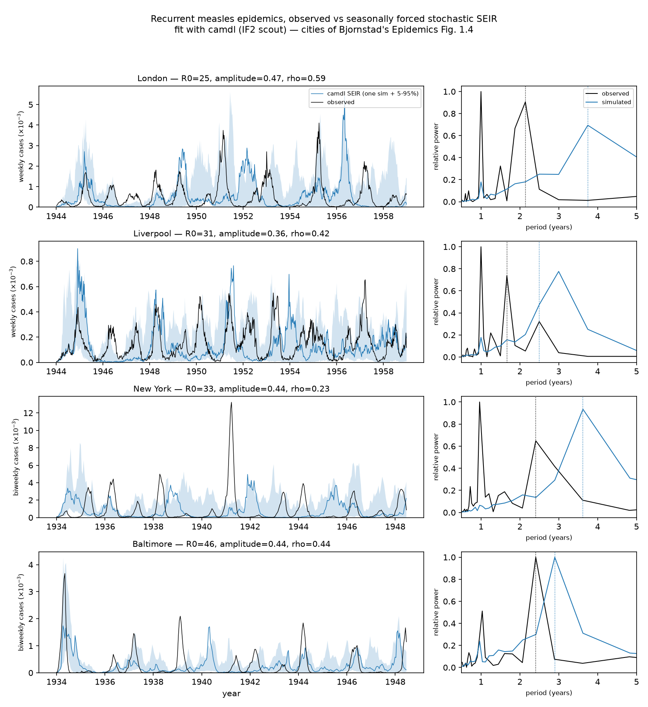
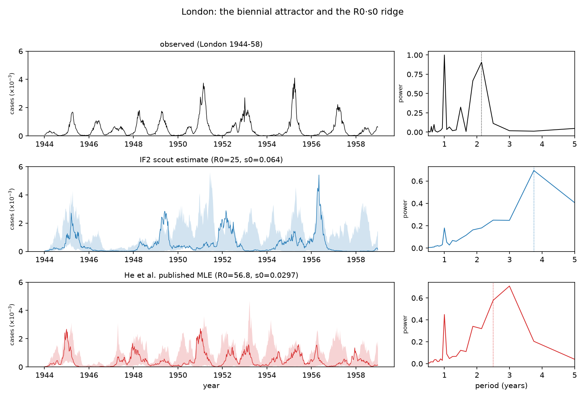
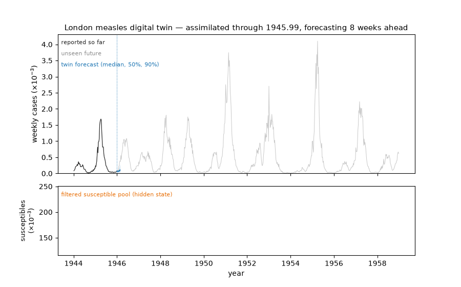
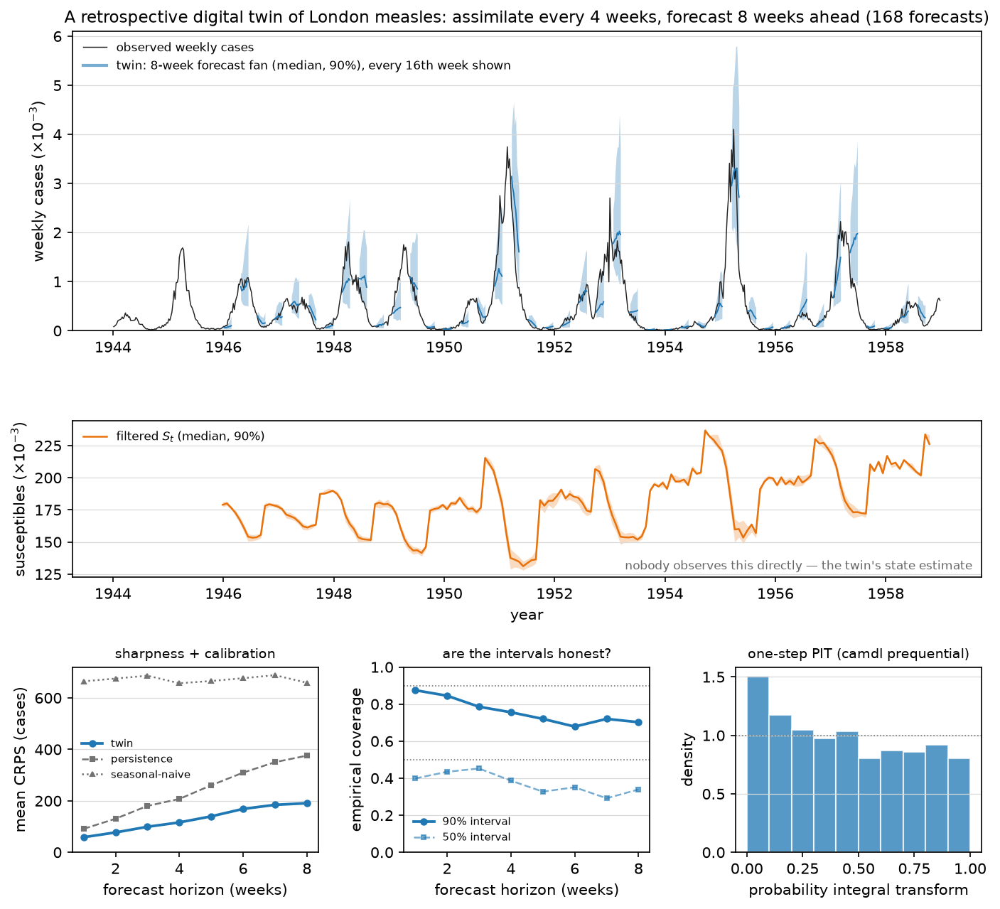

# Measles incidence in four cities, after Bjornstad's *Epidemics* Fig. 1.4 — with camdl

Bjornstad's *Epidemics: Models and Data using R* opens with a figure
(Fig. 1.4) that every infectious-disease modeler should stare at for a
while: fortnightly measles incidence in Liverpool, New York, London, and
Baltimore during the pre-vaccination era. Four large cities, one virus,
and four different rhythms — annual epidemics, biennial cycles, and
irregular outbreaks. This project replicates that figure from the primary
data sources and then goes one step beyond the book's descriptive opening:
it fits a seasonally forced stochastic SEIR to each city with
[camdl](https://github.com/vsbuffalo/camdl) and asks whether one
mechanistic model, refit per city, reproduces each city's rhythm.


## Data

Fig. 1.4's caption: "Incidence of measles in various US and UK cities
during the pre-vaccination era. The data represent fortnightly incidence
(roughly corresponding to the virus' serial interval)."

| city | source | cadence | window used here |
|---|---|---|---|
| London, Liverpool | He, Ionides & King (2010) UK registry data (`twentycities.rda`, weekly notifications + annual births/population) | weekly, shown fortnightly | 1944–1958 |
| New York, Baltimore | Dalziel et al. (2016) US city data (`dalziel` dataset in Bjornstad's `epimdr2` package: biweekly cases + population + susceptible recruits) | biweekly | 1934–1948 |

The book plots 1944–1958 for all four cities; the Dalziel US series ends
mid-1948, so the US panels here take the last 14.5 pre-vaccination years
instead (the underlying US source is presumably the same city reporting
system). Both `.rda` files are committed under `sources/` and
`fetch_sources.sh` documents where they came from.

A consistency check on the raw series: dividing mean annual reported cases
by the birth stream (in a pre-vaccination endemic setting essentially
everyone gets measles, so true incidence ≈ births) gives implied reporting
rates of 0.49 (London), 0.47 (Liverpool), 0.44 (Baltimore), and 0.23
(New York). He et al.'s published London MLE for the reporting probability
is 0.488 — the data hang together.

## The camdl analysis

The model is the He, Ionides & King (2010) seasonally forced stochastic
SEIR already validated against `pomp` in
[`../camdl_replication/`](../camdl_replication/): term-time transmission
forcing, a cohort pulse of susceptibles at school entry, `(I + iota)^alpha`
inhomogeneous mixing, Gamma extra-demographic noise on the force of
infection, and the paper's discretized-Normal observation model.
`make_city_models.py` stamps out one model per city
(`<city>_seir.camdl`), pointing at that city's covariates (interpolated
population and school-entry-lagged per-capita birth rate) and observation
cadence (weekly UK, biweekly US).

Each city gets a modest IF2 "scout" fit (`fit_<city>.toml`): 4 chains ×
2000–4000 particles × 25 iterations estimating the headline parameters —
R0, seasonal `amplitude`, and initial susceptible fraction `s0`
everywhere; reporting probability `rho` for the UK cities (anchored
demographically for the US ones); extra-demographic noise `sigma_se` for
the US cities (held at He et al.'s London MLE for the UK ones) — with
natural history fixed throughout. The fit design took three
diagnostics-driven rounds to reach this shape (the log lives at the top
of `make_city_models.py`; the story is under Results). These are scout
fits, not full searches — the point is regime reproduction, not
definitive per-city MLEs.

`run_postfit.py` then forward-simulates a 20-member ensemble at each
city's point estimate, and `plot_camdl_fig.py` compares observed and
simulated series and their periodograms.

## Results



Best scout estimates per city (particle-filter loglik at the returned
MLE; full table in `results/fit_summary.tsv`):

| city | loglik | R0 | amplitude | rho | s0 | sigma_se |
|---|---|---|---|---|---|---|
| London | −4228.8 | 24.6 | 0.47 | 0.59 | 0.064 | 2.82 (fixed) |
| Liverpool | −4762.0 | 31.4 | 0.36 | 0.42 | 0.059 | 2.82 (fixed) |
| New York | −2358.3 | 32.8 | 0.44 | 0.23 (fixed) | 0.058 | 4.09 |
| Baltimore | −1793.8 | 45.7 | 0.44 | 0.44 (fixed) | 0.067 | 4.52 |

And the periodicity comparison (`results/periodicity.tsv`) — the
multiannual (> 1.2 yr) spectral peak, which measures inter-epidemic
spacing separately from the annual seasonal component:

| city | observed | simulated (median, 5–95%) |
|---|---|---|
| London | 2.14 yr | 3.75 (2.50–7.49) |
| Liverpool | 1.67 yr | 2.50 (1.86–3.03) |
| New York | 2.41 yr | 3.62 (2.06–4.95) |
| Baltimore | 2.41 yr | 2.90 (2.38–3.62) |

Three findings worth keeping:

**1. One model family really does span the four rhythms.** Each city's
fitted SEIR produces recurrent, violently fluctuating epidemics of the
right size on the right demographic canvas — Baltimore's irregular
2–3-year outbreaks especially (observed 2.41 yr vs simulated 2.90,
5–95% 2.38–3.62), and Liverpool's fast quasi-annual cycling (1.67 vs
2.50, interval reaching down to 1.86). This is Bjornstad's Chapter 1
point made mechanistic: the differences between panels are parameter
differences (birth rates, population size, seasonality), not different
kinds of disease.

**2. The scout fits find a ridge, not the attractor.** London's IF2
scout walks to R0 ≈ 25 with s0 ≈ 0.064 — even when started at He et
al.'s published MLE (R0 = 56.8, s0 = 0.0297). The product is conserved
(25 × 0.064 = 1.6 ≈ 56.8 × 0.0297 = 1.69): on a one-city window the
likelihood pins the *effective* reproduction number R0·s0 and lets the
factors slide. The factors matter for the dynamics, though — simulating
at the ridge point gives a ~3.75-year inter-epidemic period, while
simulating at the published full-search MLE (same model, same
covariates) recovers the biennial attractor (2.50 yr, 5–95% 2.12–3.00,
against 2.14 observed) and the strong annual harmonic:



He et al.'s search used orders of magnitude more compute than these
4-chain × 25-iteration scouts; camdl's own diagnostics flagged every
scout run as unconverged (ESS-at-MLE errors on each). The lesson is the
same one `../camdl_replication/` recorded for its He et al. scout: the
estimates move toward the truth, and the tooling correctly refuses to
certify them.

**3. The reporting rate cannot be fit on these windows — anchor it.**
Three fit rounds, each redesigned off camdl's diagnostics (the round
log is in `make_city_models.py`): round 1 held all noise at He et al.'s
London values and New York's chains all died in the particle-filter
degeneracy watchdog; round 2 estimated sigma_se and both US cities
pinned rho at its 0.95 bound with sigma_se near its own bound — noise
absorbing what the susceptible budget could not identify. Round 3
anchored rho at the demographically implied value (mean reported cases
over the birth stream, the standard TSIR susceptible-reconstruction
move) and the logliks improved enormously *despite one fewer free
parameter* (Baltimore −3225.5 → −1793.8, New York −2642.6 → −2358.3) —
strong evidence rounds 1–2 were stuck in bad local modes, not that the
data preferred rho ≈ 0.95.

## A retrospective digital twin

A "digital twin," as the term is settling (e.g., the 2023 National
Academies report), is a virtual representation of a *specific* physical
system, continuously updated by data from that system, coupled to
decisions, at decision-relevant fidelity. The fitted London model plus a
particle filter is most of one — what's missing is the *live loop*. This
demo supplies the loop retrospectively: it replays 1946–58 as if the
data were arriving in real time.



Every 4 weeks (168 times), the twin:

1. **assimilates** everything reported so far — `camdl pfilter` over the
   truncated series, saving the filtered particle cloud
   p(S, E, I, R | data so far) via `--save-final-state`;
2. **nowcasts** the hidden state — the susceptible pool nobody observes,
   with uncertainty (middle panel: the sawtooth of susceptible build-up
   and epidemic burn-down is the mechanism of Fig. 1.4's cycles, made
   visible);
3. **forecasts** 8 weeks ahead — `camdl simulate --init-state` restarts
   the model from 200 members of the filtered cloud (camdl's built-in
   forecast workflow), preserving seasonal phase and covariates;
4. **scores itself** when the "future" arrives — sample CRPS, interval
   coverage, and two point baselines; plus camdl's own one-step-ahead
   prequential scorecard (`--save-prequential`: log score, CRPS, PIT).



The scorecard (`results/twin/london_score_summary.tsv`):

| horizon | twin CRPS | persistence | seasonal-naive | 90% coverage |
|---|---|---|---|---|
| 1 week | 59 | 91 | 664 | 0.88 |
| 4 weeks | 116 | 207 | 657 | 0.76 |
| 8 weeks | 191 | 376 | 659 | 0.70 |

Teaching points that fall out of the numbers:

- **Assimilation is where the value is.** The same model whose
  *unconditioned* simulations dephase within a few years (the fan chart
  in the analysis above) beats persistence at every horizon once it is
  restarted from filtered state every 4 weeks. A mediocre model plus
  data assimilation outforecasts a good model left to free-run.
- **Seasonal-naive fails *because* London is biennial** — "same week
  last year" is exactly wrong in an alternating regime, and its CRPS
  (~660) is worse than persistence at every horizon. A baseline choice
  is a hypothesis about the system.
- **The intervals are honest at 1 week (88% vs nominal 90%) and
  overconfident by 8 weeks (70%)** — fixed parameters plus growing
  state uncertainty understate long-horizon risk. The PIT histogram's
  mild left lean says one-step predictions run slightly high. In a real
  twin this scorecard is what triggers re-fitting.
- **What this demo deliberately leaves out** marks the rest of the road
  to a real twin: parameters are frozen at the scout MLE (no drift
  tracking / rolling re-fit), the data arrive clean (no reporting
  delay or nowcasting layer), nothing anchors the S-level ridge (no
  serosurvey stream), and no decision feeds back (no vaccination
  scenario branching — though `camdl simulate --init-state` plus an
  intervention flag is exactly where it would attach).

Reproduce with `uv run python digital_twin_replay.py` (~25 min), then
`plot_twin.py` and `twin_animation.py`.

## Quickstart

```bash
# data (sources/ is already committed; fetch_sources.sh re-downloads)
uv run python prepare_data.py
uv run python plot_fig14.py            # the Fig 1.4 replica

# models + fits (camdl on PATH; ~15 min per city on 4 cores)
uv run python make_city_models.py
for c in london liverpool newyork baltimore; do
  camdl fit run fit_$c.toml --label $c --seed 7
done

# ensemble simulation, periodicity analysis, final figure
uv run python run_postfit.py          # picks each city's best fit by loglik
uv run python plot_camdl_fig.py
uv run python london_he_mle_check.py  # the ridge-vs-attractor comparison
```

(The committed results came from three fit rounds with different seeds
and labels — see the round log in `make_city_models.py`; `run_postfit.py`
selects the best particle-filter loglik per city across whatever fit
directories exist.)

## Files

- `prepare_data.py` — converts the two `.rda` sources into per-city case
  and covariate TSVs (`data/`), plus the fortnightly panel data
- `plot_fig14.py` — the Fig 1.4 replica (`results/fig14_replica.png`)
- `make_city_models.py` — generates `<city>_seir.camdl` + `fit_<city>.toml`
- `run_postfit.py` — extracts IF2 estimates, simulates the ensembles
- `plot_camdl_fig.py` — final figure + `results/periodicity.tsv`
- `london_he_mle_check.py` — London at the published He et al. MLE vs
  the scout's ridge point (`results/london_he_mle_check.png`)
- `digital_twin_replay.py` — the assimilate/nowcast/forecast/score loop
  (writes `results/twin/`)
- `plot_twin.py`, `twin_animation.py` — the twin scorecard figure and
  the animated replay GIF

## References

- Bjornstad, O.N. *Epidemics: Models and Data using R*. Springer (Use R!).
  Fig. 1.4 and the `epimdr`/`epimdr2` companion packages.
- He, D., Ionides, E.L. & King, A.A. 2010. Plug-and-play inference for
  disease dynamics: measles in large and small populations as a case
  study. *J. R. Soc. Interface* 7:271–283.
  [doi:10.1098/rsif.2009.0151](https://doi.org/10.1098/rsif.2009.0151)
- Dalziel, B.D. et al. 2016. Persistent chaos of measles epidemics in the
  prevaccination United States caused by a small change in seasonal
  transmission patterns. *PLoS Comput Biol* 12:e1004655.
  [doi:10.1371/journal.pcbi.1004655](https://doi.org/10.1371/journal.pcbi.1004655)
- Grenfell, B.T., Bjornstad, O.N. & Kappey, J. 2001. Travelling waves and
  spatial hierarchies in measles epidemics. *Nature* 414:716–723.
