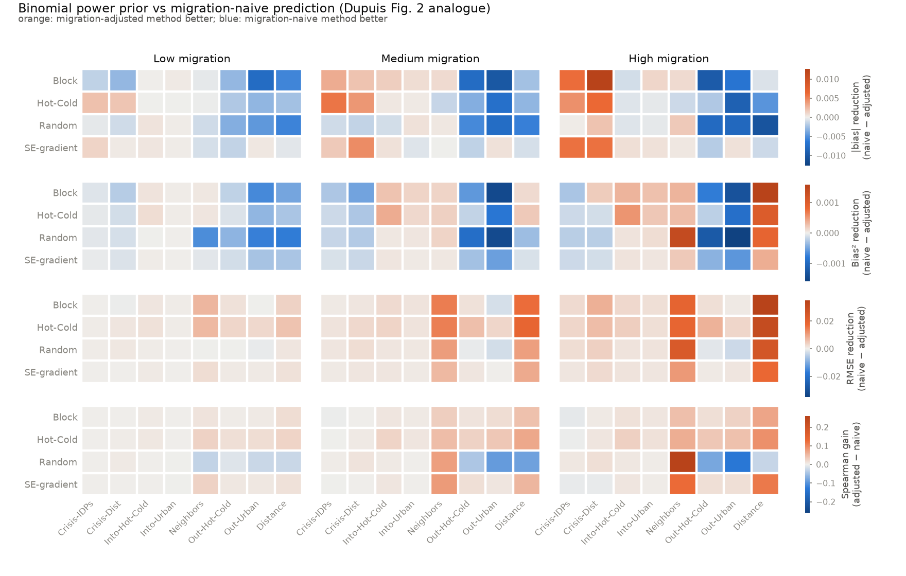
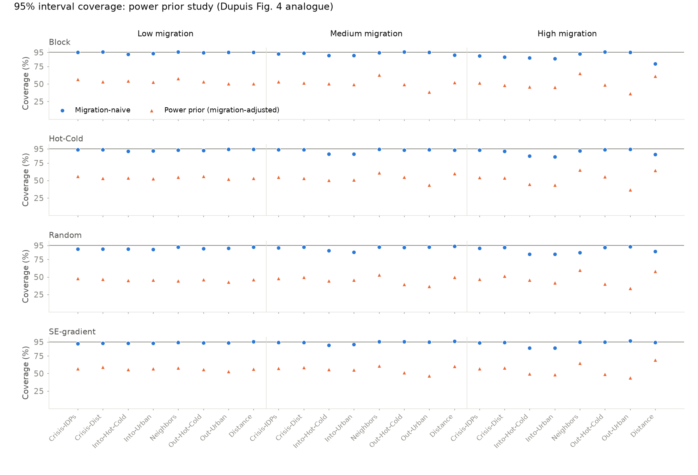
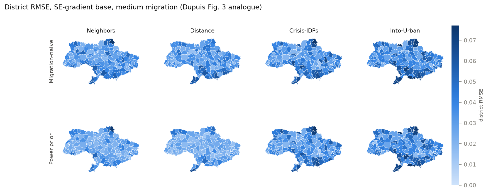
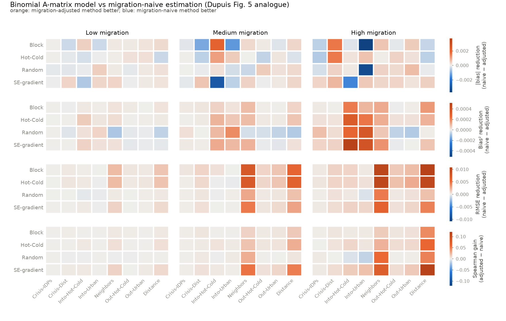
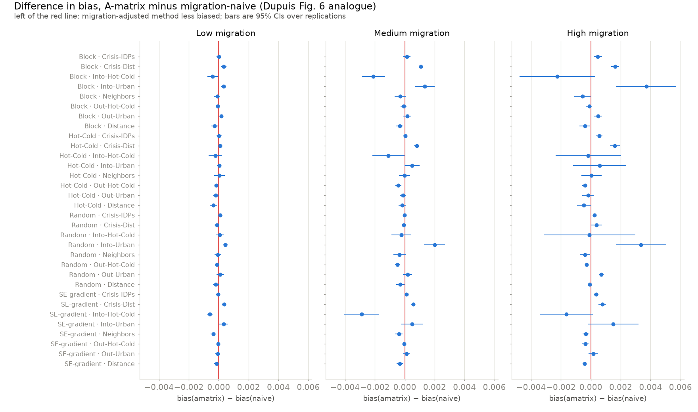
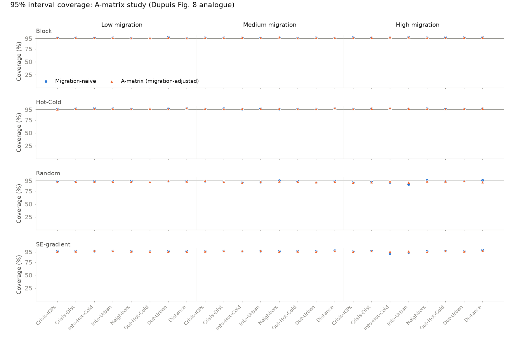

# Replicating "Bayesian methods for incorporating migration into small area estimation of infectious disease burden" with numpyro

Replicates the binomial simulation studies of Genevieve Dupuis, *Bayesian
Methods for Incorporating Migration Into Small Area Estimation of Infectious
Disease Burden*, PhD dissertation, Boston University Biostatistics, 2026
(advisor Helen Jenkins). The full text is open access on OpenBU under
CC BY-NC-ND 4.0: <https://hdl.handle.net/2144/53596> (the ProQuest record is
32703879).

<!-- TLDR -->

## What the dissertation does

Migration moves people with a disease, and with it the local mix of disease
characteristics. The dissertation asks how to fold migration into small area
estimates when the only extra data are flows between areas, and proposes two
methods built on a standard **unit-level Bayesian small area estimation
(SAE)** model (Parker et al.'s weighted pseudo-likelihood logistic model):

```
logit(theta_i) = X_i beta + eta_{area(i)}
eta | sigma_eta^2 ~ N(0, sigma_eta^2 Sigma_r),   Sigma_r = (L + I / sigma_eta^2)^{-1}
beta | sigma_beta^2 ~ N(0, sigma_beta^2 I),      sigma^2 ~ InverseGamma
```

where `L` is the graph Laplacian of a drive-time adjacency between district
centroids. District estimates are finite-population proportions: observed
outcomes for sampled cases plus posterior-predictive draws for the rest.

1. **Migration-adjusted power prior (Chapter 2).** Work one destination area
   at a time. Approximate its baseline (migration-naive) posterior by a
   `Beta(alpha_j, beta_j)`, then treat the binomial likelihoods of the area
   itself and of every origin area as power-prior terms with exponents equal
   to the share of the post-migration population that came from each place.
   The exponents are drawn from `Beta` priors built from migrant counts and
   renormalised at every iteration, never updated by the outcome data. Each
   draw of the migration-adjusted posterior is then conjugate:
   `Beta(alpha_j + sum_k a_jk y_k, beta_j + sum_k a_jk (n_k - y_k))`, with the
   `k = j` term carrying the focal area's own data scaled by the stayer share.
2. **Migration-informed spatial random effects, the "A-matrix" (Chapter 3).**
   Replace `eta` in the linear predictor by `A eta`, where `A` is the
   row-stochastic post-migration composition matrix (`a_jk` = share of
   residents of `j` who came from `k`). Rows get Dirichlet priors from the
   migrant counts and, as with the power prior, are drawn from the prior rather
   than updated. Migration therefore enters estimation directly and keeps its
   asymmetry without touching the symmetric spatial covariance.

Chapter 4 extends both to multinomial outcomes (four TB drug-resistance
classes) and compares them head to head under a method-neutral data-generating
process. All evaluations use synthetic populations built on Ukraine's 2015-2018
TB registry (district case loads, covariates, drive times) which is not public.

The headline findings (dissertation Figures 2-8, 15-16, Table 2):

- the power prior lowers RMSE and bias² everywhere, more so as migration
  rises and when migrants come from all districts, at the cost of slightly
  more average bias and **95% interval coverage of roughly 40-50% instead of 95%**;
- the A-matrix model lowers RMSE with no bias penalty and keeps coverage at
  85-99%, but its gains are smaller;
- head to head, the power prior is more precise (lower RMSE, TVD) and the
  A-matrix approach has far better coverage (by 0.3-0.7), so the author
  recommends the power prior for prediction with uncertain migration data
  and the A-matrix for inference.

## What this replication does

Everything is re-implemented in Python: the unit-level SAE model in
[numpyro](https://num.pyro.ai) (NUTS instead of the dissertation's
Pólya-Gamma Gibbs sampler), the power prior in NumPy, and the three binomial
simulation designs on the real post-2020 Ukrainian district map (128 of the 139
admin-2 units, excluding Crimea and Sevastopol as the dissertation does).

| Dissertation component | Here |
|---|---|
| Ch. 2 binomial power prior vs. naive prediction (4 base patterns × 8 migration patterns × 3 levels, 50 replications) | same grid, 10 replications |
| Ch. 3 binomial A-matrix vs. naive estimation (same grid) | same grid, 8 replications |
| Ch. 4 method-neutral head-to-head (multinomial) | binomial analogue, same grid, 8 replications; multinomial on a reduced grid |
| Ch. 4 multinomial extensions | reduced grid (2 base × 4 migration patterns × 3 levels, 5 replications) |
| Ch. 4 misspecification study, runtimes | not replicated |
| Ukraine registry case loads, covariates, drive times, observed RR pattern | stand-ins (see below) |

## Results

### Power prior vs. migration-naive prediction (Chapter 2)



The dissertation's Figure 2 pattern reappears. Averaged over the 32
base-pattern × migration-pattern scenarios at each migration level
(10 replications, 128 districts):

| migration level | method | bias | bias² | RMSE | Spearman | 95% coverage | posterior sd |
|---|---|---|---|---|---|---|---|
| low | naive | −0.001 | 0.0005 | 0.044 | 0.83 | 0.93 | 0.043 |
| low | power prior | +0.001 | 0.0007 | 0.042 | 0.83 | 0.53 | 0.016 |
| medium | naive | −0.002 | 0.0005 | 0.044 | 0.82 | 0.93 | 0.043 |
| medium | power prior | +0.002 | 0.0007 | 0.040 | 0.83 | 0.52 | 0.015 |
| high | naive | −0.003 | 0.0007 | 0.048 | 0.80 | 0.90 | 0.043 |
| high | power prior | +0.003 | 0.0007 | 0.040 | 0.82 | 0.51 | 0.015 |

- **RMSE** (dissertation: lower everywhere, gains growing with migration and
  largest for Neighbors and Distance): replicated. The power prior has lower
  RMSE in 86 of 96 scenarios (one tie; the 9 losses are all at most 0.003 and
  sit in the Out-Urban and Out-Hot-Cold patterns); the reductions reach 0.035
  (Block, Distance, high migration) and 0.019-0.024 for Neighbors, versus at
  most 0.008 when migrants leave from only a few districts. The dissertation's largest
  reductions were about 0.06; its case loads and sampling fraction differ.
- **Bias** (dissertation: naive slightly better on average, mixed by
  scenario): replicated. The power prior has the smaller absolute bias in 41
  of 96 scenarios. The naive predictions are biased slightly downward, the
  power prior slightly upward, by about the same amount; the sign flips
  because the power prior pulls each district toward the raw mixture of
  origin-area proportions.
- **Bias²** (dissertation: favours the power prior almost everywhere): not
  replicated. The power prior has the lower bias² in only 40 of 96 scenarios.
  With 10 replications the per-district bias² is noisy and the two methods
  are tied on average; the power prior wins in the all-district patterns at
  high migration and loses for Out-Urban and Distance in the Random base
  pattern.
- **Spearman correlation** (dissertation: better in most settings, worse
  under high migration into hot/cold spots or cities): replicated in
  direction. The power prior ranks districts better in 77 of 96 scenarios;
  the exceptions concentrate in the Random base pattern with Out-Urban,
  Out-Hot-Cold and Distance migration.
- **Coverage** (dissertation: about 40-50% for the power prior vs 95% for the
  naive model): replicated. Power prior coverage ranges from 34% to 70%
  (mean 52%) while the naive model ranges from 79% to 96% (mean 92%), dipping
  below 90% only under high migration.





### Why the power prior under-covers

The power prior's conjugate update adds each area's *full* case count to the
Beta prior that already summarises the migration-naive posterior, so the
focal area's own data enter twice. With a fraction `f` of cases having a known
outcome, the baseline posterior behaves like a binomial with roughly `n_j = f N_j`
observations, and the update then adds `a_jj N_j + sum_k a_jk N_k ≈ N_j` more,
inflating precision by about `1 + 1/f`. At `f ≈ 0.1` that is a tenfold precision
gain, which is exactly the regime where 95% intervals cover about half the
time. The posterior sd column above shows the mechanism: 0.015 against 0.043.

`sensitivity_sampling.py` varies the share of cases with known status (Block
base pattern, medium migration, 3 replications):

| known RR status | pattern | naive RMSE | power prior RMSE | naive coverage | power prior coverage |
|---|---|---|---|---|---|
| ~10% | Neighbors | 0.040 | 0.027 | 0.95 | 0.62 |
| ~10% | Distance | 0.045 | 0.029 | 0.92 | 0.53 |
| ~10% | Crisis-IDPs | 0.040 | 0.041 | 0.96 | 0.52 |
| ~25% | Neighbors | 0.033 | 0.021 | 0.88 | 0.70 |
| ~25% | Distance | 0.042 | 0.023 | 0.76 | 0.65 |
| ~25% | Crisis-IDPs | 0.034 | 0.031 | 0.87 | 0.65 |
| ~50% | Neighbors | 0.029 | 0.020 | 0.70 | 0.67 |
| ~50% | Distance | 0.040 | 0.020 | 0.51 | 0.65 |
| ~50% | Crisis-IDPs | 0.030 | 0.026 | 0.67 | 0.65 |

Two things follow. First, the dissertation's "95% vs 40%" contrast needs a
small sampling fraction; when half the cases have a known outcome the naive
finite-population intervals become too narrow for a truth that is redrawn
at `t1` and shifted by migration, and the power prior's coverage is as good or
better. Second, the power prior's RMSE advantage does not depend on this: it
is a mixture estimator whose point predictions improve whenever migration
actually mixes areas.

A variant that uses only the *sampled* individuals' counts in the update
(`pp_sample`, `results/figures/fig2b_prediction_heatmap_pp_sample.png`) has
coverage of about 82% but a positive bias of 0.013-0.015, because the raw
sample proportions carry the informative over-sampling of previously treated
cases that the model-based baseline corrects for. The full-population variant
inherits the design correction through the imputed counts.

### A-matrix vs. migration-naive estimation (Chapter 3)



Here the data are generated the way the A-matrix model assumes (district
effects mixed through the realized composition matrix before outcomes are
drawn), so the method is favoured by design, as the dissertation notes.
Averaged over the 32 scenarios per level (8 replications):

| migration level | method | bias | bias² | RMSE | Spearman | 95% coverage | posterior sd |
|---|---|---|---|---|---|---|---|
| low | naive | 0.0000 | 0.0005 | 0.039 | 0.86 | 0.96 | 0.043 |
| low | A-matrix | 0.0000 | 0.0005 | 0.038 | 0.86 | 0.96 | 0.042 |
| medium | naive | +0.0006 | 0.0005 | 0.039 | 0.84 | 0.96 | 0.043 |
| medium | A-matrix | +0.0005 | 0.0005 | 0.037 | 0.85 | 0.96 | 0.041 |
| high | naive | +0.0001 | 0.0007 | 0.041 | 0.81 | 0.96 | 0.045 |
| high | A-matrix | +0.0004 | 0.0006 | 0.038 | 0.83 | 0.96 | 0.043 |

- **RMSE** (dissertation: consistently lower, gains growing with migration,
  largest for Distance, Neighbors, Into-Urban and Into-Hot-Cold): replicated
  in direction and shape. The A-matrix model has lower RMSE in 74 of 96
  scenarios with 14 ties and 8 losses, all of them tiny (≤ 0.0003) and at low
  migration. Gains grow from 0.0004 (low) to 0.0024 (high) on average and
  concentrate in the Distance and Neighbors patterns (0.007-0.011 at high
  migration); they are near zero when migrants leave from a few districts.
  The Into-Urban and Into-Hot-Cold gains of the dissertation do not appear
  here because our eight destination districts receive flows from everywhere
  and are already well estimated. The dissertation's gains were larger (up to
  0.03), with the same ordering by pattern.
- **Bias** (dissertation: no meaningful difference, all |differences| below
  0.005): replicated. The largest absolute bias difference is 0.004 and the
  forest plot below shows nearly every interval covering zero.
- **Bias²** (dissertation: favours the A-matrix everywhere): largely
  replicated, 73 of 96 scenarios.
- **Spearman correlation**: higher for the A-matrix model in 85 of 96
  scenarios.
- **Coverage** (dissertation: 85-99% for both, lowest for the Random base
  pattern): replicated. Both methods cover 88-99%, averaging 96%, and the
  Random base pattern is the lowest at 94%.





District-level RMSE maps for the SE-gradient base pattern at medium
migration are in `results/figures/fig7_estimation_rmse_maps.png` (Dupuis
Figure 7 analogue). Diagnostics: one of 1,536 fits had a divergent transition
and one had an R-hat above 1.05 (1.058); the rest were below.

<!-- RESULTS-HEADTOHEAD -->

<!-- RESULTS-MULTINOMIAL -->

## Implementation notes

- **Sampler.** The dissertation uses Pólya-Gamma data augmentation and a Gibbs
  sampler written in R. Here the same model runs under NUTS in numpyro
  (`models.py`). The spatial prior is implemented through the eigendecomposition
  of the Laplacian, `eta = sigma_eta V diag((lambda + 1/sigma_eta^2)^{-1/2}) z`,
  which reproduces `Sigma_r = (L + I/sigma_eta^2)^{-1}` exactly while keeping
  the random effects non-centred.
- **Likelihood on cells.** Individuals are aggregated into district × covariate
  cells (128 × 16). With weights constant within a cell the weighted binomial
  pseudo-likelihood aggregates exactly, so each gradient costs O(2,048) instead
  of O(100,000). Sampling weights are normalised to sum to the sample size.
- **A-matrix as a prior draw.** The dissertation redraws `A` from its Dirichlet
  prior at every Gibbs iteration without conditioning on the data. NUTS cannot
  do that mid-chain, so each chain draws its own `A` from the prior and holds
  it fixed; pooling chains integrates over the prior on `A`. With counts in the
  hundreds the prior is tight and this is practically identical to plugging in
  the mean.
- **Power prior counts.** The conjugate update sums outcomes over "individuals
  in area `k`" and the binomial formulation defines `n_k` as the total
  population. The main variant (`pp`) therefore uses each area's full case load
  with observed plus posterior-mean imputed positives. A second variant
  (`pp_sample`) uses only the sampled individuals, in case the sums were meant
  over the sample. (A third variant in the code, `pp_tempered`, tempers the
  baseline Beta prior by the stayer share instead of re-using the focal area's
  likelihood; it is badly biased for destinations of large flows and is not
  reported.)
- **MCMC settings.** 2 chains × (400 warm-up + 400 draws) per fit; R-hat and
  divergences are logged for every fit in `results/raw/*.diagnostics.csv`.

## Stand-ins and assumptions

| Quantity | Dissertation | Here |
|---|---|---|
| Districts | 136 raions / 122 used | HDX COD-AB v05 admin-2 layer, 128 units outside Crimea and Sevastopol |
| Spatial graph | centroids within 2.5 h drive time, median 5 neighbours | centroids within 94 km (threshold chosen to give median degree 5 with no isolated district) |
| Case loads | registry counts 2015-2018 | 0.0024 × district population proxy (≈98k cases); population proxy from oblast totals, the 30 cities ≥ 100k, and settlement counts (`prepare_data.py`) |
| Covariates | age, sex, new/relapse | sex (68% male), four age groups, previously treated (22%); log-odds effects 0.10, 0.10/0.00/−0.30, 1.20 |
| Known RR status | "a subset of cases" | 8% of new and 16% of previously treated cases (≈10%), informative sampling with weights 1/π |
| Base patterns | block, hot/cold, random, observed Ukraine | block, hot/cold (3 hotspots, 3 coldspots, inverse-distance-squared interpolation), random U(0.1, 0.4), south-east gradient as a stand-in for the registry pattern |
| Spatial smoothing of base pattern | via Sigma_r, correlation ≥ 0.95 with input | logit-scale noise with sd 0.10 from (L + I)^{-1}, correlation ≥ 0.95 checked in tests |
| Migration levels | 10%-70% of case load | 10%, 40%, 70% of cases in eligible origin districts |
| Neighbour migration | adjacent districts, equal probability | shared-border contiguity, equal probability |
| Travel-time migration | inverse drive time | inverse centroid distance |
| Crisis origins | conflict-affected districts | Donetsk, Luhansk, Kherson oblasts plus the frontline raions of Kharkiv and Zaporizhzhia oblasts (28 districts) |
| Crisis-IDP destinations | observed IDP distribution | approximate oblast shares from IOM surveys, split within oblast by population |
| Urban centres | major cities | raions of Kyiv, Kharkiv, Odesa, Dnipro, Zaporizhzhia, Lviv, Kryvyi Rih, Mykolaiv |
| Hyper-priors | IG(a, b), IG(c, d), values unstated | IG(0.5, 0.5) for both variances |
| Replications | 50 | 10 |

## Reproducing

```bash
cd migration_sae_replication
uv sync
uv run pytest -q                                   # unit tests (~40 s)
uv run python simulation.py --study prediction     # ~7 min on 4 cores
uv run python simulation.py --study estimation --reps 8   # ~85 min on 4 cores
uv run python simulation.py --study headtohead --reps 8   # ~45 min
uv run python multinomial.py --study headtohead --reps 5 --bases block hotcold --patterns neighbors distance crisis_idp into_urban
uv run python summarize.py results/raw/*.parquet   # scenario metrics -> results/*.csv
uv run python make_figures.py                      # -> results/figures/
```

`data/ukraine_adm2.geojson` is derived from HDX files with `prepare_data.py`;
the raw downloads (85 MB) are not committed.

## Files

- `geography.py` - district geometry, spatial graph, contiguity, district sets
- `synthetic.py` - covariates, base patterns, migration patterns, population and sampling
- `models.py` - numpyro unit-level SAE model (naive and A-matrix), prediction
- `power_prior.py` - migration-adjusted power prior (binomial and multinomial)
- `simulation.py` - the three studies, parallel over scenarios
- `summarize.py`, `make_figures.py` - metrics and figures
- `sensitivity_sampling.py` - power prior coverage vs. share of cases with known status
- `test_synthetic.py`, `test_models.py` - unit tests
