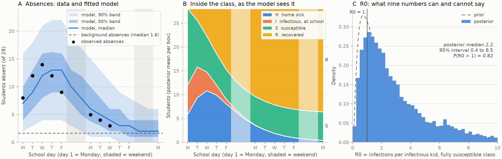
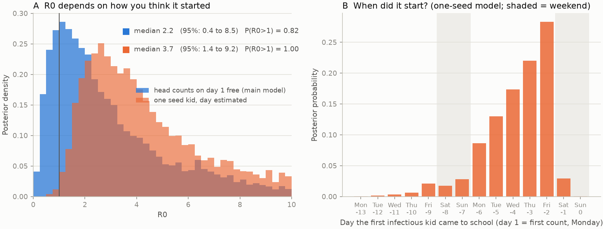

# A norovirus outbreak in one classroom, modeled with camdl

Nine attendance counts from a class of 28, a four-box model, and a Bayesian
fit that runs in about two minutes. Built as a worked example for an
introductory epidemiological modeling class.



## TL;DR

- **The data:** how many of 28 students showed up each school day for two
  weeks during a December 2024 norovirus outbreak (a photo of the note is
  in `data/`). That's it. Nobody was tested; nobody counted who vomited.
- **The model:** four boxes. Susceptible → Infectious-at-school →
  Home-sick → Recovered. We only ever see the Home-sick box, plus the kids
  who are absent for ordinary reasons.
- **The tool:** [camdl](https://github.com/vsbuffalo/camdl), a small
  language for stochastic compartmental models. The whole model is 90
  lines, 40 of them comments. Fitting is one command.
- **What we learn:** roughly how many kids got sick (most of the class),
  how long they stayed home (about 3 days), and how many were absent for
  unrelated reasons (about 1.6 a day). What we *don't* learn from these
  data alone: R0, because the record starts after the outbreak was already
  under way. A companion model shows how one extra assumption changes that.

## The data

A parent wrote down the daily attendance during the outbreak:

| day | weekday | present | absent |
|---:|---|---:|---:|
| 1 | Mon | 20 | 8 |
| 2 | Tue | 16 | 12 |
| 3 | Wed | 14 | 14 |
| 4 | Thu | 16 | 12 |
| 5 | Fri | 19 | 9 |
| 8 | Mon | 23 | 5 |
| 9 | Tue | 24 | 4 |
| 10 | Wed | 25 | 3 |
| 11 | Thu | (unreadable) | |

Two footnotes on the same scrap of paper matter for the model. On January
20 the class had *still* not had a 100%-attendance day; the first one came
on January 22. So a couple of absences on an ordinary day is normal, and
"absent" is not the same as "sick."

The model reads `data/absent.tsv`. Weekend days and the unreadable
Thursday are in the file as `NA`. camdl treats `NA` as "not observed," which
is different from an observed zero. Half the class was not present on
Saturday either, but nobody counted.

## The model, box by box

Here is the core of `classroom_norovirus.camdl`:

```camdl
compartments { S, I, H, R }
let N = S + I + H + R

transitions {
  infection : S --> I @ beta * school(t) * S * I / N
  sick      : I --> H @ I / d_school
  recover   : H --> R @ H / d_home
}
```

- **S, susceptible.** At school, healthy, can catch it.
- **I, infectious at school.** Infected but not yet sick. Norovirus
  incubates for 12–48 hours, and this is the kid who spreads it: still in
  class, sharing the pencil sharpener. The model holds this window at
  `d_school = 1` day.
- **H, home sick.** Vomiting or diarrhea, then kept home until symptom-free
  (most schools ask for 24–48 hours). How long, on average, is `d_home`; we
  estimate it.
- **R, recovered.** Back at school and immune for the rest of this outbreak.

The infection rate is the usual mass-action term, times `school(t)`, which
is 1 on weekdays and 0 on Saturday and Sunday. Kids keep recovering over
the weekend, but nobody infects a classmate.

Each arrow is a *rate*, and camdl turns the rates into random daily
transitions (a chain-binomial process). With 28 kids, chance matters a lot,
which is why the fitted band in panel A is so wide even where the model
fits well. Running the same model twice gives two different outbreaks.

### What we observe

```camdl
observations {
  absent {
    columns   { time : time, absent : count }
    projected = H + a0
    absent    ~ poisson(rate = projected)
  }
}
```

The observed count is a snapshot of the H box, plus `a0` kids out for
unrelated reasons, with Poisson noise. This is the link between the model's
hidden boxes and the one number we have each day.

### Where the outbreak was on day 1

The record starts on a Monday with 8 kids already out, so the outbreak
began before the first count. Rather than guess, the model has two
initial-condition parameters, `i0` (infectious at school on day 1) and
`h0` (already home sick), and estimates them along with everything else:

```camdl
init {
  S = 28.0 - i0 - h0
  I = i0
  H = h0
}
```

## Fitting

`fit.toml` says which parameters to estimate, what we believe about them
before seeing data (the priors), and which algorithm to use. The priors are
deliberately loose but not silly:

| parameter | prior | why |
|---|---|---|
| `beta` (so R0 = beta × 1 day) | log-normal, median 2, 95% range 0.3–14 | "probably a couple of infections per case, could be anything" |
| `d_home` | log-normal, median 3 days, 95% range 1.7–5.4 | 1–3 days of illness plus a day-after rule |
| `a0` | log-normal, median 1.5, 95% range 0.6–4 | US elementary schools run 5–8% daily absence, i.e. 1.4–2.2 of 28 |
| `i0`, `h0` | uniform 0–12 | no idea |

camdl fits the model with particle Gibbs (PGAS): it alternates between
proposing hidden trajectories of the four boxes that are consistent with
the counts and updating the parameters given those trajectories. Four
chains, 12,000 sweeps each, two and a half minutes on a laptop-class
machine. The convergence diagnostics all pass (R̂ ≤ 1.007 on every
parameter).

## What nine numbers can say

Posterior medians with 95% intervals:

| quantity | estimate |
|---|---|
| days home sick, `d_home` | 2.9 (1.8 to 4.8) |
| background absences per day, `a0` | 1.6 (0.6 to 4.0) |
| kids infectious at school on day 1, `i0` | 6 (0.4 to 11.7) |
| kids home sick on day 1, `h0` | 6 (0.4 to 11.7) |
| peak kids home sick on one day | 14 (7 to 20) |
| attack rate (share of class infected) | 96% (39% to 100%) |
| R0 = beta × `d_school` | 2.2 (0.4 to 8.5) |

Three things worth saying in class:

1. **The fit is fine and the band is honest.** Panel A: every observed
   point sits inside the 50% band or close to it, and the model, replayed
   forward from day 1 without looking at the data, reproduces the rise,
   the peak, and the decay to background. The width of the band is mostly
   the randomness of a 28-person epidemic, not ignorance about parameters.

2. **The model sees things we didn't.** Panel B is the posterior mean of
   each box. On the Monday the record starts, the model thinks about six
   kids were home and about six more were infectious but still in class.
   By Wednesday most of the class had been infected. The orange sliver,
   the infectious-at-school kids, is the part of the outbreak nobody
   counted.

3. **R0 is barely updated (panel C).** The posterior for R0 is a bit
   narrower than the prior and shifted right, but it still spans 0.4 to
   8.5. Why? Because the record starts mid-outbreak. A rise from 8 to 14
   absences could be six kids who were *already* infected on Monday going
   home Tuesday and Wednesday, with no further transmission at all (a
   point-source exposure: one kid throws up in the classroom Friday, many
   are exposed at once). Or it could be sustained spread. The nine counts
   cannot tell these apart, and the model correctly refuses to pretend.
   The posterior gives an 82% probability that R0 > 1, which is the
   data's way of saying "there was probably some classroom transmission."

## Companion model: one seed kid, and when?

`classroom_norovirus_seed.camdl` keeps the same four boxes but replaces the
day-1 head counts with a different assumption: the outbreak started with
**one** infectious kid at school on some earlier day `t_seed`, and everything
after that is classroom spread.

```camdl
events {
  introduction : transfer(count = 1, from = S, to = I) at [t_seed]
}
```

`t_seed` is a parameter. The data get to say when the outbreak began.

One technical note, because it bit me: this variant is fit with PMMH
(particle marginal Metropolis-Hastings) rather than PGAS. PGAS updates the
parameters *given* one sampled hidden path, and the seed day is baked into
that path (it is the step where S drops by one), so the conditional update
learns nothing about `t_seed` and its posterior comes back flat. PMMH
scores each proposal with a fresh particle-filter likelihood, which does
depend on the seed day. Both are one line in the fit file; see
`fit_seed.toml`.



| quantity | main model | one-seed model |
|---|---|---|
| R0 | 2.2 (0.4 to 8.5) | 3.7 (1.4 to 9.2) |
| P(R0 > 1) | 0.82 | 1.00 |
| days home sick, `d_home` | 2.9 (1.8 to 4.8) | 3.4 (2.1 to 5.4) |
| background absences, `a0` | 1.6 (0.6 to 4.0) | 1.7 (0.6 to 4.1) |
| seed day, `t_seed` | (not in model) | -3.3 (-8.8 to -1.5): the Wed–Fri before the record |

Under the one-seed assumption, R0 is clearly above 1 and the first
infectious kid most likely came to school on the Thursday or Friday before
the first count. That is what the data say *if* you believe the outbreak
grew from one kid by classroom spread alone. The two lines of R0 in panel
A were fit to the same nine numbers.

One more honest wrinkle: the one-seed model's forward replays fizzle a
quarter of the time (one kid gets sick, nobody else does), because that is
what a single introduction with R0 around 3 does in a group of 28. The fit
conditions on the outbreak we saw; a forward simulation does not.

The point for students: **the two models fit the same nine numbers about
equally well and disagree about R0.** What distinguishes them is an
assumption about how the outbreak started, and the data cannot check it.
That's not a flaw in the fitting; it is the fitting telling you which
question to go ask the teacher.

## Exercises

1. **Is Poisson too noisy?** The observation model says a day with 12
   expected absences varies with standard deviation 3.5. But a kid home
   sick is counted absent with certainty; only the background part is
   really random. Try `absent ~ neg_binomial(...)`, or a `normal` with a
   fixed small `sd`, and see how the R0 posterior changes.
2. **Close the school.** Add an intervention that sets `school(t)` to 0
   from day 3 on (see `interventions {}` in `camdl docs language`) and
   compare the attack rate with `camdl fit predict --scenario`.
3. **Use the January footnote.** The class had at least one absence every
   day through January 20 and none on January 22. What does that say about
   `a0`? Try encoding January 22 as an observed 0 at a late time.
4. **Change the infectious window.** `d_school` is fixed at 1 day. Refit
   with 0.5 and 2 days. R0 = beta × d_school; does R0 move, or just beta?
5. **Fade-outs.** Simulate the seed model 100 times at the posterior
   median. How often does the single seed fizzle without an outbreak? What
   does that imply about how many *other* classrooms had a seed kid that
   December and nothing happened?

## Quickstart

Install camdl once (its `install.sh` builds the OCaml and Rust toolchains
with no sudo), then from this directory:

```bash
camdl check classroom_norovirus.camdl
camdl fit run fit.toml --label classroom --seed 7          # ~2.5 min
camdl fit predict @classroom --n-draws 400
cp results/fits/fit-*/predictive/absent.tsv results/predictive_absent.tsv
camdl simulate classroom_norovirus.camdl --draws posterior \
    --fit results/fits/fit-*/01-posterior-*/seed_7-*/ -n 400 --dt 0.25 \
    --seed 11 -o results/posterior_traj.tsv --obs results/posterior_obs.tsv
cp results/fits/fit-*/01-posterior-*/seed_7-*/draws.tsv results/posterior_draws.tsv
uv run python plot.py
```

For the one-seed companion (about 4 minutes):

```bash
camdl fit run fit_seed.toml --label classroom-seed --seed 7
cp results/fits/fit_seed-*/01-posterior-*/seed_7-*/draws.tsv results/posterior_draws_seed.tsv
uv run python plot_seed.py
```

## Files

- `classroom_norovirus.camdl` — the model (four boxes, weekend forcing,
  observation model, reported quantities)
- `fit.toml` — priors and the PGAS stage
- `classroom_norovirus_seed.camdl`, `fit_seed.toml` — the one-seed
  companion model
- `data/attendance.tsv` — the note, transcribed; `data/absent.tsv` — what
  the model reads; `data/attendance_note.jpg` — the note
- `params/guess.toml` — hand-picked values for a first forward simulation
- `plot.py` — the figure; `plot_seed.py` — the R0 / seed-day comparison
- `results/` — posterior draws, predictive band, trajectories, figures
  (the content-addressed `results/fits/`, `results/sims/` trees are
  gitignored; rerun the quickstart to regenerate them)

## Further reading

- CDC, *About Norovirus*: incubation 12–48 hours, illness 1–3 days,
  shedding continues for days after recovery.
- Vince Buffalo, *Introducing camdl*
  (https://vincebuffalo.com/blog/introducing-camdl/), and `camdl docs
  workflow` for the fit → summary → predict loop used here.
- Andrieu, Doucet & Holenstein (2010), *Particle Markov chain Monte Carlo
  methods*, and Lindsten, Jordan & Schön (2014) for the ancestor-sampling
  variant (PGAS) camdl runs.
- The sibling directory `../camdl_replication/` fits camdl to two published
  outbreak papers, for a look at the same tool on bigger problems.
