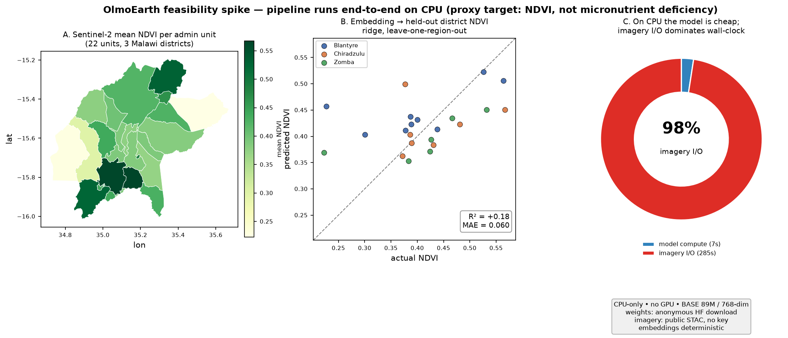

# OlmoEarth feasibility spike — GO / NO-GO memo

*Date: 2026-07-18. Author: AI-assisted spike. Scope: can Ai2's OlmoEarth run
end-to-end to produce image embeddings usable as covariates in an admin-unit
areal-prediction workflow? This memo answers "does the pipeline run, on what
compute, with what data friction" — **not** predictive accuracy for the real
outcome.*

> **Proxy caveat, up front.** The downstream target in this spike is mean NDVI (an
> open, EO-derivable stand-in) plus a synthetic spatial field. These prove the
> plumbing works and that embeddings carry spatial signal. They say **nothing**
> about predicting micronutrient deficiency. NDVI is also partly derivable from
> the same bands fed to the model, so it is a *lower bar* than a truly external
> outcome.

---

## Bottom line: **GO** on technical feasibility — with a **NEEDS-MORE** on predictive value

The full vertical slice ran end-to-end on a **CPU-only** box with **open weights,
open data, and no paid accounts**: admin boundaries → cloud-free Sentinel-2 chips
→ OlmoEarth embeddings (one 768-dim vector per admin unit) → ridge regressor →
held-out-region evaluation. Nothing about OlmoEarth itself is a blocker. The real
cost and risk live in **EO data engineering** (cloud-free imagery preparation and
I/O at scale), not in the model.

- **Did it run end-to-end?** **Yes.** All four milestones completed. 22 Malawi
  Admin-2-style units got embeddings; a regressor trained and scored on held-out
  districts.
- **Is a GPU required?** **No** for inference. BASE (89M) runs on 4 CPU cores.
  A GPU is a 10–50× accelerator that matters at national scale but is not required
  to run or prototype.
- **Data-access friction?** **Low.** Model weights download anonymously from
  Hugging Face (no token, no gating). Imagery came from a public STAC with no
  account or key.

---

## What was built (the vertical slice)

| Milestone | Result |
|---|---|
| M0 recon | `docs/RECON.md` — loader API, input spec, and license all read from source before coding. |
| M1 smoke | BASE + NANO both load from HF and run a forward on CPU; embeddings deterministic. |
| M2 data  | 22 admin units (GADM Malawi ADM2, 3 southern districts) → Sentinel-2 chips → 768-dim BASE embeddings → `outputs/embeddings.csv`. |
| M3 model | ridge/GBM from embeddings → NDVI + synthetic target; 5-fold, leave-one-unit-out, leave-one-region-out. |

## Variant, license, and fitness for the intended use

- **Variant used:** `OlmoEarth-v1-Base` (89M encoder params, **embedding dim 768**)
  for the real embedding run; `Nano` (1.4M, dim 128) / `Tiny` (6.2M, dim 192) for
  smoke tests. Loaded via the `olmoearth-pretrain-minimal` PyPI package (Apache-2.0
  code).
- **Weights license:** **OlmoEarth Artifact License** — a custom Ai2
  responsible-AI license. It **permits** research, derivative works, and using
  model outputs (embeddings) as features, commercial or not. It **prohibits**
  military/surveillance/policing and extractive-industry uses (mining, drilling,
  deforestation).
- **Fitness verdict:** Micronutrient-prevalence mapping for public health is
  squarely permitted and hits none of the prohibited categories. ✅ **One
  caveat:** it is a bespoke, non-OSI license — a quick institutional legal skim is
  prudent before productionizing, but nothing about the intended use conflicts
  with it.

## Compute used, and whether a GPU is required (budget driver)

Measured on a **4-vCPU / 15 GB RAM / no-GPU** container, `torch 2.8.0+cpu`:

| Step | Measurement |
|---|---|
| Env build (`uv lock` + `uv sync`) | ~26 s; venv 1.1 GB (mostly CPU torch) |
| Load BASE weights (download + init) | 14.7 s (first time; cached after) |
| BASE forward + pool, 128×128×12 chip | **13.7 s** on CPU |
| BASE forward + pool, 64×64×3 chip | **~0.3 s** on CPU |
| NANO forward, 64×64×6 chip | 0.03 s |
| Peak process RSS (BASE) | **~1.9 GB** |
| Determinism (same input ×2) | max abs diff = **0** |
| M2 full run, 22 units | 292 s wall; **model compute only 7.1 s**; **~13 s/unit is imagery I/O** |

**Key takeaway for budget:** on CPU the *model* is cheap; **imagery download/read
dominates wall-clock**. A GPU is optional, not required. Memory fits comfortably
in 15 GB. This means prototyping and even a one-time national extraction can run
on **ordinary CPU nodes**; GPU only buys speed at scale.

## Data-access friction and download volumes

- **Model weights:** anonymous `hf_hub_download` from `allenai/OlmoEarth-*`. No
  token, no click-through gating (only a rate-limit *warning* for unauthenticated
  use). BASE weights are a few hundred MB, downloaded once.
- **Admin boundaries:** intended source geoBoundaries is GitHub-hosted, and **this
  session's proxy blocked github.com** — a friction point specific to locked-down
  environments. Fell back to **GADM** (UC Davis host, 120 KB zip). *Note:* GADM's
  license is academic/non-commercial; for a funded deliverable prefer geoBoundaries
  (CC-BY), reachable from a normal network.
- **Imagery:** **Element84 Earth Search** STAC (`sentinel-2-l2a`) + the public
  `sentinel-cogs` S3 bucket — **no account, no key, no egress fees**. Read as
  windowed COG range-requests, so only ~tens of MB moved, not whole scenes.
  Microsoft Planetary Computer is an alternative but needs a (free) signing token.
- **Total downloads for the whole spike:** ~1.2 GB (almost all the one-time CPU
  torch wheel), plus a few hundred MB of model weights and only tens of MB of
  imagery.

## Wall-clock per unit and extrapolation to ~4 countries

Measured: **~13 s/unit** end-to-end here, of which ~0.3 s is BASE compute and the
rest is imagery I/O — for a *minimal* setup (1 sample point/unit, 3 dates,
64×64 chip, serial reads through a proxy).

Order-of-magnitude extrapolation (**assumptions stated**):

- Assume ~4 African countries at Admin-2 ≈ **1,500–3,000 units** (highly variable:
  Malawi ~28 districts vs Ghana ~260 vs Nigeria 774 LGAs — a real project must
  count them).
- Assume real units need **many chips each** to cover their area (say ~10–30),
  vs the 1 used here → **~30k–90k chips**.
- **Compute (BASE, CPU):** at ~0.3 s/small-chip → **~3–8 CPU-hours**; a one-time
  overnight job. On one modest GPU, minutes-to-an-hour.
- **Imagery I/O (the real cost):** at ~1–4 s per windowed read, serial →
  **tens of hours to a few days**; but this **parallelizes trivially** across
  workers and drops sharply with a nearby/cached imagery source. This — cloud-free
  compositing, tiling, and read throughput — is where the engineering budget goes.

**Conclusion:** a national-scale extraction is feasible without exotic hardware.
Plan the budget around **EO data operations and parallel I/O**, not GPUs.

## Embedding dimensionality and downstream behaviour

- BASE embedding = **768-dim** per unit (Nano 128, Tiny 192).
- With only 22 units (**p ≫ n**), heavy regularization is essential — ridge worked,
  gradient boosting overfit.
- **NDVI (proxy):** ridge on embeddings reached **leave-one-unit-out R²=+0.32**
  (MAE 0.050) and **leave-one-region-out R²=+0.18**, beating the predict-the-mean
  baseline. So the pooled embedding **does linearly encode real spatial signal**
  that transfers to an unseen district — the transportability rehearsal is
  positive, if modest.
- **Synthetic lon/lat field:** embeddings scored **negative** R² while a trivial
  lon/lat model hit R²=0.95. Informative negative: OlmoEarth embeddings encode
  **landcover content, not geographic coordinates**, so they can't fake
  transportability by memorizing position — a desirable property.
- 5-fold R² was noisier than LOO (expected at n=22 with tiny folds); trust LOO/
  region splits here.

## Top risks / bottlenecks for the funded project

1. **EO data engineering is the real work, not the model.** Cloud-free
   compositing, band alignment, temporal stacking, tile-edge handling, and read
   throughput dominate cost and complexity. (Here, 2/24 units were skipped purely
   from tile-edge/footprint gaps.)
2. **Predictive value for the real outcome is unknown.** This spike only shows
   embeddings encode *NDVI-like* signal. Whether they improve micronutrient-
   deficiency prediction over cheaper covariates is untested and must be measured
   against a baseline.
3. **Aggregation design is unvalidated.** Chip size, number of chips per unit,
   temporal window, and pooling strategy are free knobs that will materially
   affect downstream skill and need methodological work.
4. **Tooling is early.** The minimal package has rough edges we hit and worked
   around: `pool_unmasked_tokens` shape bug on the single-modality path; an
   **undocumented T ≥ 3** temporal-length requirement; a README that instructs
   `uv sync --extra torch-cpu` extras that the published `pyproject.toml` doesn't
   define. All surmountable, but budget for reading source.
5. **License is bespoke.** Permissive enough for this use, but not OSI — needs a
   legal skim, and prohibited-use terms must stay satisfied.
6. **Environment/data access.** Locked-down networks (like this session's proxy)
   block some sources (geoBoundaries via GitHub); confirm imagery/boundary hosts
   are reachable from the target compute environment.

## Recommendation: **GO** (feasibility) / **NEEDS-MORE** (accuracy)

Run the pipeline as a covariate generator — it works, on modest compute, with open
data and an acceptable license. **Before committing funding on accuracy grounds**,
do a focused follow-up spike that swaps in the real outcome and a proper baseline.

### The 3 biggest open questions

1. **Signal for the real target:** do OlmoEarth embeddings improve micronutrient-
   deficiency prediction over cheaper covariates (existing EO indices, DHS proxies)?
   Requires the real outcome data and a baseline model.
2. **Aggregation methodology:** what chip size, per-unit coverage, temporal
   compositing, and pooling give stable, transportable features — and how sensitive
   are results to those choices?
3. **Scale operations:** at 4-country Admin-2 scale, what is the imagery-prep
   pipeline (cloud-free mosaicking, tiling, storage, parallel I/O), and is that EO
   data-ops effort — the true cost — in the budget?
