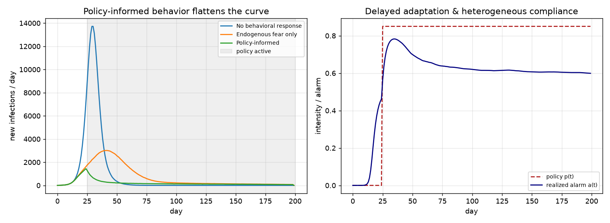
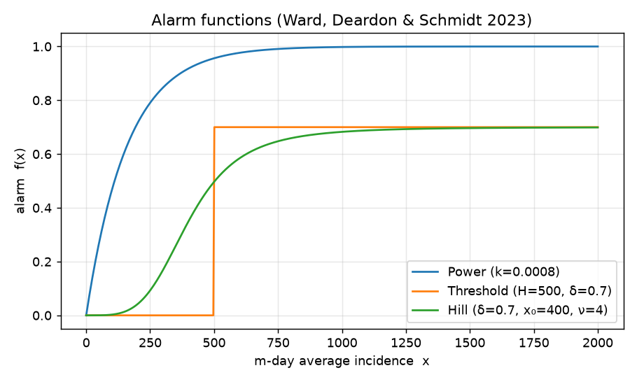
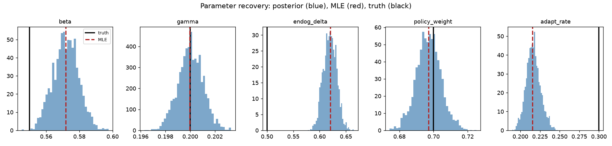
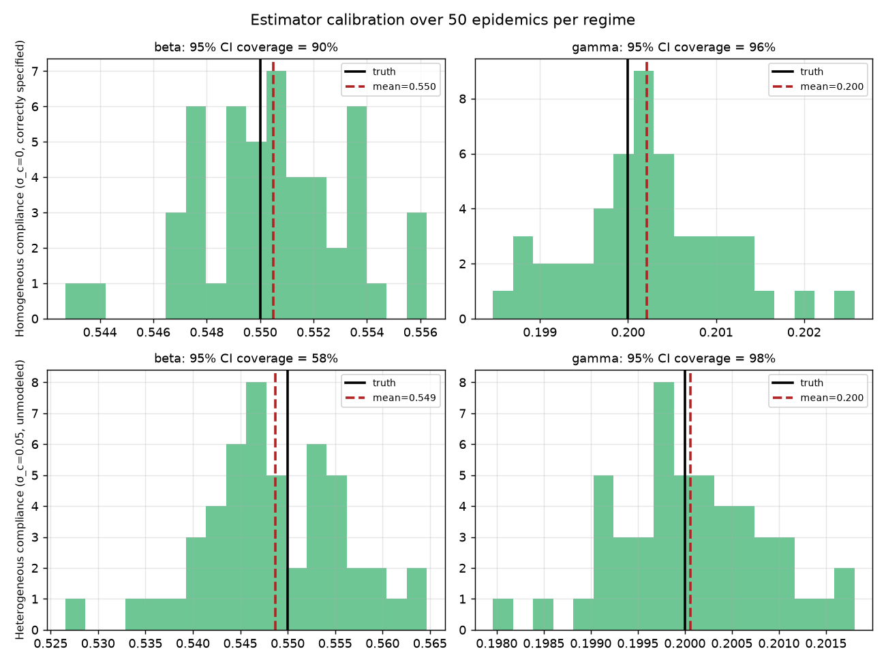
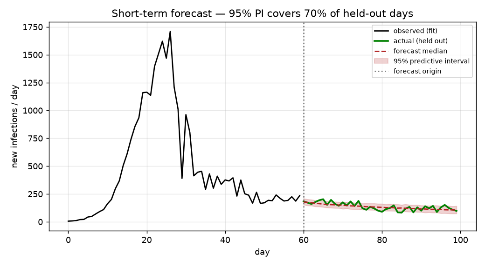

# Replicating "Policy-Informed Behavioral Responses" in an Epidemic Model

A Python replication of the modeling framework in:

> Pathak, W., Pokharel, G., & Hossain, S. (2026). **Modeling Infectious Disease
> Transmission Dynamics with Policy-Informed Behavioral Responses.** In
> *Statistical Science: From Theory to Applied Research IV* (SIS-FENStatS 2026),
> pp. 293–299. Springer, Cham. https://doi.org/10.1007/978-3-032-30665-4_48

## An important caveat up front

The chapter is **paywalled** — only the abstract, keywords, and reference list
are public, and there is no preprint. This is therefore not a line-by-line
reproduction of the authors' exact equations, dataset, or numbers, because those
are not available to read.

What *is* possible, and what this repo does, is a faithful replication of the
**framework the abstract describes**, built on the concrete, open-access
methodology the chapter cites as its backbone — reference [6]:

> Ward, C., Deardon, R., & Schmidt, A. M. (2023). Bayesian modeling of dynamic
> behavioral change during an epidemic. *Infectious Disease Modelling* 8(4),
> 947–963. https://doi.org/10.1016/j.idm.2023.08.002 (arXiv:2211.00122)

Ward et al. give the alarm-modulated chain-binomial SIR. We implement that and
extend it in the direction the 2026 abstract states: the behavioral response
becomes **policy-informed** — "stochastic, policy-dependent processes that
adjust contact rates and transmission probabilities over time, capturing
heterogeneous compliance and delayed adaptation."

## TL;DR

- **What the paper claims:** embedding a policy-driven behavioral-change model in
  a stochastic epidemic model improves (1) parameter estimation, (2) uncertainty
  quantification, and (3) short-term forecasting.
- **What we built:** a stochastic chain-binomial SIR whose transmission rate is
  scaled by an *alarm* term `a_t ∈ [0,1]`. Alarm combines endogenous fear (a Hill
  function of recent incidence) with a **policy signal** `p(t)`, filtered through
  **delayed adaptation** and **heterogeneous compliance**.
- **What we reproduced:** policy-informed behavior flattens the epidemic curve;
  MLE and MCMC recover the generating parameters; the uncertainty machinery is
  calibrated when the model is correctly specified (≈95% CI coverage) and, tellingly,
  becomes *overconfident* when compliance heterogeneity goes unmodeled — a concrete
  argument for why the paper foregrounds uncertainty quantification; and a
  forecast fit on 60 days covers the held-out trajectory.



## The problem

Standard epidemic models fix contact patterns and assume everyone reacts the
same way. Real populations don't: when a policy is announced, people change
behavior *gradually*, *unevenly*, and in ways that depend on the policy's timing
and strength. Ignoring that feedback biases estimates and wrecks forecasts — the
model credits a slowing epidemic to depleted susceptibles when the real cause is
people staying home.

## The model

**Compartments** evolve in discrete time with binomial transitions (Ward,
Deardon & Schmidt 2023):

```
I*_t ~ Binomial(S_t, π^SI_t)        R*_t ~ Binomial(I_t, π^IR)
S_{t+1} = S_t − I*_t
I_{t+1} = I_t + I*_t − R*_t
R_{t+1} = R_t + R*_t
```

**Behavior enters through the transmission probability:**

```
π^SI_t = 1 − exp(−β (1 − a_t) I_t / N)        π^IR = 1 − exp(−γ)
```

When alarm `a_t = 0`, transmission runs at baseline `β`; when `a_t → 1`, it is
suppressed toward zero.

**The alarm functions** `f(x) → [0,1]` of `m`-day average incidence `x`, all
three from Ward et al. (`model.py`):

| form | equation | parameters |
|------|----------|------------|
| Power | `f(x) = 1 − (1 − x/N)^(1/k)` | `k > 0` |
| Threshold | `f(x) = δ · 1(x > H)` | `H`, `δ ∈ [0,1]` |
| Hill | `f(x) = δ / (1 + (x₀/x)^ν)` | `δ`, `x₀`, `ν` |



**The policy-informed extension** (the 2026 chapter's contribution) layers four
mechanisms on top, in `model.py`:

1. **Policy signal** `p(t) ∈ [0,1]` — interventions are `(start, end, intensity)`
   windows; intensity encodes strength/type (0.4 = advisory, 0.9 = lockdown).
2. **Combination** — endogenous fear and policy pressure reinforce and saturate:
   `a*_t = 1 − (1 − f_endog(x))·(1 − w·p(t))`, with policy weight `w`.
3. **Delayed adaptation** — realized alarm tracks the target with geometric lag:
   `ā_t = (1−ρ)·ā_{t−1} + ρ·a*_t`, adaptation rate `ρ ∈ (0,1]`.
4. **Heterogeneous compliance** — realized alarm is a noisy draw around the mean,
   `a_t = clip(ā_t + N(0, σ_c²), 0, 1)`, so compliance varies day to day.

The right panel of the first figure shows the policy switching on as a step while
the realized alarm ramps up slowly (delayed adaptation) and jitters
(heterogeneous compliance).

## Inference

With both incidence `I*` and removals `R*` observed, the complete-data
log-likelihood is a sum of binomial terms (`model.log_likelihood`). We estimate
by:

- **Maximum likelihood** — multi-start L-BFGS-B, with standard errors from a
  finite-difference observed-information matrix (`inference.fit_mle`).
- **Bayesian** — random-walk Metropolis with bounded-flat priors, seeded at the
  MLE with proposals scaled to the MLE standard errors (`inference.fit_mcmc`).
  This scaling matters: the complete-data likelihood is very informative for
  large populations, so a naïve proposal rejects nearly everything (an early
  version sat at 0% acceptance until the proposal was tied to the MLE SEs).

### Parameter recovery

Fitting a 200-day epidemic (N = 200,000) simulated from known parameters:



The epidemiological core — `β` and `γ` — is recovered tightly and accurately.
The behavioral parameters (`endog_delta`, `policy_weight`, `adapt_rate`) are
**partially identifiable**: they all shape the same alarm path and trade off
against one another, so a single realization pins them down less sharply. This is
an honest feature of the model, not a bug, and it is exactly why the paper frames
the contribution around *uncertainty quantification* rather than point estimates.
Exact numbers from the latest run are in `results_summary.json`.

### Uncertainty quantification: calibrated — until heterogeneity is ignored

Point estimates from one epidemic can miss; the question is whether the *stated
uncertainty* is honest. Refitting `β` and `γ` on 50 independent stochastic
epidemics per regime:



- **Top row — homogeneous compliance (σ_c = 0):** the chain-binomial likelihood
  is correctly specified, point estimates are unbiased, and the Wald 95% CIs sit
  near the nominal rate (β ≈ 90%, γ ≈ 96% in the latest run). The estimation
  machinery works.
- **Bottom row — heterogeneous compliance (σ_c = 0.05):** the point estimates
  stay unbiased, but day-to-day compliance adds extra-binomial process noise the
  likelihood doesn't model. Coverage for **β collapses (≈60%)** while **γ stays
  near 95%** — exactly as the mechanism predicts, since compliance perturbs the
  *transmission* term (β) and leaves the *removal* process (γ) untouched.

The second row is the interesting result: unmodeled behavioral heterogeneity
does not bias the estimates, it makes inference about transmission
**overconfident**. That is a direct, quantitative motivation for the paper's
emphasis on uncertainty quantification, and it points to the obvious next step —
an overdispersed (beta-binomial) transmission likelihood. (Exact coverage
numbers vary a little run to run with 50 simulations per regime; see
`results_summary.json`.)

### Short-term forecasting

Fitting on the first 60 days and projecting the next 40 — continuing both the
epidemic *and* its behavioral response forward, with a posterior draw per path so
the fan reflects parameter and process uncertainty:



The 95% posterior-predictive interval covers the held-out trajectory.

## How to run

```bash
uv sync
uv run pytest test_model.py -v     # 10 tests: alarm bounds, conservation, likelihood
uv run python run_experiments.py   # regenerates all figures + results_summary.json
```

Runtime is a few minutes, dominated by the two MCMC runs and the calibration
study.

## Files

- `model.py` — alarm functions, policy signal, stochastic simulation, likelihood.
- `inference.py` — MLE, Metropolis MCMC, posterior-predictive forecasting.
- `run_experiments.py` — reproduces every figure and the numeric summary.
- `test_model.py` — unit tests for the model invariants.
- `figures/` — generated plots.
- `results_summary.json` — generated numeric results.

## What would change with the full text

If the chapter's exact equations and data were available, the pieces most likely
to differ are: the specific functional form linking policy intensity to alarm;
whether removals are observed or must be imputed via data augmentation; the prior
specifications; and the real dataset (the abstract mentions short-term
forecasting but names no specific outbreak in the public text). The scaffolding
here — chain-binomial SIR, alarm-modulated transmission, policy signal, delayed
adaptation, heterogeneous compliance, and Bayesian inference — follows the
abstract and its cited methodology, and each choice is isolated in one function,
so swapping in the paper's exact form is a small edit.

## References

1. Pathak, Pokharel & Hossain (2026), *op. cit.* — the paper being replicated.
2. Ward, Deardon & Schmidt (2023). Bayesian modeling of dynamic behavioral change
   during an epidemic. *Infect. Dis. Model.* 8(4), 947–963.
3. Funk, Salathé & Jansen (2010). Modelling the influence of human behaviour on
   the spread of infectious diseases. *J. R. Soc. Interface* 7(50), 1247–1256.
4. Ward, Deardon & Deeth (2025). A framework for incorporating behavioral change
   into individual-level spatial epidemic models. *Can. J. Stat.* 53(1), e11828.
