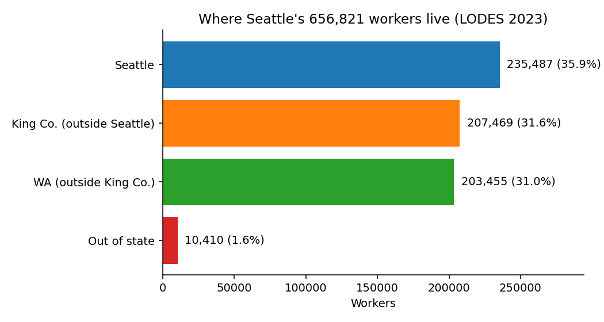
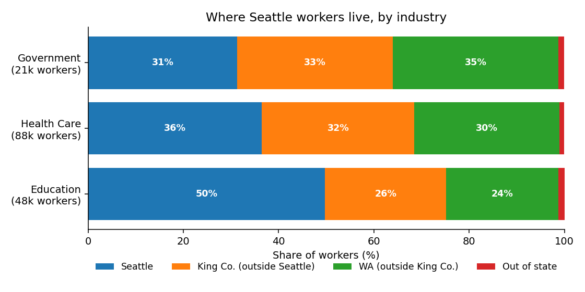
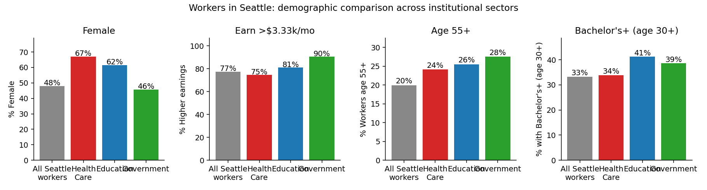

# Seattle commuter demographics — who eats lunch in Seattle?

A look at LODES8 (LEHD Origin–Destination Employment Statistics, 2023, the
latest year released) for the City of Seattle, with a focus on the workers in
sectors whose menus are most exposed to public-health policy: hospitals,
schools, and government offices.

## TL;DR

Seattle is a **major job importer**. Of the 656,821 jobs located inside the
city, only 36% are held by people who also live in Seattle. The remaining
**421,334 workers commute in** — about half from elsewhere in King County,
half from beyond it.

| | Workers | Share |
|---|---:|---:|
| Live in Seattle, work in Seattle | 235,487 | 35.9% |
| Live in rest of King County, work in Seattle | 207,469 | 31.6% |
| Live in WA outside King County, work in Seattle | 203,455 | 31.0% |
| Live outside WA, work in Seattle | 10,410 | 1.6% |
| **All workers in Seattle** | **656,821** | **100%** |

For lunch-menu purposes, the institutional sectors most likely to operate
on-site cafeterias subject to public-health-influenced procurement are:

| Sector (NAICS) | Workers in Seattle | Live in Seattle | Live outside King Co. |
|---|---:|---:|---:|
| Health Care & Social Assistance (62) | 87,955 | 36.5% | 31.5% |
| Educational Services (61)            | 48,451 | 49.7% | 24.8% |
| Public Administration (92)           | 21,360 | 31.3% | 36.0% |

**Education workers** are nearly twice as likely as **government workers**
to live in the city where they work. **Government workers** are the most
"imported" — over a third commute in from beyond King County, more than
any other major Seattle sector.





## What's in here

| File | What it does |
|---|---|
| `download.py`              | Fetches LODES8 (WA, 2023) and the 2020 Census block-to-place crosswalk into `data/` (≈25 MB, gitignored). |
| `lib.py`                   | Loaders, LODES column-label maps, Seattle/King-County block classification. |
| `01_topline.py`            | Counts and demographics for residents and workers in Seattle and King County; OD breakdown of Seattle workers by home location. |
| `02_industry_drilldown.py` | Workers in Seattle in NAICS 61/62/92; estimated home-origin and demographic mix per sector. |
| `03_plots.py`              | The three figures above. |
| `results/`                 | All CSVs and PNGs (committed). |

To reproduce:

```bash
uv sync
uv run python download.py
uv run python 01_topline.py
uv run python 02_industry_drilldown.py
uv run python 03_plots.py
```

## Findings

### Where Seattle's workers live

Two-thirds of Seattle workers (64.1%) live outside the city limits. One-third
(32.6%) live outside King County altogether — they're the audience most
likely to be reached by *workplace* food policy in Seattle but not by
*residential* food policy in Seattle / King County.

### Hospitals (NAICS 62, ≈88k workers)

Healthcare is the **largest** institutional employer in Seattle and the
single biggest target for menu policy.

- 67% female (vs. 48% city-wide)
- 11% Black, 20% Asian, 67% White (Black share noticeably above the city average)
- 75% earn more than $3,333/month — the lowest "high earner" share of the
  three sectors, reflecting a wide internal split between physicians and
  support staff (CNAs, dietary, environmental).
- 64% commute in from outside Seattle; 32% from outside King County —
  matching the city-wide average. Hospital workers are an *average*
  commuting population, not unusually local or unusually long-distance.

### Education (NAICS 61, ≈48k workers)

- **The most local** sector — 50% of education workers in Seattle also live
  in Seattle, vs. 36% city-wide. K–12 teachers and university staff cluster
  near their workplaces.
- 62% female
- 41% have a Bachelor's or higher (age 30+) — the highest of the three.
- Only 14% are age ≤29 (vs. 20% city-wide); only 9% earn under $1,250/mo.

### Government (NAICS 92, ≈21k workers)

- **The most imported** sector — 69% live outside Seattle, 36% live outside
  King County. King County government workers, in particular, often live
  in south-county suburbs.
- 46% female (close to parity, unlike the other two sectors).
- Oldest workforce: 28% are age 55+ (vs. 20% city-wide).
- 90% earn more than $3,333/month — the highest share of the three.

### What this means for menu reach

| Want to influence the lunches of… | Where is policy best targeted? |
|---|---|
| ≈88k hospital workers (most of any institutional sector) | Workplace-based policy in Seattle catches them all, but only 36% are reachable through City of Seattle residential channels. |
| ≈48k education workers | High overlap between residence and workplace — *city* policy reaches half of them at home and all of them at work. |
| ≈21k government workers | Workplace policy reaches the whole population, but only 31% are City of Seattle residents — *King County* policy is the right scope for residential reach. |

## Data sources

- **LODES8** (LEHD Origin-Destination Employment Statistics), state of WA,
  2023 vintage: <https://lehd.ces.census.gov/data/lodes/LODES8/>
- **2020 Census Block Assignment File** for WA (block ↔ incorporated place):
  <https://www2.census.gov/geo/docs/maps-data/data/baf2020/>
- LODES technical documentation:
  <https://lehd.ces.census.gov/data/lodes/LODES8/LODESTechDoc8.3.pdf>

LODES is derived from state Unemployment Insurance wage records joined with
Census demographic data. It is **jobs**, not people (multi-job-holders are
counted once per job), and it excludes:

- most self-employed workers,
- most active-duty military,
- informal-sector workers.

Federal civilian workers are included in LODES8 (one of the main gains over
LODES7).

## Methodology notes

- "Seattle" is defined by 2020 Census blocks assigned to Place FIPS 5363000
  (City of Seattle). 10,364 blocks.
- "King County" = blocks whose GEOID begins with `53033`. 27,686 blocks (2020 vintage).
- The OD file gives age, earnings, and a 3-category industry super-sector
  at the worker level but no race / sex / education. Where the analysis
  crosses an industry-specific (NAICS 61/62/92) workforce with home origin,
  the home-origin shares are estimated by **weighting OD inflows to each
  Seattle work-block by that block's share of jobs in the target industry**
  (from the WAC file). This is exact when a Seattle work-block is dominated
  by a single employer (hospital campuses, school buildings, government
  offices — typical for our three sectors) and an approximation otherwise.
- The "Bachelor's+" share is computed against the *all-ages* worker
  denominator, but LODES only assigns educational attainment to workers
  age 30+. Within age 30+, the Bachelor's+ share is roughly 33/80 ≈ 41%
  city-wide. The four-panel demographic figure uses raw shares for
  comparability across sectors.

## See also

If you want richer demographic detail than LODES provides — disability
status, language spoken at home, occupation, transportation mode — the
ACS workplace-geography tables (B08006–B08603, B08524/B08526) cover Seattle
at the place and county level. They lack LODES's tract / block resolution
but cross more demographic dimensions, and they're updated annually.

For migration-style flows (specific home county → workplace county pairs)
the ACS publishes county-to-county commuting flow tables every five years
(latest: 2016–2020 5-year ACS), with limited demographic splits.
