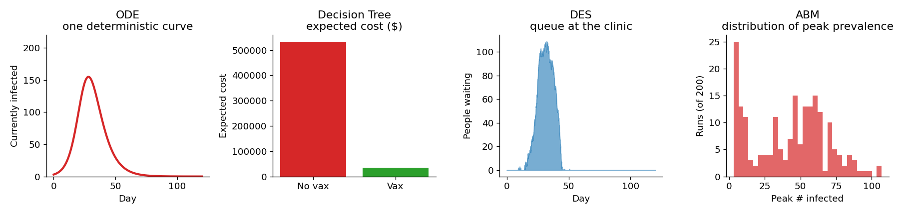
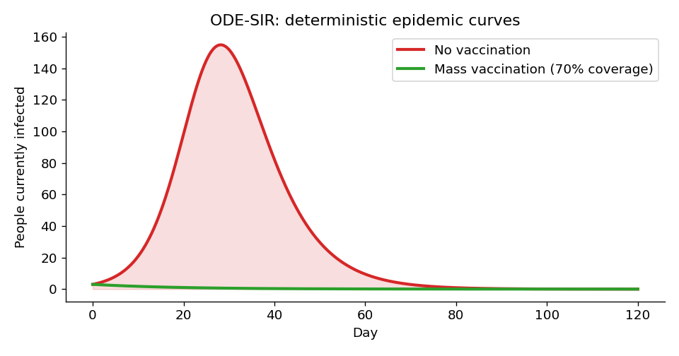
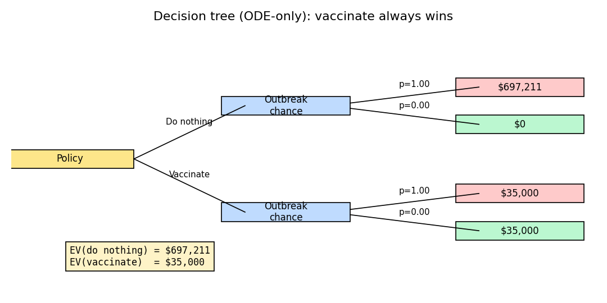
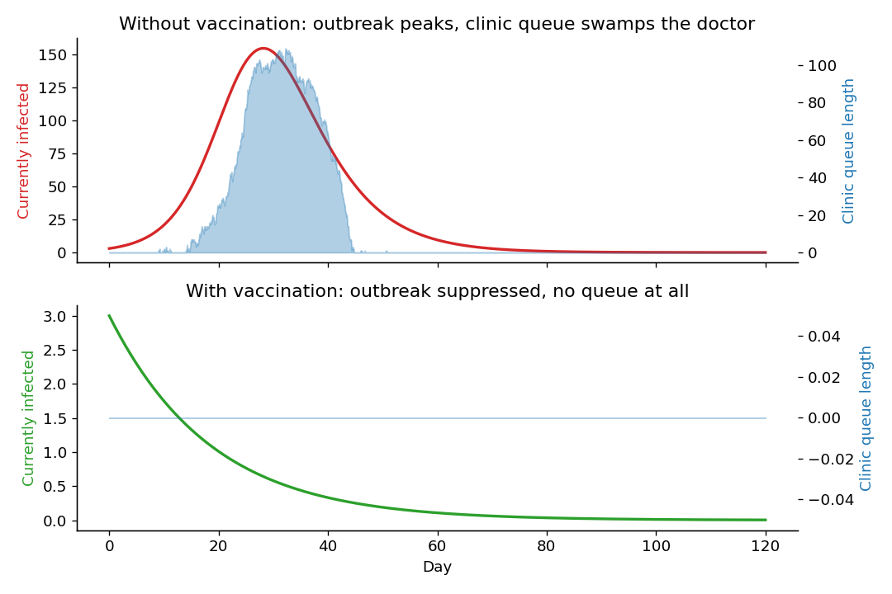
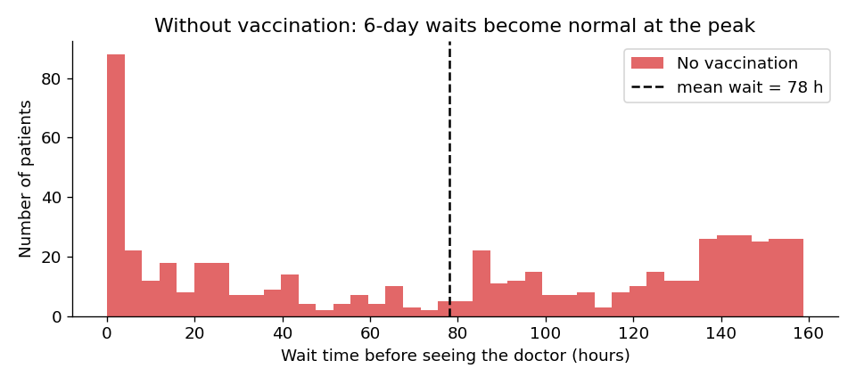
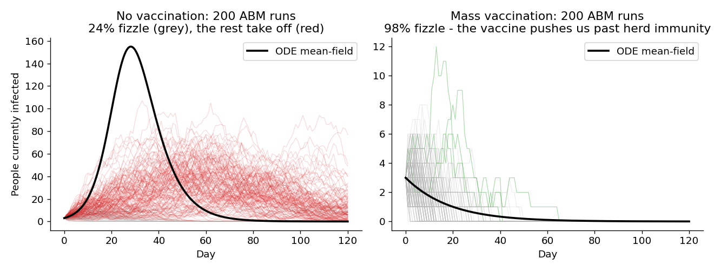
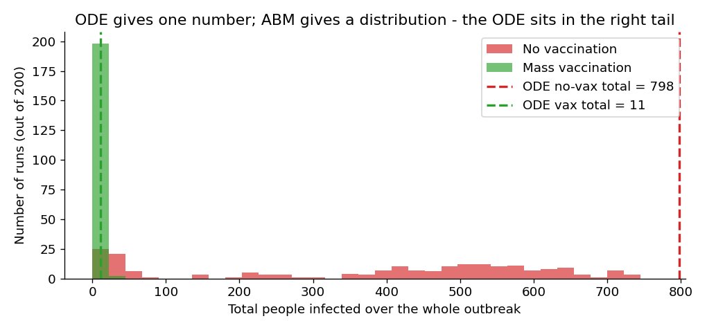

# Four Lenses on an Outbreak: When to Use ODE, Decision Trees, DES, and ABM

*A hands-on comparison of four simulation methods on a single concrete problem.*

[](https://colab.research.google.com/github/aflaxman/ai_assisted_research/blob/main/simulation_methods_comparison/tour.ipynb)



## TL;DR

**What you'll learn**: Each major simulation method - ODE, decision tree, discrete-event, agent-based - answers a *different* question. Knowing which is which is more useful than picking a favorite.

**What you'll get**: One scenario (a respiratory outbreak in a town of 1,000), modeled four ways, with code you can run in under a minute.

**The approach**: Build the same disease, the same town, and the same intervention in all four frameworks. Watch each lens light up a part of the picture the others miss.

---

## The Problem: Should the Mayor Vaccinate?

A respiratory virus has been spotted in a town of 1,000 people. Three cases are confirmed. The mayor needs a recommendation by Friday. Should the town pay for a mass vaccination campaign, or wait it out?

The honest answer is: *it depends on what you want to know*.

- **How big could this get on average?** -> ODE.
- **Which choice has lower expected cost?** -> Decision Tree.
- **Will the clinic be overwhelmed?** -> Discrete-Event Simulation.
- **Could it fizzle on its own? Are some neighborhoods more at risk?** -> Agent-Based Model.

Different questions, different tools.

---

## The Scenario

The same parameters drive all four models. They live in [`scenario.py`](scenario.py).

| Knob | Value |
|---|---|
| Population | 1,000 |
| Initial infected | 3 |
| R₀ | 2.0 |
| Infectious period | 5 days |
| Care-seeking rate | 70% of cases |
| Clinic capacity | 1 doctor, 90 min/visit (~16 patients/day) |
| Vaccine coverage achievable | 70% |
| Vaccine effectiveness | 90% |
| Costs | $500 mild case, $8,000 hospitalized, $50/dose |

---

## Lens 1: ODE - The Textbook SIR Model

The SIR ODE compresses the town into three numbers (S, I, R) and lets them flow into each other.



The answer is unambiguous: do nothing and ~80% of the town gets sick; vaccinate and the outbreak collapses.

**Why use it**: milliseconds to solve, transparent, analytic insights (R₀, herd immunity).

**Why it's not enough**: it has no individuals, no queues, no networks, no dice. It will tell you the same story every time.

See [`ode_sir.py`](ode_sir.py).

---

## Lens 2: Decision Tree - Cost-Effectiveness of the Policy Choice

The mayor doesn't care about $I(t)$. She cares about dollars and doses. A decision tree wraps the model output in a policy frame: branches for choices, branches for chance, payoffs at the leaves, one number to compare.



| Option | Expected Cost |
|---|---|
| Do nothing | $697,211 |
| Mass-vaccinate | $35,000 |

Vaccinating wins. But notice the "outbreak fizzles" branch on the no-vax side: probability **zero**. The ODE never lets that happen. We'll fix this branch with the ABM and watch the recommendation tighten.

See [`decision_tree.py`](decision_tree.py).

---

## Lens 3: DES - What Happens at the Clinic When Everyone Shows Up

The ODE counts cases. It does not count exam rooms. We feed clinic arrivals using an inhomogeneous Poisson process driven by the ODE's infection rate (a deliberate hand-off: ODE supplies the rate, DES supplies the queue), then watch one doctor try to keep up.



Without vaccination, the queue piles up to **109 people**. Mean wait time is **78 hours**, p95 is **155 hours** - patients waiting almost a week to see the doctor.



With vaccination, the queue stays at zero. *Same intervention, but now we have a second argument for it that doesn't appear anywhere in the ODE: clinic capacity.*

See [`des_clinic.py`](des_clinic.py).

---

## Lens 4: ABM - The Outbreak Might Never Happen

The ODE is deterministic. The decision tree borrowed its determinism. But three cases in a town of 1,000 is *small* - sometimes the chain just dies. The ABM puts 1,000 agents on a small-world network and rolls dice every day. We run it 200 times.



**24%** of no-vaccination runs end with the outbreak fizzling on its own. **98%** of vaccination runs do.

The ODE curve (black) sits in the right tail of the distribution: it's a mean-field upper bound, not an expected outcome.



See [`abm_network.py`](abm_network.py).

---

## Putting It Back Together: The Hybrid Tree

The ABM gives the decision tree the one number the ODE could not - the probability of fizzle. Plug it in:

| Option | p(outbreak) | Cost if outbreak | Cost if fizzles | Expected cost |
|---|---|---|---|---|
| Do nothing | 0.76 | $697,211 | $0 | **$530,233** |
| Mass-vaccinate | 0.02 | $35,000 | $35,000 | **$35,000** |

Vaccinating still wins - the campaign's $35,000 is cheap compared to even one moderate-sized outbreak - but the margin shrinks. With a smaller initial seed, lower R₀, or costlier vaccine, this calculation flips. A decision built on ODE numbers alone would never have shown that flexibility.

---

## When to Reach for Which Lens

| If your question is... | Use | Why |
|---|---|---|
| How big, on average, and how fast can I find out? | **ODE** | Closed-form, transparent, milliseconds. |
| Which discrete policy should I pick? | **Decision Tree** | Frames choices and probabilities explicitly. |
| Can the system *handle* the load? | **DES** | Queues, resources, and scheduling are first-class. |
| Could things go very differently? Who's at risk? | **ABM** | Individuals, networks, and variance. |
| All of the above for one real decision | **Hybrid** | ODE -> probabilities -> tree; DES -> capacity check; ABM -> stress test. |

A practical recipe: start with the ODE to bound the answer, draw the decision tree to clarify the choice, run the DES to check that the recommended option doesn't break operational reality, and run the ABM to see if the recommendation is robust to stochasticity and structure. None of these models is a substitute for the others; they are different **lenses**, and the work is choosing the right one for the question in front of you.

---

## Running It Yourself

```bash
cd simulation_methods_comparison
uv venv
uv sync
.venv/bin/jupyter notebook tour.ipynb
```

Or run all the code without the notebook:

```bash
.venv/bin/python build_notebook.py     # rebuilds tour.ipynb from one script
.venv/bin/jupyter nbconvert --to notebook --execute tour.ipynb --output tour.ipynb
```

## Challenges

1. **Raise R₀ to 3.5** (more transmissible). Does the ABM fizzle rate drop to zero? Does the DES queue still bind? Does the decision tree's margin grow?
2. **Cut the vaccine budget**: lower achievable coverage to 30%. At what coverage does mass-vaccination stop being optimal in the hybrid tree?
3. **Add a second clinic** in the DES (2 servers). How much does the peak queue shrink? Is hiring a second doctor cheaper than vaccinating?
4. **Replace the small-world network with a power-law one** in the ABM. Does the extinction probability go up or down? Where does the ODE mean-field sit in the new distribution?
5. **Build a SEIR ODE** with a latent compartment and re-run the comparison. Does the clinic peak shift later?

## Further Reading

- Vynnycky & White, *An Introduction to Infectious Disease Modelling* (Oxford, 2010) - the standard text on compartmental models.
- Banks, Carson, Nelson & Nicol, *Discrete-Event System Simulation* - the DES reference.
- Railsback & Grimm, *Agent-Based and Individual-Based Modeling* - practical ABM design.
- Drummond et al., *Methods for the Economic Evaluation of Health Care Programmes* - decision trees in health economics.
- Keeling & Rohani, *Modeling Infectious Diseases in Humans and Animals* - both ODE and ABM, with code.
