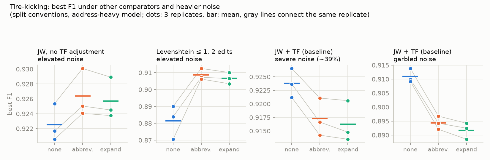

# St or Street? An experiment on address standardization direction for record linkage

```python
>>> from rapidfuzz.distance import JaroWinkler
>>> JaroWinkler.similarity("10 main st", "10 main street")     # same address
0.943
>>> JaroWinkler.similarity("maple street", "marple street")    # different streets
0.979
```

Two street names that differ only in suffix convention score *lower* than two
different streets that share a long suffix. That asymmetry is the heart of a
[debate in splink discussion #3250](https://github.com/moj-analytical-services/splink/discussions/3250):
before linking records, should you standardize street suffixes to full words
(St → Street), as the splink docs recommend, or to abbreviations
(Street → St), as the US healthcare interoperability standard
[Project US@](https://oncprojectracking.healthit.gov/wiki/display/TechLabSC/Project+US%40+Home)
specifies? This experiment uses [pseudopeople](https://pseudopeople.readthedocs.io/)
— simulated census-style data with known ground truth and realistic noise — to
measure what the choice actually does to [splink](https://moj-analytical-services.github.io/splink/)
linkage quality.

## TL;DR

- **If you standardize, abbreviate.** Across 48 paired replicates spanning
  2 linkage models, 2 convention regimes, 4 noise levels, and 3 string
  comparators (Jaro–Winkler with and without term-frequency adjustment,
  absolute Levenshtein), Street→St beat St→Street on average precision in
  **48 of 48** and on best F1 in 45 of 48. The margin is small — ~0.001 F1
  with a rich model, ~0.002–0.005 when addresses carry more weight — but its
  sign barely wavers, and no comparator, noise level, or regime flipped it.
- **Why: long suffixes pad non-match similarity.** Expanding to full words
  roughly doubles the share of *non-matching* address pairs clearing a
  Jaro–Winkler 0.7 threshold (1.5% → 3.0%), because unrelated streets share
  "...street". Splink then halves that comparison level's match weight —
  the model corrects the damage, but the evidence budget shrinks.
- **The case for expansion didn't materialize.** The naive abbreviation map
  merged no more distinct street names than expansion did (both: the same 44
  form-pairs), while naive expansion corrupted 6 Saint-style names
  ("st clair ave" → "street clair avenue") — harmlessly, since it corrupted
  them consistently.
- **Doing nothing looked surprisingly strong — but only under one
  configuration.** With splink's usual Jaro–Winkler levels plus a
  term-frequency adjustment on the exact-match level, un-cleaned street
  names won best F1 in 21/24 paired replicates: JW's prefix weighting
  absorbs a suffix-only mismatch, and TF-free fuzzy levels dodge the
  penalty that standardized exact matches pay on common street names.
  Kick the tires and it deflates: drop the TF adjustment and no-cleaning
  loses to abbreviation in 6/6 replicates; switch to Levenshtein-at-
  thresholds (where "st"→"street" is 4 edits) and no-cleaning collapses,
  costing 0.013–0.027 F1. Standardizing is the robust choice; skipping it
  is safe only if you know your comparator forgives suffixes.
- Whatever you do, do it to *both* datasets — every camp in the discussion
  agrees that consistency dominates direction, and nothing here contradicts
  them.

## The problem

The splink data-cleaning guidance says: "Replace abbreviations with full words
(e.g., standardize 'St.' and 'Street' to 'Street')." In [discussion
#3250](https://github.com/moj-analytical-services/splink/discussions/3250),
a user asked why — their pipeline abbreviates instead. One reply defended
expansion: abbreviations are many-to-one ("St" conflates Street and Saint),
and fuzzy string metrics disagree on several characters when one side
abbreviates. [Another reply](https://github.com/moj-analytical-services/splink/discussions/3250#discussioncomment-18163210)
pushed back: Project US@, the US standard for patient addressing, standardizes
*to* USPS abbreviations ("ST"), so for US health data the splink guidance is
arguably backwards.

Both sides agree consistency is what matters most. But when you control the
cleaning for both datasets, you still have to pick a direction, and the two
camps predict opposite failure modes:

- **Pro-expansion:** abbreviating collides distinct words; short strings give
  fuzzy metrics less to work with, so typos hurt more.
- **Pro-abbreviation:** long shared suffixes inflate the similarity of
  *different* addresses ("maple street" vs "marple street"), costing
  precision; the discriminating tokens should dominate the comparison.

Simulation can arbitrate, because with simulated data we know the truth.

## The experiment

[pseudopeople](https://pseudopeople.readthedocs.io/) generates census-style
datasets for a simulated US population, with configurable, realistic noise
(typos, OCR errors, phonetic errors, missingness). Its street names arrive
with naturally mixed conventions — the sample data contains "st" (1,209
records), "street" (515), "ave" (864), "avenue" (455), and typo-corrupted
forms like "stree" and "svv" that no cleaner's dictionary will recognize.

**Design.** Each replicate draws the same simulated 2020 census twice with
different noise seeds, giving two extracts of ~10,070 records where every
person appears in both and `simulant_id` provides ground truth. We cross four
factors:

| Factor | Levels |
|---|---|
| Street-name treatment | `none`, `abbreviate` (Street→St), `expand` (St→Street) |
| Convention regime | `consistent` (as generated), `split` (extract A's pipeline abbreviates, extract B's expands — the scenario from the discussion), `mixed` (each record flips a coin) and `dropsuffix` (a quarter of records lose the suffix token) in the comparator benchmark |
| Street-name noise | `default` (~4% of cells corrupted or blanked), `elevated` (~15%), plus `severe` (~39%) and `garbled` (~14% of cells, half the tokens mangled) in phase 2 |
| Linkage model | `full` (first name, last name, DOB, street number, street name), `address_heavy` (first name, street number, street name only) |
| Street comparator (phase 2) | Jaro–Winkler + TF adjustment (baseline), Jaro–Winkler without TF, Levenshtein at 1 and 2 edits |

with 3 replicates per cell. Both treatments use the same USPS suffix
dictionary ([suffix_maps.py](suffix_maps.py)), applied token-wise in either
direction, so neither direction gets a vocabulary advantage. Treatments and
regimes touch only the `street_name` column; the splink model specification,
blocking rules (which never use `street_name`), and training procedure
(random-sampling u estimation, two EM sessions) are identical in every cell.

**Evaluation.**

1. *Comparator level* ([microbench.py](microbench.py)): Jaro–Winkler
   similarity distributions for ~29,600 true pairs and ~50,000 non-matching
   pairs per cell.
2. *Pipeline level* ([run_experiment.py](run_experiment.py)): full splink
   linkage — estimate parameters, predict, sweep the match-probability
   threshold against ground truth, report best-F1 and average precision, and
   capture the trained m/u parameters of the street-name comparison.

## Results

### The mechanism: what the comparator sees


With split conventions and no cleaning (blue), only 13% of true pairs match
exactly, and the whole true-pair curve is shifted left — though note how much
of the damage Jaro–Winkler absorbs on its own: 90% of true pairs still clear
0.92. Either standardization (orange, green) restores the exact-match share
to 86% and the two directions are nearly indistinguishable on true pairs.

The right panel is where the directions separate: among *non-matching* pairs,
expansion (green) roughly doubles the share clearing any threshold between
0.6 and 0.9 relative to abbreviation (orange). Long shared suffixes pad the
similarity of unrelated streets, exactly as the pro-abbreviation camp
predicts. In ROC-AUC terms the comparator differences are tiny (fourth
decimal place), with abbreviation narrowly ahead of expansion in the split
regime.

### The collisions: rarer and tamer than argued

- The Saint problem is real: the naive expander turns "st clair ave" into
  "street clair avenue" (6 of 4,066 distinct street names). But it does so
  *consistently on both sides*, so the corrupted form still matches itself.
- The many-to-one problem did not bite either direction: both mappings merge
  exactly the same 44 pairs of distinct raw forms (e.g., "10th st" ↔
  "10th street"), which is the intended unification, and splink's
  term-frequency adjustment compensates for the merged forms' higher
  frequency.

### The outcome: what splink reports


The absolute differences are small — street name is one field among several —
but the *ordering* is remarkably stable. Connecting each replicate across
treatments (gray lines) shows the same downward slope almost everywhere:

| Paired comparison (24 replicates) | best F1 | average precision |
|---|---|---|
| abbreviate beats expand | 22/24, mean +0.0010 | **24/24**, mean +0.0009 |
| no cleaning beats abbreviate | 21/24, mean +0.0014 | 16/24, mean −0.0021 |

Mean best F1 in the hardest cell (split conventions, elevated noise):

| Model | none | abbreviate | expand |
|---|---|---|---|
| full (names, DOB, address) | 0.9770 | 0.9762 | 0.9756 |
| address-heavy (first name + address) | 0.9259 | 0.9220 | 0.9196 |

**Abbreviation never loses to expansion.** The gap is tiny with a rich model
(~0.001 F1) and grows when addresses carry more of the weight (~0.002–0.005
F1, and up to +0.005 recall at a precision ≥ 0.995 operating point), but its
sign is the same in essentially every paired replicate, both regimes, both
noise levels, both models.

**Why:** the trained model parameters tell the story. In the full model
(split conventions, elevated noise), the street-name comparison levels earn
these match weights (log₂ m/u, averaged over replicates):

| Comparison level | none | abbreviate | expand |
|---|---|---|---|
| Exact match | 11.4 | 9.5 | 9.7 |
| Jaro–Winkler ≥ 0.92 | 9.4 | 8.6 | 8.2 |
| Jaro–Winkler ≥ 0.7 | +3.6 | +1.7 | +0.7 |

Under expansion, the fuzzy levels are worth up to a bit less evidence apiece,
because unrelated streets sharing a spelled-out suffix flood into them
(doubling u). Splink learns the correction — that is why the F1 cost stays
near a thousandth instead of becoming catastrophic — but the evidence budget
shrinks.

**The dark horse: doing nothing.** "No cleaning" won best F1 in 21/24 paired
replicates, even in the split regime, because splink recalibrated around the
convention mismatch: an exact street match became rarer and therefore more
informative (11.4 bits vs 9.5), and true pairs that disagreed only on suffix
convention still cleared JW 0.92 and collected 9.4 bits. It is not a free
lunch — in the address-heavy model with split conventions, "none" loses
average precision (−0.004 vs abbreviate) because its PR curve sags at the
high-precision end — but it is a striking demonstration that splink's fuzzy
levels plus parameter estimation absorb most of what suffix standardization
would fix.

## Kicking the tires

The phase-1 results — especially "no cleaning wins" — deserved suspicion, so
a second battery varied the string comparator, the noise, and the failure
modes ([run_experiment2.py](run_experiment2.py),
[microbench_metrics.py](microbench_metrics.py); split conventions
throughout).



**Is "no cleaning wins" a term-frequency artifact? Largely, yes.** In the
baseline model, TF adjustment applies only to the *exact-match* level, so a
standardized exact match on "main st" is discounted for being a common
value, while an un-cleaned pair ("main st" / "main street") lands on the
JW ≥ 0.92 level and collects its full, undiscounted weight. Remove the TF
adjustment and the ordering flips: abbreviation beats no-cleaning in 6/6
paired replicates (both models). So phase 1's dark horse was exploiting a
quirk of *where* splink applies TF adjustments, not proving cleaning
useless.

**Does the comparator matter? Enormously — more than the cleaning
direction.** Jaro–Winkler weights the shared prefix, so a suffix-only
difference is nearly invisible to it; that is what made no-cleaning viable.
Replace the street comparison with `LevenshteinAtThresholds([1, 2])` —
absolute edits, where "st" vs "street" is 4 — and no-cleaning collapses:
−0.013 F1 (full model) to −0.027 F1 (address-heavy) versus abbreviation,
losing all 6 of 6 paired replicates. With standardized input, Levenshtein
performs nearly as well as JW; with mixed conventions it cannot cope. The
comparator-level benchmark
([results/microbench_metrics.csv](results/microbench_metrics.csv)) says the
same in AUC terms across four metrics (JW, plain Jaro, normalized
Levenshtein, normalized Damerau–Levenshtein): abbreviate ≥ expand under
every metric, every regime, every noise level.

**What about heavier or different noise?** Two harsher conditions:
`severe` (~39% of street names corrupted; cross-extract street agreement
falls to 62%) and `garbled` (~14% of cells hit, but half the tokens mangled
when hit — "ygoff drt"). The abbreviate > expand ordering holds in both
(11/12 paired replicates on F1, 12/12 on average precision), and the gap
*widens* with noise at the comparator level. Under JW + TF, no-cleaning
still wins best F1 in these conditions, but under severe noise it loses
average precision to abbreviation (−0.008 on the address-heavy model) — its
PR curve sags exactly where high-precision linkage operates.

**A regime where expansion truly hurts: dropped suffixes.** If records
sometimes lose the suffix entirely ("main st" → "main"), expansion is the
worst treatment by a wide margin at the comparator level (AUC 0.992 vs
0.9986 for abbreviation at default noise, edit-distance metrics): "main" vs
"main street" is a much larger relative mismatch than "main" vs "main st".
Abbreviation minimizes the damage a missing suffix can do — an argument the
discussion did not raise.

**What does Project US@ actually say about matching?** Nothing about string
distances. It is a *formatting* specification — an address data model and
standardized element formats built on USPS Publication 28 (whence "ST"),
developed by ONC with USPS, CDC, HL7, X12 and EHR vendors. Match-rate
claims associated with it come from patient-matching research around
address standardization, not from the spec prescribing a matcher. Its
practical relevance here: US health data increasingly arrives already
standardized to USPS abbreviations, and matching *that* consistently means
abbreviating your other source, not expanding both.

**Could this all be an artifact of pseudopeople?** Its known limits cut in
identifiable directions:

- The sample population is one synthetic metro (~10k people, ~4,000
  distinct street names); term-frequency skew in real national data would
  strengthen TF effects, not weaken the abbreviate-vs-expand comparison.
- Its noise is character-level (typos, OCR, phonetic); it never swaps
  conventions, so the convention regimes here are imposed by construction —
  which is also what makes the treatment effect cleanly identifiable.
- Each household's true address is a single fixed string, and noise is
  independent across extracts. Real sources differ *systematically*
  (parsing, truncation, moves, PO boxes, units), which the split and
  dropsuffix regimes only partially mimic. That favors "none" in the
  consistent regime, and is another reason not to take the dark horse too
  seriously.

## Reproducing

```bash
cd splink_address_abbrev
uv sync
uv run python generate_data.py    # ~8 min: builds data/ from the pseudopeople sample population
uv run python microbench.py       # ~3 min: JW comparator analysis -> results/microbench.csv
uv run python run_experiment.py   # ~30 min: 36 splink runs -> results/linkage_results.csv
uv run python run_experiment.py address_heavy   # ~15 min: 36 more -> results/linkage_results_address.csv
uv run python run_experiment2.py  # ~45 min: 72 tire-kicking runs -> results/linkage_results_phase2.csv
uv run python microbench_metrics.py  # ~15 min: 4-metric AUC matrix -> results/microbench_metrics.csv
uv run python summarize.py        # tables and paired comparisons
uv run python make_figures.py     # figures/
uv run pytest                     # tests for the suffix maps
```

## Caveats

- Only token-wise dictionary mapping was tested. A parsing standardizer
  (e.g., libpostal, usaddress) that knows "St" at the start of a name means
  Saint would change the collision story.
- The 2.3:1 abbreviated-to-full suffix ratio in pseudopeople's vocabulary
  may not match your data; see the pseudopeople limitations discussed under
  "Kicking the tires".
- Blocking never used street_name, so these results measure the comparison
  stage only. Standardization matters more if street names enter your
  blocking keys, where "main st" ≠ "main street" costs candidate pairs
  outright.

## Challenges for the reader

1. Add a `parsed` treatment using libpostal and see whether smart expansion
   beats naive abbreviation.
2. Make the suffix the *only* difference: compare "main st" vs "main street"
   linkage with street-suffix tokens split into their own comparison column.
3. Re-run with pseudopeople's large-scale population (requires access to the
   full simulated US) where street-name term frequencies are far more skewed.

## Further reading

- [Splink discussion #3250](https://github.com/moj-analytical-services/splink/discussions/3250)
- [Project US@ Technical Specification](https://oncprojectracking.healthit.gov/wiki/display/TechLabSC/Project+US%40+Home) — the US healthcare address standard (Appendix B: USPS abbreviations)
- [USPS Publication 28](https://pe.usps.com/text/pub28/welcome.htm) — street suffix abbreviations
- [pseudopeople documentation](https://pseudopeople.readthedocs.io/)
- [Splink documentation](https://moj-analytical-services.github.io/splink/)
