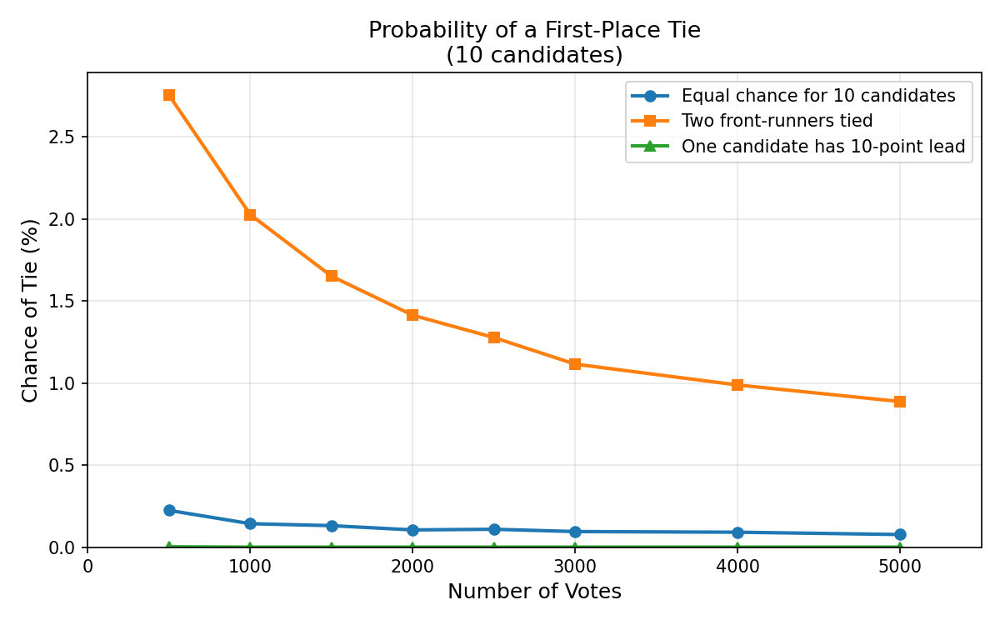

# When Two Names Became One: The Probability of a Tie in Community Voting

## TL;DR

- In 1975, a Seattle community vote to rename a library produced a perfect tie between Frederick Douglass and Sojourner Truth, so both names were used.
- A tie among ~2,000 voters choosing from 10 candidates sounds impossible, but simulations show it happens roughly **1 in 70 elections** when two candidates have equal support.
- The key insight: tie probabilities scale as $O(1/\sqrt{N})$, not $O(1/N)$—they're rarer than coin flips, but not astronomically rare.

---

## The Story

In 1975, Seattle's Central District faced a question: what should the new Yesler branch library be called? The community organized a ballot listing ten distinguished Black Americans—James Baldwin, Benjamin Banneker, Gwendolyn Brooks, W.E.B. DuBois, Lorraine Hansberry, James Weldon Johnson, Frederick Douglass, Richard Wright, Sojourner Truth, and Harriet Tubman—plus a write-in option. [[ballot image](https://www.capitolhillseattle.com/wp-content/uploads/2025/12/Douglass-Truth-renaming-ballot.jpg)]

When the votes were counted, Frederick Douglass and Sojourner Truth had received *exactly the same number of votes*.

Rather than hold a runoff, the library embraced the coincidence. On December 5, 1975, Mayor Wes Uhlman proclaimed the opening of the [Douglass-Truth Library](https://www.spl.org/about-us/news-releases/the-seattle-public-library-celebrates-50-years-of-douglass-truth)—a name that honors both figures and, perhaps fittingly, represents a community that couldn't choose between two towering legacies. The library celebrated its [50th anniversary in 2025](https://www.historylink.org/file/2085).

---

## The Question

A tie with almost 2,000 voters sounds impossible. But is it?

**A note on the data:** The exact vote totals aren't recorded in any source I've found. The "[Report on Designation](https://www.seattle.gov/documents/Departments/Neighborhoods/HistoricPreservation/Landmarks/RelatedDocuments/DesRptDouglassTruthLibrary.pdf)" from Seattle Landmarks confirms the tie but doesn't give numbers. At the library's 50th anniversary celebration, an old-timer mentioned that "almost 2,000 people voted." I'll treat that as approximate—good enough for a back-of-envelope calculation, but not precise.

Let's build up the math from simple to realistic.

---

## Model 1: The Simplest Case (Two Candidates, Fair Coin)

Suppose only two candidates are running, and each voter flips a fair coin. With $N$ voters, the probability of an exact tie is:

$$P(\text{tie}) = \binom{N}{N/2} \cdot \left(\frac{1}{2}\right)^N$$

For large $N$, Stirling's approximation gives us:

$$P(\text{tie}) \approx \sqrt{\frac{2}{\pi N}}$$

This is the crucial insight: **tie probability scales as $1/\sqrt{N}$, not $1/N$.**

For $N = 2000$:

| Method | P(tie) |
|--------|--------|
| Exact | 1.78% |
| Stirling approx | 1.78% |

One in 56. Not rare at all! This is our sanity check: even in the most volatile scenario (50/50 split), ties happen roughly once every 50-60 elections.

---

## Model 2: Two Front-Runners + Everyone Else

Real elections have more than two candidates. Let's model this as a *multinomial* distribution:

- Candidate D (Douglass) gets each vote with probability $p_D$
- Candidate T (Truth) gets each vote with probability $p_T$
- The remaining candidates share probability $1 - p_D - p_T$

If $p_D = p_T = p$, the votes for D and T follow a symmetric distribution. The key random variable is $X_D - X_T$: the vote difference.

For large $N$ with $p_D \approx p_T \approx p$, the difference is approximately normal:

$$X_D - X_T \sim \mathcal{N}\left(0, \sqrt{2Np(1-p)}\right)$$

Wait—that's not quite right. The variance of $X_D - X_T$ when $p_D = p_T = p$ is:

$$\text{Var}(X_D - X_T) = \text{Var}(X_D) + \text{Var}(X_T) - 2\text{Cov}(X_D, X_T)$$

For multinomial: $\text{Var}(X_i) = Np_i(1-p_i)$ and $\text{Cov}(X_i, X_j) = -Np_ip_j$.

So: $\text{Var}(X_D - X_T) = 2Np(1-p) + 2Np^2 = 2Np$.

The tie probability is approximately the density at zero times one vote width:

$$P(X_D = X_T) \approx \frac{1}{\sqrt{4\pi Np}}$$

For $N = 2000$ and $p = 0.2$ (two front-runners with 20% each): $P(\text{tie}) \approx \frac{1}{\sqrt{4\pi \cdot 2000 \cdot 0.2}} \approx 0.014$ or about 1.4%.

But this is just $P(X_D = X_T)$—not $P(\text{tie for first place})$. They might tie for third!

---

## Model 3: Why Simulation Helps

Computing $P(\text{D and T tie for first place among 10 candidates})$ analytically gets messy. You need the joint probability that:

1. $X_D = X_T$
2. $X_D \geq X_i$ for all other candidates $i$
3. No other candidate $j$ has $X_j = X_D$

This involves high-dimensional integrals over multinomial distributions. Doable, but tedious. Monte Carlo simulation is cleaner.

---

## Simulation Results

I ran 200,000 trials for each scenario with $N = 2000$ voters and 10 candidates. ([Code: `tie_sim.py`](tie_sim.py))

| Scenario | P(any tie D=T) | P(tie for 1st) | Odds |
|----------|----------------|----------------|------|
| A: Equal support (all 10%) | 2.01% | 0.11% | 1 in 893 |
| B: Front-runners at 20%/20% | 1.41% | **1.41%** | **1 in 71** |
| C: Front-runners at 21%/19% | 0.56% | 0.56% | 1 in 178 |
| D1: Strong leads (25%/25%) | 1.27% | 1.27% | 1 in 79 |
| D2: Weak leads (15%/15%) | 1.64% | 1.64% | 1 in 61 |

**Key observations:**

1. **Scenario B is the plausible case** for Douglass-Truth: two clear front-runners with similar support. A tie for first happens about **1 in 71 elections**. Rare, but not astronomical.

2. **When front-runners dominate, any tie is a tie for first.** In Scenario B, nearly 100% of D=T ties are ties for first place—because when D and T each command 20% while others split 60% across eight candidates, a D=T tie almost always means they're both winning.

3. **A small gap kills the tie probability.** Moving from 20%/20% to 21%/19% cuts the odds from 1-in-71 to 1-in-178. The tie probability is very sensitive to asymmetry.

4. **Equal support across all 10 is actually worse for first-place ties.** Scenario A has more any-ties (2.01%) but far fewer first-place ties (0.11%) because everyone is competitive—D and T might tie, but a third candidate often beats them both.

---

## What Assumptions Are We Making?

Every model embeds assumptions. Here are ours:

| Assumption | Reality check | Effect if wrong |
|------------|--------------|-----------------|
| **Independent votes** | Reasonable for secret ballot | Correlated votes (households, social influence) could increase or decrease tie probability |
| **Stable preferences** | Each voter has a fixed probability | Strategic voting or late-breaking news could concentrate votes |
| **Known probabilities** | We guess at $p_D, p_T$ | If true preferences were 22%/18%, ties become much rarer |
| **Random sampling** | Multinomial draw | Self-selected voters might differ from a random sample |
| **No abstentions on ballot** | Every voter picks exactly one | Spoiled ballots reduce effective $N$ |

The biggest source of uncertainty: **we don't know the actual vote distribution.** If Douglass and Truth each had ~30% support, ties become more common. If the race was tighter (15%/15% with competitive others), ties are rarer for first place.

---

## What Data Would Sharpen This?

- **Actual vote totals** for all 10 candidates (not just the tie)
- **Exact number of voters** (the "~2,000" is anecdotal)
- **Distribution method** (was it one ballot per household? per library card?)
- **Demographic breakdowns** (community ties to specific candidates)

If anyone has access to Seattle Public Library archives from 1975, I'd love to see the raw numbers.

---

## The Takeaway

A tie in a 2,000-voter, 10-candidate race is unlikely but not miraculous. Under plausible assumptions—two front-runners with roughly equal support—it happens about **once every 70 elections**.

The Douglass-Truth Library stands as a monument to that happenstance. Democracy gathered the community's voice, and the community spoke with perfect ambivalence: two names, inseparable in their honor, bound together by arithmetic coincidence.

There's something fitting about that. Frederick Douglass and Sojourner Truth were both escaped slaves who became towering voices for abolition and human rights. They were contemporaries who knew each other, each bringing distinct gifts to the same cause. Perhaps the voters of Seattle's Central District weren't torn—they were simply right twice.

---

## Code and Further Reading

- **Simulation code:** [`tie_sim.py`](tie_sim.py)
- **Seattle Public Library announcement:** [50 Years of Douglass-Truth](https://www.spl.org/about-us/news-releases/the-seattle-public-library-celebrates-50-years-of-douglass-truth)
- **HistoryLink essay:** [Douglass-Truth Library opens](https://www.historylink.org/file/2085)
- **Seattle Landmarks report:** [Designation Report (PDF)](https://www.seattle.gov/documents/Departments/Neighborhoods/HistoricPreservation/Landmarks/RelatedDocuments/DesRptDouglassTruthLibrary.pdf)
- **Original ballot image:** [Capitol Hill Seattle Blog](https://www.capitolhillseattle.com/wp-content/uploads/2025/12/Douglass-Truth-renaming-ballot.jpg)

---

*This post was written with AI assistance. The simulation code is available for replication.*
