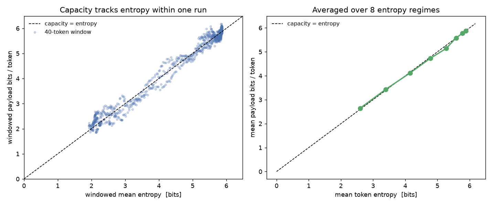
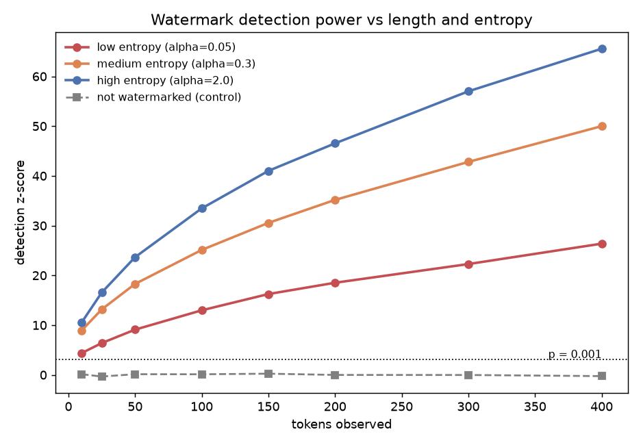

# One Trick, Two Secrets: Watermarking and Steganography Share a Coin

```text
Secret payload: b'Meet at the old mill, midnight.'

STEGOTEXT (an ordinary-looking distilgpt2 sample):
  going to be the big winner of an earlier series due to two issues in which
  a team of experienced, competitive team members have been forced to step up
  to defend themselves against a strong front...

Recovered with key : b'Meet at the old mill, midnight.'   (exact)
Recovered wrong key : b'\xe3\x18D\xab\xbe\xdd ...'          (garbage)
```

That paragraph is a real distilgpt2 sample. It is also a ciphertext. The same
secret key that a watermark detector would use to prove "a model wrote this"
can, with one small change, pull an arbitrary hidden message back out of the
text. This directory implements both, shows they are the same trick, and
measures the one quantity that governs each: entropy.

## TL;DR

- **Watermarking an LLM and doing cryptographic steganography with an LLM are
  the same mechanism** — keyed pseudorandom biasing of token sampling — pointed
  at two different goals.
- I built a small, tested library (`stegowm/`) with three pieces sharing one
  PRF: a **distortion-free watermark** (Gumbel/Aaronson, the Christ-Gunn-Zamir
  family), a **Meteor-style steganographic channel** (arithmetic coding over the
  model distribution), and pluggable **model sources** (a synthetic one with an
  entropy knob, and real GPT-2).
- **Result 1:** steganographic capacity equals the entropy of the text, to
  within measurement noise (97–102%). See `figures/capacity_vs_entropy.png`.
- **Result 2:** watermark detection power grows with length and with entropy;
  text you did not generate never trips the detector. See
  `figures/watermark_power.png`.
- It runs on real GPT-2: a 31-byte secret hides in 74 tokens (3.35 bits/token)
  and recovers exactly; the watermark detects at p = 2e-57 with the key and
  p = 0.78 without it.

This is the project idea from [`../README.md`](../README.md), carried out.

## The problem: two goals that sound opposite

Watermarking asks: *can I prove this text came from my model, without changing
how the text reads?* Steganography asks: *can I hide a message in this text, so
that no one can even tell a message is there?* One wants a signal to survive; the
other wants a signal to vanish. They sound like opposites.

They are duals. Both work by replacing the true randomness the model would use to
sample each token with **pseudorandom bits from a secret key**. Without the key,
the bits are indistinguishable from random, so the model's output distribution is
untouched — nothing reads differently, nothing looks tampered with. With the key,
the bits are perfectly reproducible, which is exactly what lets a detector find a
watermark or a receiver read a payload.

| | Hidden thing | Adversary's goal | Governed by |
|---|---|---|---|
| **Watermark** | one bit: "we made this" | *detect* the mark | entropy → detection power |
| **Steganography** | an arbitrary payload | *notice a message exists* | entropy → capacity |

Luis von Ahn and coauthors defined provably secure steganography in 2002, but it
needed something that did not exist yet: an efficient sampler of realistic text.
An LLM is exactly that sampler. So both constructions below are that 2002 idea,
finally instantiated. (The full literature trail is in
[`../README.md`](../README.md).)

## The shared coin

Every token is a draw from the model's next-token distribution `p`. Instead of
flipping a fair coin to make that draw, we flip a **keyed** coin:

```python
u = PRF(secret_key, context)     # looks uniform to everyone but the key holder
token = sample(p, using=u)       # still distributed exactly as p
```

Because `u` is pseudorandom, an observer sees an honest sample from `p`. Because
the key holder can recompute `u`, the token secretly encodes information. What
that information *is* — a detectable bias or a decodable payload — is the only
difference between the two schemes.

### Watermark: bias the coin, then test for the bias

The watermark (`stegowm/watermark.py:38`) uses the Gumbel trick: score every
candidate token with a keyed `r_v ~ Uniform(0,1)` and emit
`argmax_v r_v**(1/p_v)`. This samples exactly from `p`, yet the emitted token
tends to have an unusually large `r`. The detector (`watermark.py:51`) replays
the scores and sums `-ln(1 - r)` over the text; watermarked text pushes that sum
into the tail of a Gamma distribution.

### Steganography: decode the payload *into* the coin

The channel (`stegowm/stego.py`, engine in `stegowm/arithcoder.py`) treats the
secret payload — XORed with a keystream so it looks uniform — as a bit stream and
**arithmetic-decodes** it against the model (`arithcoder.py:51`). Decoding a
random stream produces model-distributed tokens, so the output is ordinary text.
The receiver **arithmetic-encodes** the tokens back into the bit stream
(`arithcoder.py:107`) and XORs the keystream away.

Arithmetic coding is what makes this efficient. A naive "commit the bits every
token agrees on" scheme throws away each token's low-order bits and reaches only
about half the entropy — and worse, it stalls forever on a confident model. The
range coder carries those undetermined low-order bits forward in its register, so
later tokens reclaim them. That carry-forward is precisely Meteor's "randomness
reuse," and it is why the payload rate reaches the entropy of the text.

## Result 1: capacity = entropy



Left: within a single run whose entropy oscillates, a 40-token sliding window
carries payload bits at almost exactly its own entropy (points hug `y = x`).
Right: averaged over eight entropy regimes, mean bits-per-token equals mean
entropy across the whole range.

```text
H= 2.60  ->  2.65 bits/token  (102% of entropy)
H= 4.15  ->  4.12 bits/token  ( 99% of entropy)
H= 5.89  ->  5.88 bits/token  (100% of entropy)
```

The lesson the steganography literature keeps repeating falls straight out:
**capacity is entropy.** Confident, low-entropy text carries almost nothing;
every bit of surprisal is one bit of smuggling room.

## Result 2: watermark power grows with length and entropy



Detection evidence accumulates with each token, faster when the model is less
certain — a near-deterministic model is forced to emit particular tokens whatever
the secret scores say, and leaks little. Text we never watermarked (gray)
sits at the null forever. The same entropy that gives steganography its capacity
gives the watermark its power.

## It works on real GPT-2

`experiments/demo_gpt2.py` hides a sentence in distilgpt2 output and reads it
back. Full transcript in `figures/gpt2_demo_output.txt`:

```text
74 tokens carry 248 payload bits (3.35 bits/token).
Recovered with key : b'Meet at the old mill, midnight.'   Exact match: True

Watermark detect (own key)   : z=24.3  p=2.45e-57
Watermark detect (other key) : z=-0.8  p=0.78
```

## Files

```
stegowm/
  prf.py         HMAC-SHA256 keystream and keyed Uniform(0,1) draws
  sampler.py     fixed-point cumulative distributions, entropy helpers
  arithcoder.py  incremental integer arithmetic coder (the engine)
  stego.py       Meteor-style hide/recover with a length header + keystream
  watermark.py   Gumbel distortion-free watermark + Gamma-tail detector
  sources.py     SyntheticSource (entropy knob), MixedEntropySource, GPT2Source
experiments/
  exp_capacity.py    -> figures/capacity_vs_entropy.png
  exp_watermark.py   -> figures/watermark_power.png
  demo_gpt2.py       real distilgpt2 hide/recover + watermark
tests/
  test_core.py   exact recovery, no-stall, distortion-free, capacity, detection
```

## Run it

```bash
uv venv && uv pip install -r requirements.txt
.venv/bin/python tests/test_core.py            # correctness gates
.venv/bin/python experiments/exp_capacity.py   # capacity figure
.venv/bin/python experiments/exp_watermark.py  # watermark figure

# optional: the real-GPT-2 demo
uv pip install -r requirements-gpt2.txt
.venv/bin/python experiments/demo_gpt2.py
```

## How to use this in your own work

Any model with a `dist(context) -> probability_vector` method drops in — see the
three classes in `sources.py`. To watermark or hide messages in a different LLM,
wrap its next-token distribution (top-k truncated and renormalized) the way
`GPT2Source` does (`sources.py:98`), and the rest is unchanged.

## Honest limitations (a.k.a. challenges to try)

1. **Fragility.** This channel is distortion-free but *not robust*: change one
   token and the payload after it is gone. Measure how many payload bits survive
   an LLM paraphrase, and compare against the watermark's single bit. (This is
   the tension the 2024–2026 literature is chasing.)
2. **Low entropy starves it.** Try `temperature=0.5` in `GPT2Source` and watch
   the bits-per-token collapse. How would you route the payload only through
   high-entropy positions?
3. **Public-key version.** The whole demo is symmetric-key. Sketch how von Ahn &
   Hopper's public-key steganography (2004) or Fairoze et al.'s
   publicly-detectable watermark (2024) would change the PRF layer.
4. **True undetectability.** The Gumbel watermark is distortion-free per token,
   but the full CGZ guarantee handles low-entropy runs by seeding on accumulated
   empirical entropy. Add that seeding and test undetectability on peaky text.

## Further reading

- Hopper, Langford, von Ahn, *Provably Secure Steganography*, CRYPTO 2002.
- Kaptchuk, Jois, Green, Rubin, *Meteor*, ACM CCS 2021 — the arithmetic-coding
  channel this demo mirrors.
- Christ, Gunn, Zamir, *Undetectable Watermarks for Language Models*, COLT 2024.
- Zamir, *Excuse me, sir? Your language model is leaking (information)*, 2024 —
  the watermark-to-steganography upgrade.

Links and the full map are in [`../README.md`](../README.md).
