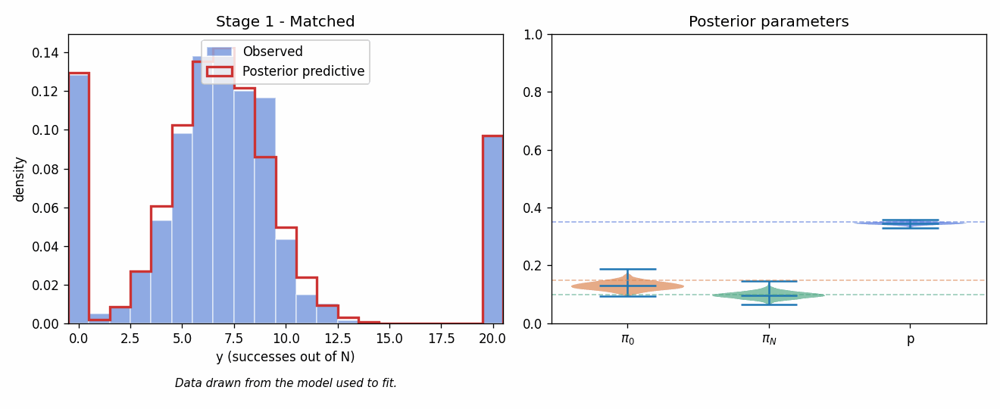

# Zero- and N-inflated Binomial in NumPyro

A small experiment: fit a zero- and N-inflated Binomial model in NumPyro to
simulated data, then progressively misspecify the data-generating process and
watch the fit deteriorate.

## Model

For each observation `y_i ∈ {0, 1, ..., N}`:

```
y_i = 0      with probability π_0  (structural zero)
y_i = N      with probability π_N  (structural max)
y_i ~ Bin(N, p)  with probability 1 - π_0 - π_N
```

Priors: `π = (π_0, π_N, π_bin) ~ Dirichlet(1, 1, 1)`, `p ~ Beta(1, 1)`.
The likelihood marginalises the discrete component label with `logsumexp`.

See `zni_binomial.py:30`.

## Stages of misspecification

1. **Matched.** Data drawn from the same model. Posterior recovers
   `π_0 = 0.15`, `π_N = 0.10`, `p = 0.35`; posterior predictive matches the
   histogram.
2. **Beta-Binomial overdispersion.** Per-obs `p_i ~ Beta(2, 4)`. The body is
   wider than any single Binomial(N, p); the fit absorbs the spread by
   inflating `π_0` and `π_N` and missing the shoulders.
3. **Two-component mixture in p.** Half the obs use `p = 0.15`, half use
   `p = 0.75`. The body is bimodal, but the model can only place one
   unimodal Binomial bump - the worst fit of the four.
4. **Variable trial counts.** `N_i` varies in `[8, 20]`; the model assumes
   `N = 20`. The structural-N inflation collapses (`π_N ≈ 0`) because no
   observation reaches 20 unless drawn from the body.

## Run

```bash
uv sync
uv run python zni_binomial.py
```

Outputs `frames/stage_*.png` and `zni_binomial_stages.gif`.



## Notebooks

Two walkthrough notebooks compare this NumPyro model with the R package
[`mcount`](https://cran.r-project.org/package=mcount) (Zhou et al., 2024),
whose `mznib()` function fits a *marginalized* zero- and N-inflated Binomial
by maximum likelihood with bootstrap inference.

- `01_numpyro_walkthrough.ipynb` — defines the NumPyro model, fits matched
  data, then walks through the four misspecification stages.
- `02_compare_mcount.ipynb` — fits the same data with `mcount::mznib` via
  `rpy2`, then lays the two outputs side by side.
- `03_treatment_effect_rct.ipynb` — simulates a digital-reminder RCT for
  medication adherence with a ~25% lift on the latent success rate, then
  estimates the treatment effect with a naive Binomial GLM, `mcount::mznib`,
  and the NumPyro ZNI-Binomial regression. Walks through four stages of
  increasing misspecification and shows where each method holds up. Two
  punchlines:
  - When the treatment also reduces the structural-zero rate (a realistic
    adherence story), `mznib`'s marginalized parameterization recovers the
    correct effect; the NumPyro model with effect on `p` only undershoots
    by ~40%.
  - Under subject-level overdispersion, only `mznib`'s nonparametric
    bootstrap widens the CI honestly; the naive GLM and NumPyro intervals
    are about three times too narrow.

The headline finding: both methods agree on `E[y/N]` whenever the marginal
mean is well-defined, but they answer different questions. `mznib` reports a
single regression coefficient on the proportion scale; the NumPyro model
exposes π_0, π_N, p separately. Posterior predictive checks (NumPyro) and
per-row N (`mznib`) are the diagnostics that catch the misspecification each
tool is silent about.

To regenerate the executed notebooks:

```bash
uv run python build_notebooks.py
```

This requires R ≥ 4.3 with `mcount` installed.
